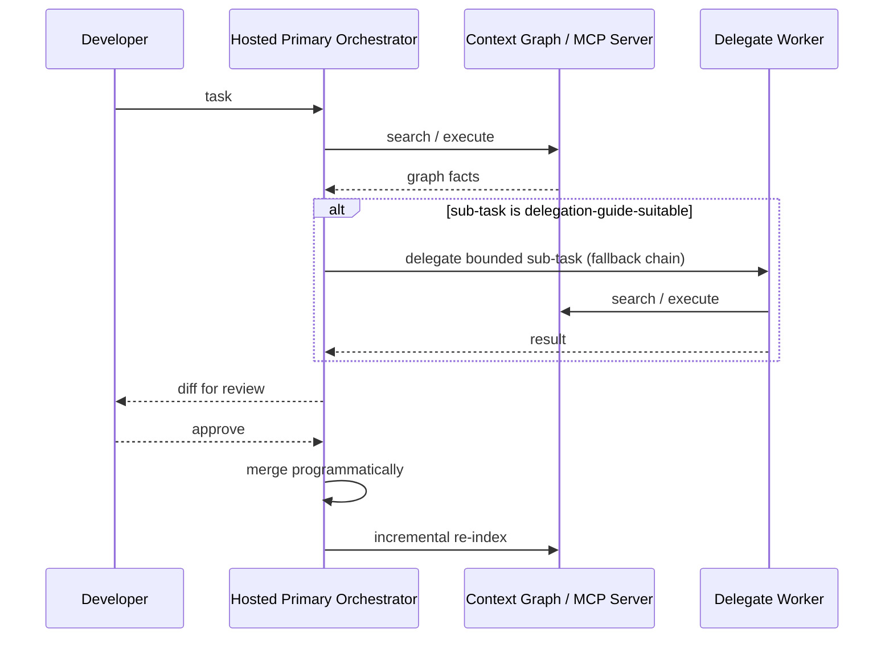

# Hybrid Local/Hosted Coding Agent — Requirements

## Summary

A hosted CLI agent (Claude Code, then others via a config-driven adapter) drives the coding work loop as the primary orchestrator, delegating specific bounded sub-tasks to a delegate worker — any OpenAI-API-compatible model, local or remote — via a static ranked fallback chain when a predefined delegation guide says a cheaper model is capable. Both orchestrator and delegate query a shared, gortex-built code-relationship graph exposed as an MCP server, so neither re-derives context from scratch.

## Problem Frame

As AI coding tools become central to how developers work, cost is a real constraint for developers without enterprise budgets. Hosted CLI agents (Claude Code, Codex) are reliable at sustained, multi-step coding work, but every token of that reasoning is billed. A meaningful share of a coding session's token volume is bounded, low-complexity work — file summarization, boilerplate generation, pattern-matched test scaffolding, simple search/extraction — that a local model can do well enough and cheaply, without needing to sustain multi-turn reasoning itself.

An earlier version of this brainstorm explored the reverse shape: a local model as the primary driver, escalating to hosted CLIs when stuck. Benchmark research (Aider's polyglot leaderboard, SWE-bench Pro, the Berkeley Function-Calling Leaderboard) found that local models in the hardware-realistic 14B–32B range trail frontier hosted models substantially on raw coding quality, and specifically collapse on **sustained multi-turn tool-calling** — exactly the role that design assigned them — while being comparatively competitive on bounded, single-shot tasks. This revision flips the architecture to match that evidence: hosted CLI agents stay primary and always drive; local models become delegated workers for bounded sub-tasks, not orchestrators.

No existing product treats a hosted coding agent as the default driver while systematically offloading its bounded, high-volume sub-tasks to a local model backed by a shared, durable context graph — but the individual pieces are demonstrably buildable, not unproven: an open, unresolved feature request against Claude Code itself asks for per-agent hosted/local provider routing, a community project already does static task-type delegation from Claude Code to local Ollama models (without a shared graph), and shared code-graphs over MCP are working infrastructure elsewhere (aimed at cross-tool reuse, not cross-tier reuse). Nobody combines all of it, which changes the risk profile from "unproven concept" to "integration and UX risk."

A related pressure has emerged since v1 shipped: the open-weight model ecosystem is maturing quickly — a July 2026 industry letter signed by NVIDIA, Microsoft, Meta, and two dozen others argues American AI leadership depends on a strong open-weight ecosystem, not just one frontier model winning. Some open-weight models (e.g., Moonshot's Kimi K2/K3) now clear a much higher capability bar than the 14B-32B locally-runnable range this project's original benchmark research covered, but are reachable only via a remote, OpenAI-API-compatible endpoint, not local hardware. Meanwhile the v1 delegate worker was hardcoded to Ollama specifically, despite its own documentation already claiming a "generic OpenAI-compatible fallback" — a claim the implementation didn't honor. This revision closes that gap and extends the same curated-list philosophy to hosted CLI orchestrators, so a new one can be added by declaring its invocation and output shape rather than writing a bespoke integration.

A third revision replaces graphify with gortex as the v1 context-graph engine, motivated by two concrete gaps: graphify's Python-based extraction struggles to stay fast as a codebase grows, and its "multi-repo" support is a post-hoc merge of independently-built graphs (nodes tagged with a `repo` attribute), not real cross-repo relationship edges. gortex is a Go-based, 100%-local code-intelligence engine that resolves actual cross-repo call/import edges and is built specifically for the "what does this touch, what breaks" queries a code-relationship graph exists to answer. Since v1 has never indexed anything beyond code (graphify's semantic/unstructured extraction path was already scoped out — see Key Decisions), this is a clean single-engine swap, not new dual-engine scope: graphify drops out of the active build entirely and returns only if unstructured-content ingestion (docs, PDFs) is scoped in later.

## Key Decisions

- **The hosted CLI agent is the primary orchestrator; the local model is a delegated worker, not a driver.** The hosted agent runs the task the way it already does today — planning, multi-step tool use, sustained reasoning — and calls the local model as a tool for specific bounded sub-tasks it identifies as suitable. This is the inverse of the local-primary design this brainstorm started with, changed because the evidence points the other way: local models are weak at the thing "primary orchestrator" requires (sustained multi-turn reasoning) and comparatively strong at the thing "delegated worker" requires (bounded, well-specified tasks).
- **Hosted CLI agents come from a pre-approved, curated list, each with its own tested adapter — v1 ships with Claude Code only.** Hosted CLIs change over time — new ones emerge, existing ones deprecate flags or shift terms of service — so the tool supports a maintained list of validated hosted-agent adapters rather than assuming any CLI works out of the box. Claude Code is the only v1 entry: its headless mode (`claude -p`) connects to project-scoped custom MCP servers with no interactive step, letting the hosted orchestrator actually call the graph and delegate-worker tools unattended. Codex CLI is deferred (see Scope Boundaries) — as of this writing, `codex exec` has no working way to approve MCP tool calls non-interactively without disabling its sandbox entirely (a confirmed open upstream issue), which would violate the never-full-bypass rule below. This mirrors the existing delegate-worker curated-list decision below, now applied to the primary-driver side as well.
- **A new hosted CLI orchestrator is addable via a config-driven adapter that declares invocation and structured-output parsing only — no hand-written custom parser (R36-R38).** This only works for CLIs that already ship a machine-parseable output mode; a CLI with irregular or text-only output still needs a hand-written adapter outside this mechanism. Config-driven adapters do not substitute for the non-interactive-MCP-approval confirmation above (R37) — a CLI still has to independently clear that gate (the same one currently blocking Codex) before it's addable at all, regardless of how declarative its adapter is.
- **Delegate candidates are a curated list of tested, tuned options plus a generic best-effort fallback, not open-ended plug-and-play.** Delegate candidates differ in tool-calling format, instruction-following quality, and context window — a prompting strategy tuned for one model doesn't reliably transfer to another. A short list of tested, tuned models ships with known-good reliability for delegated sub-tasks; any other OpenAI-API-compatible delegate — local or remote — can be plugged in through a generic adapter, marked best-effort rather than guaranteed.
- **The delegate worker is generalized from Ollama-only to any OpenAI-API-compatible endpoint, local or remote (R30-R31).** The v1 implementation's "generic OpenAI-compatible fallback" was a claim its transport didn't actually honor — the delegate client was hardcoded to Ollama's own SDK. Genuinely generalizing it (endpoint URL, credential reference, and model identifier, all config-driven) is what makes remote open-weight models like Kimi K2/K3 addable as delegates with no new code, the same way Ollama, vLLM, and aggregators like OpenRouter already are.
- **Delegate selection uses static ranked fallback chains per task type, not dynamic quality-based routing (R32-R34).** This matches how production LLM gateways actually handle multi-provider reliability (LiteLLM, Portkey, and OpenRouter's own `models`-array fallback pattern) — deterministic and debuggable, and it doesn't require the training data or live scoring a quality-optimizing router (RouteLLM, Martian, the already-deferred Ramp-Router-style consultant) would need to calibrate. Dynamic quality-based delegate routing is deferred to a future revisit once real multi-candidate delegation usage data exists.
- **Fallback chains rank free/local delegate candidates before paid remote candidates by default (R33).** Once a remote, paid delegate (e.g. Kimi via a hosted API) is a valid chain entry, this default is what keeps the original cost-savings thesis intact — paid delegates are a fallback, not the default path. The developer can reorder a specific chain to change this.
- **The delegate client stays single-protocol (OpenAI-API-compatible) for v1; Anthropic's Messages API is out of scope for the delegate tier.** No delegate candidate under consideration needs it — Kimi/Moonshot, Ollama, vLLM, and OpenRouter-style aggregators all already speak OpenAI-compatible. Supporting a second wire protocol here would double the delegate client's surface for no concrete beneficiary, undercutting the same "zero code per new provider" goal the config-driven orchestrator adapter is built to protect. The client's interface should stay structured for future extensibility (mirroring the existing `GraphEngine` `Protocol` pattern) in case a real need for a second protocol appears later.
- **Hosted-orchestrator selection remains a static, manual developer choice — no dynamic real-time routing across hosted providers.** This reaffirms the existing deferred-scope decision below (a dynamic consultant/model router across hosted providers) now that delegate-tier routing exists: switching which model answers a delegate call mid-task is a stateless, per-call decision; switching which hosted CLI *drives* a task mid-run would mean transferring live orchestration state, a materially harder and riskier problem the evidence for this revisit (a strategic/positioning trigger, not a concrete pain point) doesn't justify taking on.
- **A static, predefined delegation guide maps task types to the delegate candidates suited for them — not a dynamic or adaptive router.** The hosted orchestrator doesn't decide purely ad hoc whether to delegate a sub-task; it consults a maintained reference informed by known relative model performance. Starting v1 guide, to be refined once real usage data exists: **delegable** — file/directory summarization, boilerplate or scaffolding generation against an established pattern, simple search/extraction across files, pattern-matched test generation, and the bounded proactive/lint-style checks in F3; **stays with the hosted orchestrator** — complex multi-file refactors, architecture or design decisions, ambiguous or under-specified requirements, anything requiring sustained reasoning across many tool calls, and security-sensitive changes. Which *specific* delegate candidate handles a delegable task is now a ranked fallback chain per task type (R32), not a single fixed pick — the guide names the task-type category, the chain resolves which candidate actually runs it. This ships with sensible defaults and is developer-overridable, but does not learn or self-tune at runtime — consistent with this project's existing "no adaptive calibration system in v1" position. It is a distinct decision from the deferred consultant-router idea in Scope Boundaries: that one is about dynamically picking between multiple *hosted* providers in real time based on live quality/cost scoring; this is a predefined, static reference for *local-vs-hosted* delegation on a single already-chosen hosted driver, and its fallback chains (R32-R34) are availability-driven, not quality-driven.
- **The context graph is shared infrastructure, queried by whichever model needs it, and is the actual token-savings enforcement mechanism.** It's built as an MCP server from day one — queryable by the hosted primary orchestrator, the delegate worker, or any other MCP-speaking agent — so neither model re-derives context from scratch. This is what makes savings real once the hosted model is always running: without a shared graph, "delegate the summary to local" still costs the hosted model tokens re-establishing what to summarize.
- **The graph is exposed via MCP with a Code-Mode-style narrow surface** — a fixed `search`/`execute` tool pair rather than one tool per query type, keeping the exposed schema footprint constant regardless of how rich the underlying graph gets. This holds even though gortex (the new v1 engine, below) natively ships around 175 of its own MCP tools: gortex is wrapped behind this narrow surface rather than mounted directly, and its richer capabilities (blast-radius/impact analysis, dataflow, cross-repo call chains) are reachable as named `execute` operations rather than new tools, reusing the existing operation-dispatch design instead of expanding what Claude Code's `--allowedTools` has to scope.
- **Gortex is the v1 graph engine, behind the swappable interface — replacing graphify.** Graphify's Python-based AST extraction struggles to stay fast as a codebase grows, and its multi-repo support only merges independently-built graphs after the fact rather than resolving real cross-repo relationship edges. Gortex is a Go-based, 100%-local code-intelligence engine built for exactly this: fast incremental indexing and genuine cross-repo call/import edge resolution. Graphify is dropped from the active build, not deleted from consideration — it returns only if unstructured-content ingestion (docs, PDFs, etc.) is scoped in later, since gortex is code-only by design.
- **Graph construction is directory-scoped and genuinely cross-repo** — pointed at one repo or a parent directory spanning several, with gortex resolving real relationship edges across repo boundaries rather than merging separately-built graphs, without "multi-repo" needing to be a distinct mode.
- **The graph re-indexes incrementally**, using content-hash change detection so only changed files are re-processed, triggered by commit/save events and whenever the hosted orchestrator's work merges — a bounded, already-known set of changed files. This is how savings compound over time: as graph coverage grows, both models spend less effort re-establishing context. Josu keeps owning this triggering itself rather than deferring to gortex's own built-in file watcher, even though gortex ships one — one consistent trigger model across the whole system, and it avoids gortex's watcher running independently against every ephemeral per-task worktree.
- **Gortex is a separate installed binary/daemon, not a Python dependency of josu** — a new local-runtime prerequisite alongside the existing local-model-runtime (e.g. Ollama) assumption (see Dependencies / Assumptions). If the gortex process is unreachable, that's treated the same as any other graph-miss (R13) — the querying agent falls back to direct file exploration — rather than a new hard-failure category.
- **The hosted orchestrator runs isolated and unattended by default; review moves to merge-time, not action-time.** This was originally scoped as escalation-specific behavior; it's now the primary driver's standard operating pattern, since the hosted model is always the one running unattended, not just an occasionally-invoked consultant. It runs in an isolated git worktree (seeded with the developer's uncommitted/staged changes via `git stash create`, not just the last commit) with prompts silenced via an explicit allowlist or "never ask" policy — never a full permission-bypass mode (`bypassPermissions`, `--dangerously-skip-permissions`, `--yolo`), since those strip the isolation boundary itself, which the documented incident record treats as the actually dangerous move. Work is surfaced as a diff for developer review before it merges; if the developer's real working tree has diverged since the worktree was created, the merge aborts cleanly and surfaces the conflict rather than partially applying it.
- **Delegated calls are bounded, so the heavy circuit-breaker machinery for sustained reasoning mostly dissolves.** The original design needed an iteration cap, an escalation-cycle cap, and in-task context trimming specifically to protect against the delegate's own multi-turn reasoning looping or overflowing context — those concerns don't apply once the delegate is doing bounded, mostly single-shot delegated work instead of driving. What remains: a wall-clock timeout on the hosted orchestrator's unattended run (protects host resources regardless of who's driving), and a timeout/retry on individual delegated calls (R24) — this applies to remote delegate calls at least as much as local ones, since network hangs and rate limits are additional failure modes a purely local call doesn't have.
- **Proactive checks stay local-only and bounded, waking the full hosted loop only if something serious is found.** Commit/save-triggered checks are exactly the kind of bounded, low-complexity task the delegation guide favors for local — a lightweight local scan runs first; only a finding that needs deeper action invokes the hosted orchestrator. Unlike a developer-initiated delegated task, F3 fires on every commit and debounced save — high enough frequency that letting it fall through the fallback chain (R32-R34) to a paid remote candidate during a local outage would risk real, unbounded per-save cost. F3 stays restricted to local candidates only (R39); if none is available, the check is skipped rather than escalated to remote. This preserves the original cost-conscious intent for routine, unprompted checks even though the main coding-task loop is now hosted-driven.
- **A pre-flight hardware-fit check gates local model loading**, estimating whether a curated model fits the developer's available VRAM/RAM and warning or refusing rather than silently risking a slow swap or OOM — no OS-level resource enforcement is attempted, consistent with what the best tools in this space (LM Studio, Ollama, llama.cpp) actually ship. This check applies only to local delegate candidates (R35) — a remote delegate candidate has no VRAM/RAM footprint on the developer's machine and is validated for reachability/auth instead.
- **Worktree cleanup never runs automatically in the background.** Auto-delete fires only on merge or explicit rejection; abandoned worktrees are only ever listed or removed via an explicit developer-triggered command.
- **The orchestrator keeps a local, inspectable run log**, now tracking delegation decisions specifically — which sub-tasks were delegated to local, why, what they cost, and what the hosted orchestrator did directly instead.
- **V1 avoids single-user-only assumptions** in the config/identity layer so a future multi-user mode is additive, even though no team features ship in v1.
- **When the hosted orchestrator is unavailable (quota exhausted, rate-limited), the delegate worker keeps handling its normal delegation-guide-suitable tasks rather than the system blocking entirely.** Every quota-to-local fallback pattern found in the wild is a manual, context-discontinuous workaround (flip a base-URL env var, start a fresh local session) — and Claude Code's own shipped `fallbackModel` feature explicitly excludes rate-limit/auth errors from automatic fallback, surfacing them to the user instead. This tool automates the gap, but conservatively: the delegate worker doesn't become a full substitute orchestrator during the outage — it just stays available for the same bounded task types it always handled, so the developer isn't fully blocked on delegable work while non-delegable work waits for hosted access to resume.
- **Getting better over time is a natural side effect, not a feature to build.** As the incrementally-built graph covers more of a workspace, both the hosted orchestrator and the delegate worker spend less effort re-establishing context — this falls out of what's already scoped (incremental graph, bounded delegation) without needing a separate adaptive/learning system in v1.

## Actors

- A1. **Developer** — the solo/indie developer using the tool day to day; the primary persona for v1, with the architecture kept open to team/org adoption later.
- A2. **Hosted Primary Orchestrator** — the hosted CLI agent (Claude Code, Codex CLI, or another from the pre-approved list) that drives the task loop end to end.
- A3. **Context Graph / MCP Server** — the gortex-backed, directory-scoped code-relationship graph, exposed over MCP through a narrow `search`/`execute` surface, queried by both other agent actors.
- A4. **Delegate Worker** — an OpenAI-API-compatible model, local or remote (from the curated list or the generic fallback), invoked by the hosted orchestrator for a specific bounded sub-task the delegation guide marks as delegable, resolved via that task type's ranked fallback chain.

## Key Flows

- F1. **Task completion via the hosted orchestrator, with delegation**
  - **Trigger:** Developer gives the hosted orchestrator a task.
  - **Actors:** A1, A2, A3, A4 (A4 only when a sub-task is delegated)
  - **Steps:** Orchestrator runs in an isolated worktree seeded from current working-tree state, queries the graph as needed, and for any bounded sub-task the delegation guide marks as delegable, calls the delegate worker (also graph-aware) — resolving that task type's ranked fallback chain to the first available candidate — rather than doing that piece itself; on completion, surfaces the resulting diff for developer review and merges programmatically on approval, aborting cleanly on conflict.
  - **Outcome:** Task completes with some sub-task volume offloaded to a cheaper delegate model, without the developer re-explaining context to either model.
  - **Covers:** R1, R2, R4, R6, R12

- F2. **Graph miss**
  - **Trigger:** Either agent needs context the graph doesn't have (not yet indexed, stale, or genuinely uncovered), or the gortex engine itself is unreachable.
  - **Actors:** A2 or A4, A3
  - **Steps:** The querying agent falls back to direct file exploration; the graph is not the only path to context for either model.
  - **Outcome:** A graph gap or engine outage costs speed/insight for that one query, not a blocked task.
  - **Covers:** R13

- F3. **Event-triggered proactive check**
  - **Trigger:** Developer commits, or saves a file (debounced).
  - **Actors:** A3, A4 (A2 only if the check surfaces something needing deeper action)
  - **Steps:** The delegate worker re-evaluates the relevant portion of the graph and surfaces any issues found; a serious finding wakes the hosted orchestrator for the full task loop.
  - **Outcome:** Developer sees potential issues without having asked, at local-only cost in the common case.
  - **Covers:** R14, R15, R16

## Requirements

**Primary Orchestration**

- R1. A hosted CLI agent from a pre-approved, tested list drives the coding task loop end to end, the way it already does when used directly.
- R2. The developer chooses which delegate candidates — local models or remote OpenAI-API-compatible endpoints, from a curated list or a generic fallback — are available for delegation; not locked to a single hardcoded model.
- R3. Adding a new hosted CLI agent to the pre-approved list requires a tested adapter for its invocation and output-parsing mechanics before it's usable.

**Delegation**

- R4. The hosted orchestrator can delegate a specific, bounded sub-task to the delegate worker rather than performing it directly.
- R5. Delegation decisions are guided by a static, predefined reference mapping task types to a ranked fallback chain of suitable delegate candidates (R32) when the task is delegable, not a dynamic or self-learning router.
- R6. The delegation guide ships with sensible defaults and is developer-overridable.
- R7. The developer can force a specific delegation choice (send a sub-task to local, or force it to stay with the hosted orchestrator) overriding the guide's default.
- R8. When delegating, the hosted orchestrator gives the delegate worker access to the same context graph, so the delegate doesn't need the task re-explained from scratch.

**Context Graph**

- R9. The graph builds over an arbitrary directory tree — a single repo or a parent directory spanning several, with real relationship edges resolved across repo boundaries — without "multi-repo" needing to be a distinct mode.
- R10. Gortex is the v1 graph engine, wired behind a swappable interface.
- R11. The graph is exposed as an MCP server queryable by both the hosted orchestrator and the delegate worker (and any other MCP-speaking agent).
- R12. The MCP server exposes a fixed `search`/`execute` tool pair, not one tool per query type, so the schema footprint stays constant regardless of graph size or the underlying engine's own native tool count; the engine's richer capabilities (e.g. impact/blast-radius analysis) are reachable as named `execute` operations, not additional tools.
- R13. When the graph has no data relevant to a query (not yet indexed, stale, or genuinely uncovered), or the graph engine itself is unreachable, the querying agent falls back to direct file exploration rather than blocking.
- R14. The graph re-indexes incrementally via content-hash change detection — not full rebuilds — triggered by commit/save events and when the hosted orchestrator's work merges, driven by josu's own event triggers rather than the engine's own built-in file watcher.

**Proactive Issue Detection**

- R15. The delegate worker re-evaluates the graph and surfaces potential issues on commit and debounced on-save, without the developer asking first; a serious finding wakes the hosted orchestrator.
- R16. The developer can query the graph on demand at any time, independent of event triggers.
- R17. No continuously active background process re-scans the graph on its own cadence.
- R39. Proactive checks (R15) use local delegate candidates only, never falling through a fallback chain (R32) to a paid remote candidate; if no local candidate is available, the check is skipped for that event rather than escalated to remote.

**Safety and Isolation**

- R18. The hosted orchestrator runs in an isolated git worktree seeded from the developer's current working-tree state (including uncommitted/staged changes), never directly against the real working tree.
- R19. The orchestrator's permission prompts are silenced via an explicit allowlist or "never ask" policy, never a full permission-bypass mode.
- R20. The orchestrator's work is surfaced as a diff for developer review before merging into the real working tree, by default.
- R21. If the developer's real working tree has diverged since the worktree was created, the merge aborts cleanly and surfaces the conflict rather than partially applying the diff.
- R22. The system never invokes a hosted orchestrator with a full permission-bypass mode (e.g. `bypassPermissions`, `--dangerously-skip-permissions`, `--yolo`).

**Resource and Loop Safety**

- R23. The hosted orchestrator's unattended run is bounded by a wall-clock timeout; exceeding it stops the run and surfaces it to the developer.
- R24. An individual delegated call — local or remote — is bounded by its own timeout and a retry on a malformed/invalid response, distinct from the orchestrator-level timeout.
- R25. The orchestrator maintains a local, inspectable run log recording each delegation decision (what was delegated, why, and its outcome/cost) and each graph interaction — reviewable without external tooling.
- R26. Before loading a local delegate candidate, the system estimates whether it fits the developer's available VRAM/RAM and warns or refuses rather than risking a slow swap or OOM; this check does not apply to remote delegate candidates (R35).
- R27. The developer can list and manually clean up abandoned worktrees via an explicit command; the system does not run automatic background cleanup.
- R28. When the hosted orchestrator's quota or rate limit is exhausted, the developer can directly request a delegation-guide-suitable bounded task (e.g., "summarize this file") and it routes straight to the delegate worker, bypassing the hosted orchestrator entirely, rather than the system blocking on all work. This does not auto-decompose arbitrary complex requests into delegable pieces — only already-bounded developer asks are served this way; anything requiring the hosted orchestrator's own task decomposition waits until hosted access resumes.
- R29. The developer is informed explicitly when the system is operating in this hosted-unavailable, local-only degraded state.

**Delegate Provider Configuration**

- R30. A delegate candidate is defined via a config entry (endpoint, credential reference, model identifier) — adding a new OpenAI-API-compatible delegate, local or remote, requires no code change.
- R31. Credentials for a remote delegate endpoint are supplied via a reference to an environment variable, never stored as plaintext in the config file.
- R32. Each task type in the delegation guide maps to a ranked, ordered list of delegate candidates (a fallback chain), not a single fixed model.
- R33. Fallback chains rank free/local delegate candidates before paid remote candidates by default; the developer can reorder a specific chain to override this.
- R34. When a delegate candidate in a chain is unreachable, rate-limited, or errors, the system tries the next candidate in the chain before treating the sub-task as failed.
- R35. The hardware pre-flight check (R26) applies only to local delegate candidates; remote candidates are validated for reachability and auth instead.

**Hosted Orchestrator Extensibility**

- R36. A new hosted CLI orchestrator is addable to the pre-approved list via a config entry declaring its invocation command/flags and a field mapping onto its structured-output mode, without a hand-written parser — only for CLIs that ship a machine-parseable output mode.
- R37. A hosted CLI orchestrator is added to the pre-approved list only after independently confirming it supports non-interactive MCP tool approval (R3's existing gate); the config-driven adapter does not substitute for this confirmation.
- R38. A hosted CLI without a structured/machine-parseable output mode is not addable via the config-driven adapter (R36); it requires a hand-written adapter outside this mechanism.

## Acceptance Examples

- AE1. **Covers R4, R5.** Given a sub-task the delegation guide marks as delegable (e.g., summarizing a large file), when the hosted orchestrator reaches that point in a task, then it delegates to the delegate worker instead of performing the summary itself.
- AE2. **Covers R7.** Given the developer explicitly forces a sub-task to stay with the hosted orchestrator, when that sub-task is reached, then it is not delegated regardless of what the guide would otherwise suggest.
- AE3. **Covers R13.** Given the graph has no data covering the files a query touches, when either agent needs that context, then it reads/searches those files directly rather than blocking.
- AE21. **Covers R13.** Given the gortex process/daemon is not running or unreachable, when either agent queries the graph, then it falls back to direct file exploration the same way it would for a genuine graph miss, rather than surfacing a distinct hard failure.
- AE4. **Covers R15.** Given a debounced save event with no serious finding, when the delegate worker's check completes, then the hosted orchestrator is never invoked for that check.
- AE5. **Covers R17.** Given no commit or save event has occurred and the developer hasn't asked a question, when time passes, then no proactive re-scan occurs.
- AE6. **Covers R18, R19, R20, R22.** Given the hosted orchestrator runs a task, when it operates, then it does so only inside an isolated worktree with prompts silenced via an allowlist (never a full permission-bypass mode), and its result reaches the developer's real working tree only as a diff pending review.
- AE7. **Covers R21.** Given the developer's real working tree has diverged since the worktree was created, when the orchestrator attempts to merge an approved diff, then the merge aborts cleanly and surfaces the conflict rather than partially applying it.
- AE8. **Covers R14.** Given the hosted orchestrator's work merges, when the merge completes, then the graph re-indexes only the files touched by that merge, not the entire workspace.
- AE9. **Covers R23.** Given the hosted orchestrator's run exceeds its wall-clock timeout, when the timeout fires, then the run stops and is surfaced to the developer rather than continuing indefinitely.
- AE10. **Covers R24.** Given a delegated call (local or remote) returns a malformed response, when the orchestrator detects it, then it retries once before treating the delegation as failed.
- AE11. **Covers R25.** Given a task delegates a sub-task, when the developer reviews the run log afterward, then they can see what was delegated, why, and its outcome without inspecting code.
- AE12. **Covers R26.** Given the developer selects a curated local model too large for their detected hardware, when they attempt to load it, then the system warns or refuses.
- AE13. **Covers R27.** Given several worktrees have been abandoned with no developer response, when the developer runs the cleanup command, then they see a list of abandoned worktrees and can choose which to remove.
- AE14. **Covers R28, R29.** Given the hosted orchestrator's quota is exhausted, when the developer directly requests a delegation-guide-suitable bounded task, then the delegate worker handles it directly and the developer is told hosted-level (orchestrator-driven) work is paused until quota resets, rather than the whole system blocking.
- AE15. **Covers R32, R34.** Given a task type's fallback chain has two delegate candidates and the first is unreachable, when the sub-task is delegated, then the system tries the second candidate before treating the delegation as failed.
- AE16. **Covers R33.** Given a fallback chain with both a free local candidate and a paid remote candidate and no developer override, when the sub-task is delegated, then the free local candidate is tried first.
- AE17. **Covers R30, R31.** Given the developer adds a new remote delegate candidate via config with an environment-variable credential reference, when the config is loaded, then the candidate is available for delegation with no code change.
- AE18. **Covers R36, R38.** Given a CLI with a structured, machine-parseable output mode and a config entry declaring its invocation and output mapping, when it's added to the pre-approved list, then no custom parser is written; given a CLI without such a mode, then it cannot be added via this mechanism.
- AE19. **Covers R37.** Given a CLI has a config-driven adapter defined but has not been confirmed to support non-interactive MCP tool approval, when an attempt is made to add it to the pre-approved list, then it is not added.
- AE20. **Covers R39.** Given a debounced save event fires and no local delegate candidate is available, when the proactive check would otherwise run, then it is skipped for that event rather than falling to a paid remote candidate.

## Success Criteria

- A meaningful share of a task's token volume is handled by the delegate worker rather than the hosted orchestrator, without the developer needing to double-check delegated work more than hosted-done work.
- The share of token volume delegated to local trends upward over time as the graph's coverage grows, without requiring a separate adaptive-learning system to make that happen (see Key Decisions).

## Scope Boundaries

**Deferred for later**

- PKM/second-brain integration (Obsidian, Notion, etc.) as live context for the graph or agent.
- Team/org features: shared budget dashboards, multi-user permissions, centralized governance for engineering leadership.
- Codex CLI as a second pre-approved hosted CLI — blocked until `codex exec` gains a working non-interactive approval path for MCP tool calls that doesn't require disabling its sandbox entirely (openai/codex#24135, open as of this writing), separate from the earlier-noted ToS ambiguity on Codex automation generally. The new config-driven orchestrator adapter (R36-R38) doesn't change this — Codex still has to independently clear the MCP-approval gate before it's addable, however declarative its adapter would be.
- A dynamic consultant/model router that picks between multiple *hosted* providers in real time based on live cost/quality scoring (Ramp Router's model, applied across hosted providers) — distinct from both this plan's static local-vs-hosted delegation guide (R5) and the new static, availability-driven delegate fallback chains (R32-R34), neither of which score or learn.
- Dynamic quality-based delegate routing (RouteLLM/Martian-style, content-aware per-request model selection among delegate candidates) — deferred pending real multi-candidate delegation usage data to calibrate against.
- A custom-parser escape hatch in the config-driven orchestrator adapter (R36) for CLIs with irregular or text-only output — keeps that mechanism's "zero code per new provider" promise honest rather than reintroducing per-provider engineering through the back door.
- A second delegate-client wire protocol (e.g. Anthropic's Messages API) — no delegate candidate under consideration needs it; the delegate client's interface stays structured for future extensibility if a real need appears.
- Swapping what Claude Code's own backend talks to via Anthropic's Messages API (e.g. pointing it at a local Anthropic-API-compatible server) — a different axis from both the delegate tier and the orchestrator adapter, not pursued here.
- Multi-CLI collaborative work, where more than one hosted agent works together on a single task rather than one hosted orchestrator per task.
- Dual-engine content-type routing (code to gortex, unstructured content like docs/PDFs to graphify) built now — this revision is a clean single-engine swap; graphify only comes back if unstructured-content ingestion is scoped in on its own.
- Mounting gortex's native MCP server surface directly to Claude Code — its capabilities stay reachable through josu's own narrow `search`/`execute` surface (R12) instead.

**Outside this product's identity**

- A general-purpose LLM router/gateway across many hosted providers with no local-model involvement — that's the RouteLLM/Martian/OpenRouter category. This product's identity is centered on local-delegation from a hosted driver, not a hosted-to-hosted routing layer. This plan does reuse OpenRouter's own fallback-chain *mechanism* for delegate-tier reliability (R32-R34) — mechanism reuse, not identity convergence into that category.
- A hosted, enterprise-first context/graph platform competing directly with Sourcegraph Cody or Augment Code on their terms. This product's identity is local-first infrastructure and developer-owned, not a SaaS platform.

## Dependencies / Assumptions

- Depends on gortex ([github.com/zzet/gortex](https://github.com/zzet/gortex)) as the v1 graph-construction engine — a separate installed binary/daemon, not a Python package, so the developer must install it locally (e.g. via its installer script or a package manager) alongside josu itself. Graphify remains a dependency in name only, held in reserve for if/when unstructured-content ingestion is scoped in.
- Assumes the developer has a local model runtime available (e.g., Ollama or similar) capable of running a curated local model for delegated sub-tasks.
- Assumes MCP remains a viable, sufficiently adopted protocol for interoperability between the hosted orchestrator and the graph server.
- Assumes hosted orchestrator access is via the developer's own existing subscription/account credentials, not a new billing relationship this product owns. **Anthropic's terms explicitly permit this**: a June 2026 policy change gives Pro/Max/Team/Enterprise subscribers a dedicated, separately-metered credit specifically for programmatic Agent SDK use, distinct from interactive chat limits — provided it's the developer's own credentials, not shared/routed for other users.
- Codex CLI is deferred out of v1 for two independent reasons: OpenAI's ambiguous ToS position on automated Codex CLI/SDK use under a personal subscription (OpenAI staff have declined to confirm compliance when directly asked), and a confirmed, currently-open technical blocker where `codex exec` cannot approve MCP tool calls non-interactively without disabling its sandbox entirely. Revisit both independently — OpenAI could clarify the ToS question, or ship a fix for the MCP-approval gap, without the other resolving.
- Assumes the build and maintenance cost of this scope (worktree isolation, multiple hosted-CLI adapters, an MCP server, a delegation guide, incremental re-indexing) pays for itself for a solo developer over time. The zero-build-cost alternative (using a hosted CLI agent directly, with no delegation) already exists; the honest bar for this tool is that delegation saves more than it costs to build and maintain.
- Assumes local models in the curated list are reliable enough for the bounded task types the delegation guide assigns them — informed by, but not fully validated against, the benchmark research below; a hands-on spike against the actual delegation harness is recommended before committing to the full build.
- Assumes remote delegate endpoints (e.g., a paid Kimi/Moonshot API key, or an aggregator like OpenRouter) are billed directly to the developer's own account, not a billing relationship this product owns or intermediates — consistent with the existing assumption on hosted-orchestrator access above.

## Sources / Research

Market/competitive research found no existing product combining a hosted-primary coding agent with systematic, graph-informed delegation of bounded sub-tasks to a local model. Closest adjacents: Continue.dev (static local/hosted split with no delegation guide), CodeGraph and GitNexus (local-first knowledge graphs, no hosted-orchestrator integration), Sourcegraph Cody and Augment Code (deep multi-repo context, hosted/enterprise-only). GitNexus's successor project, gortex, is now the adopted v1 graph engine itself rather than an adjacent (see Key Decisions).

- **gortex** ([github.com/zzet/gortex](https://github.com/zzet/gortex), [gortex.dev](https://gortex.dev/)) — the chosen v1 graph engine: a Go-based, 100%-local code-intelligence engine (257 languages, cross-repo edge resolution, own daemon with fsnotify-driven incremental indexing, a precomputed depth-3 "reach index" for fast blast-radius/impact-analysis queries). Sibling project to GitNexus, cited below.
- **graphify** (`~/.claude/skills/graphify/SKILL.md`) — this developer's existing any-input-to-knowledge-graph tool; held in reserve as the engine for unstructured content if that's ever scoped in, no longer the v1 code-graph engine.
- **MCP (Model Context Protocol)** — the interoperability layer already spoken by hosted CLI agents; the reason exposing the graph as an MCP server gets adoption "for free."
- **Cloudflare's "Code Mode" pattern** — narrow `search`/`execute` tool surface over a large underlying API, used to keep the MCP server's schema footprint fixed regardless of graph size.
- **Claude Agent SDK permission modes** — documented headless-execution patterns (silence prompts via an allowlist, keep a sandbox/worktree boundary, never combine unattended operation with a full permission-bypass mode) that the isolation decisions (R18-R22) are modeled on. Claude Code's project-scoped MCP config (`.mcp.json`, or `--mcp-config`/`--strict-mcp-config` for explicit headless manifests) connects to custom MCP servers with no interactive step in `-p` mode, confirming the delegation architecture is mechanically feasible for Claude Code specifically.
- **openai/codex#24135** ([github.com/openai/codex/issues/24135](https://github.com/openai/codex/issues/24135), open) — `codex exec` has no working non-interactive approval path for MCP tool calls short of disabling its sandbox entirely; the basis for deferring Codex CLI out of v1 in Scope Boundaries, independent of the earlier ToS ambiguity.
- **claude-context's Merkle-tree incremental indexing** — the named prior art for R14's content-hash-based incremental re-indexing.
- **LM Studio's pre-load fit estimation** and **Sandcastle's** dirty-worktree preservation — the models for R26's hardware-fit check and R27's explicit, non-automatic worktree cleanup.
- **Ramp Router** ([ramp.com/router](https://ramp.com/router)) — a public LLM model router sending each request to the lowest-cost model clearing a quality bar across providers; named prior art for the deferred dynamic hosted-provider router (Scope Boundaries), distinct from this plan's static delegation guide.
- **Benchmark evidence for the architecture flip**: Aider's polyglot leaderboard (best local 14B-32B option, Qwen3-32B, scores 40.0% vs. frontier hosted models at 72-88%, and mid-tier hosted GPT-4.1 at 52.4%); SWE-bench Pro has essentially no data at the 14-32B size class; the Berkeley Function-Calling Leaderboard shows smaller models' tool-calling accuracy collapsing specifically on multi-turn sequences (Qwen3-4B: 75-82% single-turn to ~35% multi-turn) rather than single-call accuracy — the direct evidence that "sustained multi-turn orchestration" is where local models specifically struggle, distinct from bounded task quality.
- **Anthropic's Agent SDK subscription credit** (June 2026 policy change, [support.claude.com/en/articles/15036540](https://support.claude.com/en/articles/15036540-use-the-claude-agent-sdk-with-your-claude-plan)) and **OpenAI's ambiguous Codex CLI automation position** ([github.com/openai/codex/discussions/8338](https://github.com/openai/codex/discussions/8338), where OpenAI staff declined to confirm ToS compliance) — the basis for the Dependencies/Assumptions note above.
- **anthropics/claude-code Issue #38698** ([github.com/anthropics/claude-code/issues/38698](https://github.com/anthropics/claude-code/issues/38698)) — an open, unresolved feature request for exactly this brainstorm's core shape (per-agent hosted/local provider routing), confirming real, unmet demand at the product level.
- **PratikHotchandani22/claude-ollama-agents** ([github.com/PratikHotchandani22/claude-ollama-agents](https://github.com/PratikHotchandani22/claude-ollama-agents)) — the closest working prior art: Claude Code delegates specific task types to local Ollama models via a static task→model mapping, structurally similar to this brainstorm's delegation guide (R5), but without a shared context graph (files are passed explicitly per call) and with no adoption beyond one community repo.
- **Claude Code's native `fallbackModel` feature** (shipped ~June 2026) — real, shipped hosted-to-hosted fallback on overload/errors, but explicitly excludes rate-limit/auth errors from automatic handling and never falls back to a local model — confirming R28's quota-to-local fallback is unaddressed by the incumbent tool itself.
- **colbymchenry/codegraph** ([github.com/colbymchenry/codegraph](https://github.com/colbymchenry/codegraph)) — a working local code-graph-over-MCP implementation, aimed at cross-tool context reuse rather than the cross-tier (hosted/local) reuse this brainstorm needs, but confirms the graph-sharing mechanism itself is proven, buildable infrastructure.
- **"Open Weights and American AI Leadership"** (industry letter, July 24 2026, signed by NVIDIA, Microsoft, Meta, Hugging Face, Y Combinator, Palantir, and others) — the strategic trigger for this revision: argues American AI leadership depends on a strong open-weight ecosystem, not a single frontier model winning, and that open weights let organizations access advanced AI without paying premium per-task.
- **OpenRouter's routing documentation** ([How OpenRouter Model Routing Works](https://openrouter.ai/blog/insights/model-routing/), [Model Fallbacks](https://openrouter.ai/docs/guides/routing/model-fallbacks)) — the named prior art for R32-R34's ranked fallback chains: a two-layer system (provider failover + a `models` priority array), triggered by rate limits, downtime, or refusals, tried sequentially. Confirms fallback chains are a reliability mechanism, not a quality-optimizing router, and that "gateway" doesn't imply dynamic content-aware routing by default.
- **LiteLLM and Portkey** — production LLM gateways whose default routing primitive is the same static, declared fallback-chain pattern (not a trained/dynamic router), the broader precedent for R32-R34 alongside OpenRouter specifically.
- **Anthropic's OpenAI-SDK compatibility layer** ([platform.claude.com/docs/en/api/openai-sdk](https://platform.claude.com/docs/en/api/openai-sdk), launched March 2026) — Anthropic scopes this explicitly to quick evaluation, not production use, and it covers the raw Claude model API, not the Claude Code CLI orchestrator itself; the basis for keeping Claude Code in the CLI-adapter tier (R36-R38) rather than the OpenAI-compatible delegate tier (R30) even though this shim exists.
- **Ollama v0.14+ and vLLM's Anthropic Messages API support** ([Ollama Blog](https://ollama.com/blog/claude), [vLLM docs](https://docs.vllm.ai/en/stable/serving/integrations/claude_code/)) — both now implement Anthropic's native protocol (the reverse direction), letting Claude Code point at them via `ANTHROPIC_BASE_URL`. The basis for the deferred "swap Claude Code's own backend" idea in Scope Boundaries, distinct from both the delegate tier and the orchestrator adapter.

