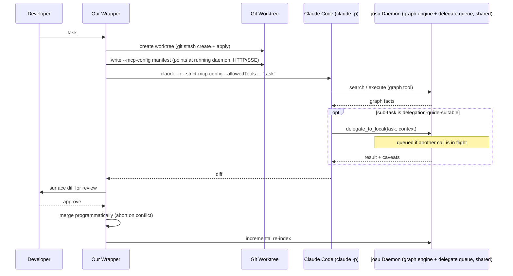

# Hybrid Local/Hosted Coding Agent — Core Architecture

## Summary

Build a Python package where Claude Code drives coding tasks as the primary orchestrator in an isolated git worktree, connecting to two custom MCP servers we provide — a graphify-built context graph and a local-model delegate tool — so it can offload bounded sub-tasks (file summaries, boilerplate, simple search) to a free local model while keeping complex work itself. Delivered in three phases: the core delegation loop, quota-exhaustion and lifecycle completeness, then the ongoing proactive-check loop.

---

## Problem Frame

The origin requirements document (see origin) was substantially revised mid-brainstorm: an earlier local-primary design was reversed after benchmark research showed local models specifically collapse on sustained multi-turn tool-calling — the exact role that design assigned them. This plan implements the revised, hosted-primary architecture: Claude Code drives as it already does when used directly, and a local model is exposed to it as a callable MCP tool for bounded sub-tasks a static delegation guide marks suitable. This plan supersedes an earlier version of itself written against the pre-flip architecture — nearly every unit below is new or substantially reworked, not patched.

---

## Key Technical Decisions

- **Delegation is mechanized as two MCP servers Claude Code connects to, not a custom orchestrator we build.** Research confirmed Claude Code's headless mode (`claude -p`) connects to project-scoped custom MCP servers with no interactive step — trust verification is deliberately disabled in `-p` mode. This means our tool's job is providing the graph and local-delegate MCP servers and wiring Claude Code to them per-worktree, not building a custom reasoning loop the way the pre-flip plan did. This is a major simplification versus the superseded version of this plan.
- **Both MCP servers run as one long-running local daemon process, reached over a local HTTP/SSE transport — not spawned per-worktree over stdio.** Stdio transport (each server spawned as a child process per Claude Code session) would give every worktree its own graph-engine instance and its own delegate queue, defeating the reasons those exist: a single shared graph avoids duplicate builds, and a single shared queue is the only way "Ollama serves one generation at a time" is actually enforced across a task's delegation, a proactive check's delegation, and a quota-fallback direct call. The daemon starts once (on first use or via `josu init`); every per-worktree manifest (U4) and every direct-call path (U7, U9) points at the same running instance. The delegate server's `local_model.py` imports `josu.graph.engine` directly in-process to query the graph — an ordinary Python import between two modules of the same daemon, not a second MCP client connection — since R11's "queryable by both" framing is about external MCP-speaking agents (Claude Code), not our own internal modules talking to each other.
- **Claude Code is the only v1 hosted CLI; Codex CLI is deferred, with no unit or placeholder for it in this plan.** `codex exec` has no working non-interactive approval path for MCP tool calls without `--dangerously-bypass-approvals-and-sandbox` (confirmed open upstream issue, openai/codex#24135) — using it would violate the never-full-bypass rule (R19/R21/R22) this plan treats as non-negotiable. Revisit if OpenAI ships a fix.
- **MCP config is written explicitly per-worktree via `--mcp-config`/`--strict-mcp-config`, not left to ambient `.mcp.json` discovery, and validated immediately before invocation.** This gives each run a deterministic, reviewable manifest — only the daemon's two servers are available, nothing picked up ambiently — which matters given headless mode's trust-dialog bypass means these servers connect without a human ever consenting in that session. Because that bypass means nothing catches a tampered or buggy manifest at the trust-dialog step, the wrapper compares the freshly-written manifest's contents (server URLs) against the known-good daemon address immediately before calling `claude -p`, closing the generation-to-invocation gap.
- **Tool-call permissions use `--allowedTools` scoped to the two MCP tools plus a minimal, narrowly-scoped file/shell set, never `--dangerously-skip-permissions`/`bypassPermissions`.** MCP trust-dialog bypass (mechanical, headless-mode-only) is a separate lever from tool-call permission bypass (a policy choice); this plan uses the former (unavoidable in headless mode) but never the latter. `Bash(git *)` as a wildcard is explicitly rejected: git worktrees share the same object database, refs, and remotes as the main repository, so a wildcard grant would let an unattended run push, force-reset, or remove other worktrees — a silent violation of R18/R20's isolation and diff-review invariants through a permission loophole, not the literal bypass flag. The allowlist instead names specific safe subcommands (`status`, `diff`, `add`, `commit`), excludes `push`, `reset`, `clean`, `worktree`, and `config`/`-c` (git aliases are a known shell-escape vector — `git config alias.x '!<cmd>'; git x` still matches a `git *` pattern while running arbitrary commands), and `Read`/`Edit` are verified by the wrapper to resolve only under the worktree root before a diff is treated as valid.
- **Delegation guidance splits across two channels: a narrow MCP tool description for mechanical usage, and a project-level `CLAUDE.md` for richer policy.** Confirmed by Anthropic's own engineering guidance that tool descriptions materially steer tool-choice (not a hack), but a single description string can't hold nuanced, evolving policy (thresholds, examples) the way a project doc can. The tool description carries "use for X, not for Y" plus latency/cost hints; `CLAUDE.md` carries the fuller delegation guide from the origin doc.
- **The local delegate returns structured output (result plus self-reported caveats), and the tool description instructs Claude Code to spot-check before accepting it — an unverifiable, best-effort mitigation, not a guaranteed control.** This is the only lever available against a black-box hosted CLI we don't control the internals of, for delegated results that are well-formed but substantively wrong (a gap the origin doc's malformed-response handling, R24, didn't cover). There is no way to test whether Claude Code actually performs the spot-check in a given run — it's a prompting convention, not an enforced mechanism — so this is recorded as an accepted, observed-not-verified risk (see Risks & Dependencies) rather than a unit with test coverage claiming it works.
- **Concurrent local-delegate calls are serialized through a single queue owned by the shared daemon (not a per-process queue); queued wait time counts against neither the per-call timeout nor the orchestrator's wall-clock timeout.** A single Ollama instance serves one generation efficiently at a time, and a task's delegation can overlap a proactive check's or a quota-fallback call's — only enforceable because all three paths share the same daemon and queue. Both timeout clocks start when a call begins executing, not while queued, so a queued-but-healthy call is never misclassified as hung or as a runaway orchestrator — the run log records queue-wait as a distinguishable cause, not folded into "timed out."
- **Per-adapter quota/rate-limit detection is deferred to implementation-time research against Claude Code's actual error surface**, not resolved at the plan level — this is adapter-specific engineering (what error type/exit code distinguishes "out of quota" from "auth failure" or "network blip"), not a cross-cutting design decision.
- **Quota-exhaustion fallback (R28) routes only already-bounded developer requests directly to the local delegate, bypassing Claude Code entirely — it does not auto-decompose arbitrary tasks.** Flow analysis found that decomposing a complex request into delegable/non-delegable pieces requires an orchestrator, which is exactly what's unavailable during the outage; scoping the fallback to direct, already-bounded asks avoids needing a second mini-orchestrator.
- **The "delegated share trends upward" success criterion is measured from actual delegations only.** Whether Claude Code silently declines to delegate a guide-suitable moment isn't observable from outside a black-box CLI without it self-reporting, which can't be relied on. This is a known, accepted measurement gap, not solved in v1.
- **The hosted orchestrator's worktree is seeded via `git stash create` (non-destructive), never `git stash push`** — the developer's real working tree stays untouched and usable during a run.
- **The orchestrator performs the merge programmatically after developer approval**, aborting cleanly on conflict if the real working tree diverged since the worktree was created — this is also the concrete, observable event the incremental re-index (R14) needs.
- **Git worktree lifecycle uses `subprocess` + the `git worktree` CLI directly, not GitPython** — GitPython has no worktree support (upstream issue closed, won't-fix) and would only wrap subprocess anyway.
- **Local model integration uses Ollama's Python client**, with argument type-coercion at the MCP tool boundary (local models are known to emit type-mismatched arguments) and a pre-flight VRAM/RAM fit check before loading a curated model, warning or refusing rather than risking a slow swap or OOM.
- **Worktree cleanup never runs automatically in the background** — auto-delete on merge/rejection only; abandoned worktrees are listed/removed via an explicit developer command.
- **The v1 graph covers AST/structural extraction only (imports, calls, class/function relationships) — not graphify's semantic extraction (docs, papers, cross-file INFERRED relationships).** Graphify's own pipeline splits these: structural extraction is deterministic and free (no LLM), while semantic extraction requires an LLM in the loop (a `GEMINI_API_KEY`, or Claude Code subagent dispatch). R14's incremental re-index needs to be cheap and fast on every commit/save — if graph maintenance itself spent hosted tokens on every change, it would undercut the tool's own cost-saving premise. AST-only extraction is what graphify's own docs confirm needs no LLM for code-only changes, so it's the only path that keeps re-indexing genuinely free. Richer semantic extraction is a scoped-out enhancement, not a v1 gap being silently ignored.

---

## High-Level Technical Design



Direct-request quota fallback (R28) and proactive checks (U9) are simpler paths that call the same daemon directly — no worktree or Claude Code invocation at all, and they share the same queue as any in-flight task delegation.

---

## Output Structure

```
josu/
├── pyproject.toml
├── josu/
│   ├── cli.py                       # entry point: init, run, models, cleanup, log
│   ├── daemon.py                     # long-running process hosting graph + delegate MCP servers (HTTP/SSE)
│   ├── graph/
│   │   ├── server.py                 # MCP low-level server (graph tools), mounted in daemon.py
│   │   ├── build.py                  # graphify wrapper, directory-scoped build
│   │   ├── index.py                  # content-hash incremental re-index
│   │   └── engine.py                 # swappable graph-engine interface
│   ├── delegate/
│   │   ├── server.py                 # MCP server exposing delegate_to_local, mounted in daemon.py
│   │   ├── queue.py                  # single shared queue serializing all delegate calls
│   │   └── local_model.py            # Ollama client wrapper; imports graph/engine.py in-process
│   ├── models/
│   │   └── curated.py                # curated model list + hardware-fit check
│   ├── orchestrator/
│   │   ├── worktree.py               # isolated worktree lifecycle (stash create/apply)
│   │   ├── mcp_manifest.py           # per-worktree --mcp-config generation, points at the daemon
│   │   ├── claude_code.py            # invocation wrapper (claude -p, --allowedTools)
│   │   ├── merge.py                  # diff review + programmatic merge, conflict abort
│   │   └── circuit_breaker.py        # wall-clock timeout, per-call delegate timeout
│   ├── fallback/
│   │   └── quota.py                  # per-adapter quota detection, direct-request routing
│   ├── proactive/
│   │   └── watchers.py               # commit/save triggers, debounce
│   ├── observability/
│   │   └── runlog.py                 # local run log
│   ├── config.py                     # delegation guide, timeouts, model choice
│   └── CLAUDE.md.template            # project-level delegation policy doc
└── tests/
```

---

## Requirements

Full detail and rationale in origin; carried forward here under the same R-IDs for traceability, grouped by capability.

**Primary Orchestration**

- R1. A hosted CLI agent from a pre-approved, tested list drives the coding task loop end to end, the way it already does when used directly.
- R2. The developer chooses which local model (curated list or generic fallback) is available for delegation.
- R3. Adding a new hosted CLI agent to the pre-approved list requires a tested adapter for its invocation and output-parsing mechanics before it's usable.

**Delegation**

- R4. The hosted orchestrator can delegate a specific, bounded sub-task to the local delegate rather than performing it directly.
- R5. Delegation decisions are guided by a static, predefined reference mapping task types to suitable models, not a dynamic or self-learning router.
- R6. The delegation guide ships with sensible defaults and is developer-overridable.
- R7. The developer can force a specific delegation choice, overriding the guide's default.
- R8. When delegating, the hosted orchestrator gives the local delegate access to the same context graph.

**Context Graph**

- R9. The graph builds over an arbitrary directory tree.
- R10. Graphify is the v1 graph engine, wired behind a swappable interface.
- R11. The graph is exposed as an MCP server queryable by both the hosted orchestrator and the local delegate.
- R12. The MCP server exposes a fixed `search`/`execute` tool pair.
- R13. When the graph has no data relevant to a query, the querying agent falls back to direct file exploration.
- R14. The graph re-indexes incrementally via content-hash change detection, triggered by commit/save events and when the hosted orchestrator's work merges.

**Proactive Issue Detection**

- R15. The local delegate re-evaluates the graph and surfaces potential issues on commit and debounced on-save; a serious finding wakes the hosted orchestrator.
- R16. The developer can query the graph on demand at any time.
- R17. No continuously active background process re-scans the graph on its own cadence.

**Safety and Isolation**

- R18. The hosted orchestrator runs in an isolated git worktree seeded from the developer's current working-tree state, never directly against the real working tree.
- R19. The orchestrator's permission prompts are silenced via an explicit allowlist, never a full permission-bypass mode.
- R20. The orchestrator's work is surfaced as a diff for developer review before merging, by default.
- R21. If the developer's real working tree has diverged since the worktree was created, the merge aborts cleanly and surfaces the conflict.
- R22. The system never invokes a hosted orchestrator with a full permission-bypass mode.

**Resource and Loop Safety**

- R23. The hosted orchestrator's unattended run is bounded by a wall-clock timeout.
- R24. An individual delegated local call is bounded by its own timeout and a retry on a malformed/invalid response.
- R25. The orchestrator maintains a local, inspectable run log recording each delegation decision and each graph interaction.
- R26. Before loading a local model, the system estimates whether it fits available VRAM/RAM and warns or refuses.
- R27. The developer can list and manually clean up abandoned worktrees via an explicit command; no automatic background cleanup.
- R28. When the hosted orchestrator's quota is exhausted, the developer can directly request a delegation-guide-suitable bounded task, routed straight to the local delegate, bypassing the hosted orchestrator entirely — not an auto-decomposition of arbitrary requests.
- R29. The developer is informed explicitly when the system is operating in this hosted-unavailable, local-only degraded state.

---

## Implementation Units

### Phase 1 — Core Delegation Loop

### U1. Context Graph MCP Server

- **Goal:** A graphify-backed, directory-scoped context graph exposed as an MCP server with a fixed two-tool (`search`/`execute`) surface, queryable by both Claude Code and the local delegate.
- **Requirements:** R9, R10, R11, R12
- **Dependencies:** none (first unit)
- **Files:** `josu/graph/server.py`, `josu/graph/build.py`, `josu/graph/engine.py`, `josu/daemon.py`, `tests/graph/test_server.py`, `tests/graph/test_build.py`
- **Approach:** `engine.py` defines the graph-engine interface (build, query) that `build.py`'s graphify wrapper implements, kept behind this interface so swapping the engine later doesn't touch `server.py` (R10). `build.py` calls graphify's Python API directly for AST-only structural extraction — `graphify.extract.collect_files()` + `graphify.extract.extract()` for code files, `graphify.build.build_from_json()` to construct the graph — never dispatching Claude Code subagents or requiring a Gemini key, since that's the semantic-extraction path this plan explicitly scopes out of v1 (see Key Technical Decisions). `server.py` uses `mcp.server.lowlevel.Server` with `list_tools()` returning exactly two static schemas (`search`, `execute`) and `call_tool()` dispatching internally to graphify's query functions (`graphify.analyze`, `graphify.build`'s graph object) — this is a thin proxy in front of graphify's own capabilities, not a wrap of graphify's native MCP server (`graphify.serve`), which exposes seven tools and would reintroduce the schema-bloat problem R7/R12 exist to avoid. Pin `mcp` to v1.x. `daemon.py` mounts this server over a local HTTP/SSE transport (not stdio) so it's one long-running process reachable by every worktree's Claude Code invocation and every direct-call path — see Key Technical Decisions.
- **Patterns to follow:** none yet (greenfield).
- **Test scenarios:**
  - `list_tools()` returns exactly two tools regardless of graph size (Covers R12).
  - `search` against a single-repo directory returns results scoped to that repo; against a parent directory containing two repos, spans both (Covers R9).
  - `execute` with a malformed operation argument returns an MCP error content block, not an unhandled exception.
  - A stub second graph engine can be swapped in behind `engine.py` without changing `server.py` (Covers R10).
- **Verification:** An MCP client (test harness) connects, lists exactly two tools, and gets scoped results for both a single-repo and multi-repo directory target.

### U2. Local Delegate MCP Server

- **Goal:** Expose a local model as a callable MCP tool for bounded sub-tasks, returning structured output with self-reported caveats, with serialized concurrency and its own timeout/retry.
- **Requirements:** R2, R4, R8, R13, R24, R26
- **Dependencies:** U1 (delegate queries the same graph)
- **Files:** `josu/delegate/server.py`, `josu/delegate/queue.py`, `josu/delegate/local_model.py`, `josu/models/curated.py`, `tests/delegate/test_server.py`, `tests/delegate/test_queue.py`
- **Approach:** `local_model.py` wraps `ollama.chat(..., tools=[...])`, coercing malformed argument types before dispatch, and structures its response as `{result, caveats}` — the caveats field carries the local model's own uncertainty notes, consumed by Claude Code's spot-check per the tool description (see U3). It imports `josu/graph/engine.py` directly (in-process, same daemon) to query the graph; when that query returns no relevant data, it falls back to direct file exploration within its scope rather than blocking (R13) — the same principle as U4's fallback below, since either caller can hit a graph miss. A connection-refused or daemon-not-running failure from `ollama.chat()` is handled distinctly from a malformed response or a timeout: it's reported as a structured "local model unreachable" error rather than an unhandled exception or a silently-treated-as-hung call. `queue.py` is the single, daemon-owned queue serializing every delegate call — a single Ollama instance serves one generation efficiently at a time, and even a single Claude Code turn can issue multiple tool calls in parallel, so this is needed from Phase 1, not just once Phase 3's proactive checks add more callers. The per-call timeout (R24) starts when execution begins, not while queued. `curated.py` holds the curated model list, the generic OpenAI-compatible fallback, and runs the pre-flight VRAM/RAM fit check (R26) before any load.
- **Patterns to follow:** U1's MCP server setup pattern.
- **Test scenarios:**
  - A bounded task (e.g., summarize a fixture file) returns a result plus non-empty caveats field.
  - Malformed tool-call argument is coerced; a genuinely unparseable response triggers one retry (Covers R24).
  - Ollama unreachable (connection refused) returns a structured "local model unreachable" error, distinct from a timeout or a malformed-response retry.
  - Two delegate calls arriving concurrently are serialized; the second's timeout clock starts only once the first completes and the second begins executing, not from arrival.
  - Curated model exceeding detected VRAM/RAM → pre-flight check warns/refuses before load (Covers R26).
  - Non-curated but OpenAI-compatible model → generic adapter used, marked untested.
- **Verification:** Two overlapping delegate requests against a fixture complete correctly in sequence with no corrupted output; a request for a too-large model is refused before any load attempt.

### U3. Delegation Guide and Tool Description

- **Goal:** Guide Claude Code's delegation decisions via a narrow MCP tool description (mechanical usage) plus a project-level `CLAUDE.md` (fuller policy).
- **Requirements:** R5, R6, R7
- **Dependencies:** U2
- **Files:** `josu/config.py`, `josu/CLAUDE.md.template`, `tests/test_delegation_guide.py`
- **Approach:** `config.py` holds the static task-type-to-model reference (local-suitable: file/directory summarization, boilerplate against an established pattern, simple search/extraction, pattern-matched test generation; stays-hosted: complex refactors, architecture decisions, ambiguous requirements, security-sensitive changes), developer-overridable. The `delegate_to_local` MCP tool's description (in U2's `server.py`) carries a short "prefer for X, avoid for Y" hint plus latency/cost characteristics; `CLAUDE.md.template` carries the fuller guide with thresholds and examples, written into each worktree so Claude Code loads it automatically at session start. R7's explicit developer override is a CLI flag/config that forces or forbids delegation for a named sub-task, read by the wrapper before invoking Claude Code.
- **Patterns to follow:** Anthropic's own tool-description guidance (state when *not* to use a tool, disambiguate inputs) — see origin Sources/Research.
- **Test scenarios:**
  - The generated `CLAUDE.md` in a worktree contains the current delegation guide content, not a stale cached copy, after a config change.
  - Developer override forcing a task to stay hosted is respected regardless of what the guide would otherwise suggest (Covers R7).
- **Verification:** Inspecting a freshly created worktree's `CLAUDE.md` shows the current guide; changing `config.py`'s guide and creating a new worktree reflects the change.

### U4. Claude Code Orchestrator Invocation

- **Goal:** Invoke Claude Code as the primary orchestrator in an isolated worktree, wired to both MCP servers, with tool-call permissions scoped via allowlist — never a full permission-bypass mode.
- **Requirements:** R1, R3, R18, R19, R22
- **Dependencies:** U1, U2, U3
- **Files:** `josu/orchestrator/worktree.py`, `josu/orchestrator/mcp_manifest.py`, `josu/orchestrator/claude_code.py`, `tests/orchestrator/test_worktree.py`, `tests/orchestrator/test_claude_code.py`
- **Approach:** `worktree.py` creates an isolated `git worktree` (subprocess + CLI, not GitPython) seeded via `git stash create` + apply of the developer's current working-tree state (not `git stash push`, which would remove it from the real tree). `mcp_manifest.py` writes an explicit, per-worktree MCP config file (not relying on ambient `.mcp.json` discovery) pointing at the running daemon (U1/U2) over HTTP/SSE, and the wrapper validates the manifest's contents against the known-good daemon address immediately before invocation. `claude_code.py` invokes `claude -p --strict-mcp-config <manifest> --allowedTools "mcp__context-graph__search,mcp__context-graph__execute,mcp__delegate-to-local__delegate_to_local,Read(<worktree>/**),Edit(<worktree>/**),Bash(git status),Bash(git diff),Bash(git add *),Bash(git commit *)" "<task>"` with `cwd` scoped to the worktree — the git subcommand list deliberately excludes `push`, `reset`, `clean`, `worktree`, and `config`/`-c` (git aliases are a shell-escape vector that still matches a wildcard `git *` pattern), since worktrees share the same object database, refs, and remotes as the main repo. The wrapper additionally verifies every path Claude Code reads or edits resolves under the worktree root before treating the resulting diff as valid, as a backstop beyond the tool-permission pattern. Parses `--output-format stream-json` output including the `system/init` event to confirm both MCP servers loaded before treating the run as valid. Never uses `--dangerously-skip-permissions`/`bypassPermissions`.
- **Patterns to follow:** U1/U2's MCP server definitions, mounted in the shared daemon (U1) that this manifest points at.
- **Test scenarios:**
  - A task against a fixture repo produces a worktree seeded with the developer's current state (including uncommitted changes) rather than just `HEAD`.
  - `system/init` output confirms both MCP servers loaded; a run where one fails to connect is flagged rather than silently proceeding.
  - The invocation never includes `--dangerously-skip-permissions`/`bypassPermissions` under any code path (Covers R19, R22).
  - The git allowlist never includes `push`, `reset`, `clean`, `worktree`, or `config`/`-c`; a simulated `git config alias.x '!<cmd>'` attempt is rejected by the allowlist, not just discouraged by convention.
  - A file path outside the worktree root (simulated) is rejected by the wrapper's path check even if Claude Code's own tool call claimed success.
  - A task referencing a delegation-guide-suitable sub-task results in Claude Code calling `delegate_to_local` (verified via `--output-format stream-json`'s tool-call events, since U6's run log isn't built yet at this unit's point in the sequence).
- **Verification:** An escalated task against a fixture repo with an intentionally boilerplate-heavy sub-task produces a worktree, a Claude Code invocation with both MCP servers connected and confirmed, and at least one `delegate_to_local` call in the resulting diff's provenance — with no git operation outside the allowlisted subcommands and no file path outside the worktree touched.

### U5. Merge and Circuit Breaker

- **Goal:** Surface Claude Code's resulting diff for developer review, merge programmatically on approval with conflict handling, and bound the run's wall-clock time.
- **Requirements:** R20, R21, R23
- **Dependencies:** U4
- **Files:** `josu/orchestrator/merge.py`, `josu/orchestrator/circuit_breaker.py`, `josu/config.py` (extended), `tests/orchestrator/test_merge.py`, `tests/orchestrator/test_circuit_breaker.py`
- **Approach:** `merge.py` surfaces the diff for developer approval; on approval, performs the merge programmatically, aborting cleanly and surfacing the conflict if the developer's real working tree has diverged since the worktree was created (new commits or edits touching the same files) rather than partially applying it. `circuit_breaker.py` enforces a wall-clock timeout on the whole Claude Code run (default configurable, e.g. 20 min), distinct from U2's per-delegate-call timeout — exceeding it stops the run and surfaces it to the developer. Time the run spends blocked on a queued (not yet executing) delegate call does not count toward this timeout either, matching U2's per-call timeout treatment, so delegate-queue congestion is never misreported as a runaway Claude Code run.
- **Patterns to follow:** none (new subsystem).
- **Test scenarios:**
  - Approved diff merges only after explicit developer approval; a rejected diff never merges.
  - Developer edits the same file in the real working tree while Claude Code is running → merge detects the conflict at approval time, aborts cleanly, surfaces it for manual resolution (Covers R21).
  - Run exceeding its wall-clock timeout stops and is surfaced to the developer rather than continuing indefinitely (Covers R23).
- **Verification:** A fixture-repo task with an intentional concurrent edit to the same file produces a surfaced conflict at merge time rather than a corrupted merge; a run forced past its timeout stops cleanly.

### U6. Run Log

- **Goal:** A local, developer-inspectable record of delegation decisions and graph interactions.
- **Requirements:** R25
- **Dependencies:** U2, U4
- **Files:** `josu/observability/runlog.py`, `josu/cli.py` (log subcommand), `tests/observability/test_runlog.py`
- **Approach:** One structured local record per task run, capturing graph queries, each delegation call (what was delegated, its caveats, cost/latency), and circuit-breaker events. Records only actual delegations, not missed-opportunity tracking (not observable from outside Claude Code — see Key Technical Decisions). No hosted telemetry; files live under the developer's project directory. `josu log` renders a run's record.
- **Patterns to follow:** none (new subsystem).
- **Test scenarios:**
  - A task that delegates a sub-task produces a run-log entry showing the delegation, its caveats, and outcome.
  - A task with no delegation still produces a run-log entry.
  - A task that trips the circuit breaker (U5) shows which limit tripped and why, reviewable without inspecting code.
- **Verification:** After running one delegating task and one non-delegating task, `josu log` shows both with enough detail to explain what happened.

---

### Phase 2 — Quota Fallback and Lifecycle

### U7. Quota-Exhaustion Direct-Request Path

- **Goal:** Detect Claude Code quota/rate-limit exhaustion and let the developer route bounded requests directly to the local delegate, bypassing the orchestrator entirely.
- **Requirements:** R28, R29
- **Dependencies:** U2, U4
- **Files:** `josu/fallback/quota.py`, `josu/cli.py` (extended), `tests/fallback/test_quota.py`
- **Approach:** `quota.py` inspects Claude Code's invocation result for a quota/rate-limit-specific signal (exact error type/exit code determined via implementation-time research against the Claude Agent SDK/CLI's actual error surface — deferred per Key Technical Decisions, not resolved here) and distinguishes it from other failures (auth error, network blip) before entering degraded mode. When detected, a developer-initiated bounded request (matching a delegation-guide category) routes directly to U2's delegate server, skipping worktree creation and the Claude Code invocation entirely; the developer is told explicitly that hosted-level work is paused until quota resets. Arbitrary complex requests are not auto-decomposed — only already-bounded asks are served this way. The task whose Claude Code invocation *triggered* the quota-exhaustion detection did create a worktree (per U4) that never reached approval or rejection — `quota.py` explicitly classifies that specific worktree as abandoned (visible to U8's cleanup command) rather than leaving it in an unclassified limbo state between "in-flight" and "abandoned."
- **Patterns to follow:** U2's delegate server, invoked directly rather than via Claude Code.
- **Test scenarios:**
  - Simulated quota-exhaustion signal → a matching bounded request routes to the local delegate directly; the developer sees an explicit "hosted paused" message (Covers R29).
  - A non-quota failure (e.g., simulated auth error) does not trigger fallback mode.
  - A complex, non-bounded request during the outage is not attempted locally — it's told to wait for quota to resume, not auto-decomposed.
- **Verification:** With a simulated quota-exhaustion signal, a bounded developer request completes via the local delegate alone, with no worktree or Claude Code invocation created for it.

### U8. Worktree Crash Recovery and Cleanup

- **Goal:** Bound disk usage from orchestrator worktrees and recover cleanly from a wrapper crash mid-run.
- **Requirements:** R27
- **Dependencies:** U4
- **Files:** `josu/orchestrator/worktree.py` (extended), `josu/cli.py` (cleanup subcommand), `tests/orchestrator/test_worktree_lifecycle.py`
- **Approach:** On startup, cross-reference `git worktree list --porcelain` against persisted in-flight-run state to detect orphaned worktrees (from a prior crash) and surface them as "abandoned, review or discard" rather than silently resuming or discarding. `josu cleanup` lists abandoned worktrees (merged/rejected ones are already auto-deleted per U5) and lets the developer choose which to remove — no automatic background sweep.
- **Patterns to follow:** U4's worktree creation/teardown patterns.
- **Test scenarios:**
  - Simulated crash mid-run (orphaned worktree, no matching in-flight state) is detected on next startup and surfaced, not silently resumed.
  - `josu cleanup` lists abandoned worktrees with enough detail (task, age) to decide; removing one deletes cleanly via `git worktree remove`.
  - A merged or rejected worktree from U5 is already gone and doesn't appear in the abandoned list.
- **Verification:** After forcibly killing the wrapper mid-run and restarting, the orphaned worktree is surfaced rather than lost; `josu cleanup` removes it on request.

---

### Phase 3 — Ongoing Maintenance Loop

### U9. Proactive Checks

- **Goal:** Commit/save-triggered issue surfacing via the local delegate, waking Claude Code only if something serious is found.
- **Requirements:** R15, R16, R17
- **Dependencies:** U2, U4
- **Files:** `josu/proactive/watchers.py`, `tests/proactive/test_watchers.py`
- **Approach:** A commit hook and a debounced file-save watcher both invoke the local delegate (via U2, directly, not through Claude Code) to re-evaluate the relevant portion of the graph and surface issues — no standing background process (R17). Hook installation (`josu init`) detects an existing `post-commit` hook (from Husky, pre-commit, or a hand-written script) and chains to it rather than silently overwriting it; if a conflict can't be safely resolved, installation aborts with a clear warning instead of clobbering existing tooling. A serious finding invokes Claude Code (U4) for the full task loop; on-demand queries (R16) bypass the event triggers entirely.
- **Patterns to follow:** U7's direct-to-delegate invocation pattern.
- **Test scenarios:**
  - Save event (debounced) triggers a check via the local delegate directly; a second save before the debounce window restarts rather than stacking checks.
  - A commit-triggered check with no serious finding never invokes Claude Code.
  - A serious finding invokes the full Claude Code loop (U4).
  - No commit/save event and no on-demand query → no proactive scan occurs (Covers R17).
  - `josu init` on a repo with an existing `post-commit` hook chains to it rather than overwriting it.
- **Verification:** A commit that surfaces a minor issue produces a local-only report; one that surfaces something serious triggers a full Claude Code run, both visible in the run log (U6).

### U10. Incremental Re-Indexing

- **Goal:** Keep the graph current without full rebuilds, triggered by commit/save events and merges.
- **Requirements:** R14
- **Dependencies:** U1, U5, U9
- **Files:** `josu/graph/index.py`, `tests/graph/test_index.py`
- **Approach:** Graphify already ships a concrete incremental mechanism — `graphify.detect.detect_incremental()` (manifest-based change detection) and `graphify.build.build_merge()` (merges new extraction into the existing graph without a full rebuild) — confirmed by reading graphify's own SKILL.md rather than assumed; the earlier plan-time uncertainty about this capability is resolved, not still open. `index.py` calls these directly for code-only changes (the common case, matching this plan's AST-only scope), triggered by the same commit/save events as U9 plus when a merge (U5) completes — a bounded, already-known set of changed files.
- **Patterns to follow:** claude-context's Merkle-tree incremental indexing (see origin Sources/Research).
- **Test scenarios:**
  - A single-file commit re-indexes only that file.
  - A merged diff touching three files re-indexes exactly those three.
  - An unrelated file elsewhere is untouched.
- **Verification:** On a fixture repo, editing one file and committing produces a re-index touching only that file's graph entries, measurably faster than a full rebuild.

---

## Scope Boundaries

**Deferred for later** (carried from origin)

- PKM/second-brain integration.
- Team/org features: shared budget dashboards, multi-user permissions, centralized governance.
- Codex CLI as a second pre-approved hosted CLI — blocked on openai/codex#24135 (MCP tool-call approval in headless mode), independent of the earlier ToS ambiguity noted in Dependencies.
- A dynamic consultant/model router across multiple hosted providers.
- Multi-CLI collaborative work.

**Outside this product's identity** (carried from origin)

- A general-purpose LLM router/gateway across hosted providers with no local-model involvement.
- A hosted, enterprise-first context/graph platform competing directly with Sourcegraph Cody or Augment Code.

**Deferred to Follow-Up Work** (plan-local)

- Adaptive/learned delegation-guide thresholds — the guide is static and developer-overridable in v1; tuning it from observed outcomes is explicitly out of scope.
- Missed-delegation-opportunity tracking for the success-criterion trend metric — not observable from outside a black-box hosted CLI without unreliable self-reporting.

---

## Risks & Dependencies

- **Codex CLI is deferred for a structural reason, not just preference** — `codex exec` cannot approve MCP tool calls non-interactively without disabling its sandbox entirely (openai/codex#24135, open). Re-check this issue's status before investing in a Codex integration.
- **Claude Code's headless MCP trust bypass is a security consideration to manage deliberately**: custom MCP servers connect with no human consent in `-p` mode, so this plan only ever points `--strict-mcp-config` at servers our own pipeline built, never at an ambient or third-party manifest.
- **Local model reliability for delegated sub-tasks remains the main external dependency** — even bounded, single-shot tasks depend on the curated local models performing consistently; the delegate's structured-caveats output (U2) is a mitigation, not a guarantee.
- **Per-adapter quota detection (U7) is unresolved at the plan level** — deferred to implementation-time research against Claude Code's actual error surface, a real but bounded risk since it's adapter-specific engineering, not an open design question.
- **Solo-build-viability risk carried from origin**: even with the delegation-as-MCP-tool simplification (versus the superseded custom-orchestrator design), this is still real infrastructure — two MCP servers, worktree lifecycle, a circuit breaker, and quota-fallback routing — for one developer to build and maintain. The phased structure exists partly to manage that; Phase 1 alone should validate whether the core loop delivers real value.
- **Anthropic's Agent SDK subscription credit is favorable and explicit** (June 2026 policy change); this plan relies on it for R1's cost model to hold as designed. Unconfirmed, though: whether `claude -p` headless invocations specifically are metered under that separate Agent SDK credit pool, versus drawing from regular interactive Pro/Max quota, is not verified anywhere — this affects both the cost model and exactly when R28's quota-exhaustion fallback triggers. Confirm before Phase 1 sign-off.
- **The local delegate's spot-check mitigation (U2/U3) is an unverifiable, best-effort prompting convention, not a tested control** — no unit's test scenarios can confirm Claude Code actually performs the spot-check in a given run, since it depends on the hosted CLI's own judgment. Accepted as an observed-not-verified risk (see Key Technical Decisions).

---

## Sources / Research

- Claude Code MCP configuration (`.mcp.json`, `--mcp-config`/`--strict-mcp-config`, headless trust-bypass behavior) — [code.claude.com/docs/en/mcp](https://code.claude.com/docs/en/mcp), [code.claude.com/docs/en/headless](https://code.claude.com/docs/en/headless), [code.claude.com/docs/en/security](https://code.claude.com/docs/en/security).
- Codex CLI's confirmed, open MCP-approval headless blocker — [github.com/openai/codex/issues/24135](https://github.com/openai/codex/issues/24135).
- Anthropic's tool-description-steers-tool-choice guidance — [anthropic.com/engineering/writing-tools-for-agents](https://www.anthropic.com/engineering/writing-tools-for-agents) — the basis for the delegation-guide split (tool description + `CLAUDE.md`) in U3.
- MCP Python SDK (`mcp.server.lowlevel.Server`) — pin to v1.x per SDK version churn between v1/v2.
- GitPython's lack of worktree support — [github.com/gitpython-developers/GitPython/issues/719](https://github.com/gitpython-developers/GitPython/issues/719) (closed, won't-fix).
- Ollama Python client tool-calling patterns and local-model reliability tiers.
- claude-context's Merkle-tree incremental indexing — reference design for U10.
- Origin requirements doc's Sources/Research carries the fuller product-level prior art (LM Studio's fit-check UX, Sandcastle's worktree-preservation pattern, the benchmark evidence behind the architecture flip, Ramp Router, anthropics/claude-code#38698, claude-ollama-agents) — see origin for full citations.
