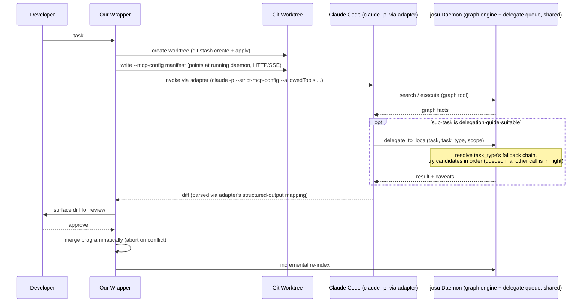
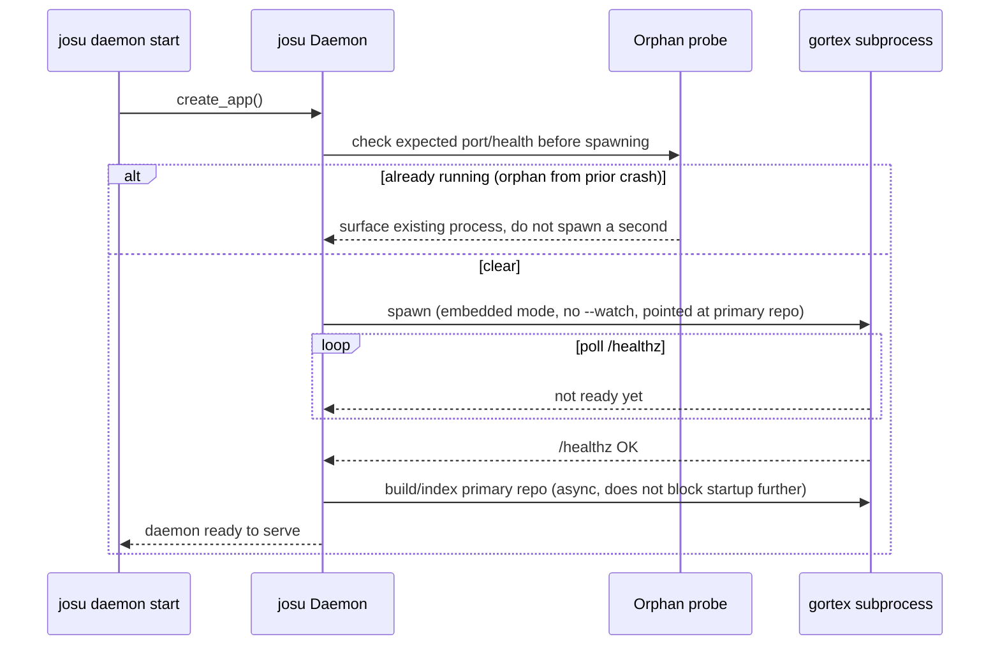
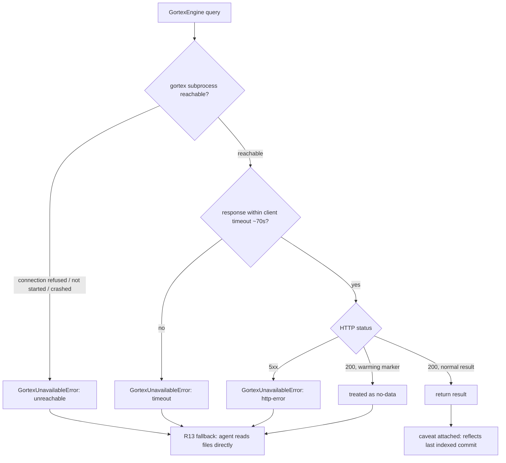
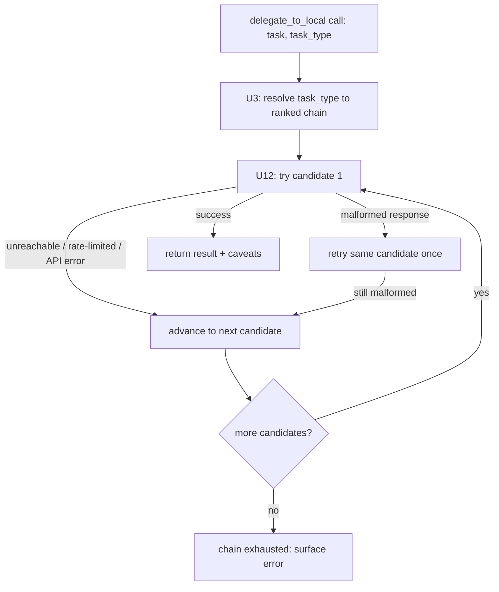

# Hybrid Local/Hosted Coding Agent — Core Architecture

## Summary

Build a Python package where Claude Code drives coding tasks as the primary orchestrator in an isolated git worktree, connecting to two custom MCP servers we provide — a gortex-built code-relationship graph and a delegate-worker tool — so it can offload bounded sub-tasks (file summaries, boilerplate, simple search) to a cheaper delegate model while keeping complex work itself. The delegate worker is provider-agnostic (any OpenAI-compatible endpoint, local or remote), selected per task type via a free-local-first ranked fallback chain, and new hosted CLI orchestrators beyond Claude Code are addable through a config-driven adapter rather than hand-written code. Delivered in three phases: the core delegation loop, quota-exhaustion and lifecycle completeness, then the ongoing proactive-check loop.

---

## Problem Frame

The origin requirements document (see origin) was substantially revised mid-brainstorm: an earlier local-primary design was reversed after benchmark research showed local models specifically collapse on sustained multi-turn tool-calling — the exact role that design assigned them. This plan implements the revised, hosted-primary architecture: Claude Code drives as it already does when used directly, and a delegate worker is exposed to it as a callable MCP tool for bounded sub-tasks a static delegation guide marks suitable. This plan supersedes an earlier version of itself written against the pre-flip architecture — nearly every unit below is new or substantially reworked, not patched.

The origin document was revised a second time to generalize the delegate worker beyond Ollama-only and to add a config-driven adapter mechanism for hosted CLI orchestrators, motivated by the maturing open-weight model ecosystem (some remote open-weight models now clear a higher capability bar than local hardware supports) and by a gap between what the v1 delegate client claimed ("generic OpenAI-compatible fallback") and what it actually implemented (hardcoded to Ollama's own SDK). This plan revision implements that generalization. Repo research confirmed two of the original plan's units — U3 (Delegation Guide) and U4 (Claude Code Orchestrator Invocation) — were never actually built, so this revision updates them in place to their final, richer form rather than building a simpler version first and upgrading it later.

The origin document was revised a third time to replace graphify with gortex (`github.com/zzet/gortex`) as the v1 graph engine, motivated by graphify's Python-based extraction struggling to stay fast as a codebase grows and its multi-repo support being a post-hoc merge of independently-built graphs rather than real cross-repo relationship edges. This plan revision implements that swap. Unlike U3/U4's prior revision, U1 (Context Graph MCP Server) was already fully built against graphify — this is a rework of shipped code, not a first build. Planning-time research surfaced that gortex is an external Go binary/daemon reached over HTTP, not an in-process Python import the way graphify was, which introduces genuinely new surface area this plan also covers: subprocess lifecycle management (spawn, health-check, crash/orphan handling) that has no existing precedent anywhere in this codebase.

---

## Key Technical Decisions

- **Delegation is mechanized as two MCP servers Claude Code connects to, not a custom orchestrator we build.** Research confirmed Claude Code's headless mode (`claude -p`) connects to project-scoped custom MCP servers with no interactive step — trust verification is deliberately disabled in `-p` mode. This means our tool's job is providing the graph and delegate-worker MCP servers and wiring Claude Code to them per-worktree, not building a custom reasoning loop the way the pre-flip plan did. This is a major simplification versus the superseded version of this plan.
- **Both MCP servers run as one long-running local daemon process, reached over a local HTTP/SSE transport — not spawned per-worktree over stdio.** Stdio transport (each server spawned as a child process per Claude Code session) would give every worktree its own graph-engine instance and its own delegate queue, defeating the reasons those exist: a single shared graph avoids duplicate builds, and a single shared queue is the only way "one generation at a time" is actually enforced across a task's delegation, a proactive check's delegation, and a quota-fallback direct call. The daemon starts once (on first use or via `josu init`); every per-worktree manifest (U4) and every direct-call path (U7, U9) points at the same running instance. The delegate server's `local_model.py` imports `josu.graph.engine` directly in-process to query the graph — an ordinary Python import between two modules of the same daemon, not a second MCP client connection — since R11's "queryable by both" framing is about external MCP-speaking agents (Claude Code), not our own internal modules talking to each other. The graph engine itself is no longer purely in-process (see gortex decisions below): `local_model.py` still imports `josu.graph.engine`'s `GraphEngine` Protocol directly, but that Protocol's concrete implementation now makes HTTP calls to a gortex subprocess the daemon owns — the "no second MCP client connection" property holds (it's a plain `httpx` call, not MCP), but it is no longer a pure in-memory call either, which is why R13's fallback contract (below) now has to cover network failure, not just "no data."
- **Gortex runs in its standalone/embedded mode, as one long-lived subprocess josu's daemon spawns and manages — not gortex's daemon-tracked mode.** Gortex ships two operating modes: daemon-tracked (repos registered via `gortex track`, one persistent graph, gortex's own `fsnotify` watcher runs automatically per tracked repo with no documented way to disable it) and standalone/embedded (`gortex mcp --index <path> --no-daemon --server --http-addr <addr>`, a single-path index in one subprocess, with auto-watch strictly opt-in via `--watch`). Daemon-tracked mode's inherent auto-watch would silently reintroduce a second, uncontrolled trigger source alongside josu's own commit/save/merge events — the exact thing "josu keeps owning reindex-triggering" (below) exists to prevent. Standalone mode without `--watch` is the only configuration that gives josu's daemon exclusive control. Josu's daemon spawns this subprocess once, pointed at the developer's primary repo path (never an ephemeral worktree — see below), and keeps it running for the daemon's lifetime.
- **`GraphEngine`'s Protocol methods become `async def`, and `GortexEngine` is built on `httpx.AsyncClient`, not a sync client.** The existing sync Protocol (`build`/`update`/`search`/`execute`) was fine for graphify's in-process, in-memory call — but every caller (`graph/server.py`'s `async def call_tool`, `delegate/local_model.py`'s `async def delegate()`/`_graph_context()`) runs on the daemon's single asyncio event loop, and the daemon is one process serving every worktree's Claude Code session, the delegate queue, and proactive checks out of that same loop (see "one long-running local daemon process" above). A synchronous `httpx` call with a ~70s timeout (below) invoked inside that async code would block the *entire* daemon for up to 70s on a single slow or hung gortex query — a materially larger blast radius than the per-task circuit-breaker budget this plan already accounts for. This mirrors a precedent this same plan already established for the delegate client (`delegate()` becoming `async def`, U11) rather than introducing a new pattern. `graph/server.py::call_tool` and `local_model.py::_graph_context()`/`delegate()` all need their engine calls `await`ed as a consequence — a real, if small, structural change, not "no structural changes" as an earlier draft of this decision claimed.
- **Gortex is queried over its `POST /v1/tools/{name}` generic HTTP dispatch, not its MCP transport.** This is a plain REST endpoint — "invoke any tool by name with a JSON argument object" — reachable via `httpx` without standing up a second MCP client inside the daemon. `GraphEngine.execute(operation, params)` maps directly onto `POST /v1/tools/{operation}` with `params` as the body; `search(query, limit)` maps onto the same endpoint against gortex's `search` (or `search_symbols`) tool. This is what makes gortex's ~180-tool native surface reachable through R12's fixed two-tool MCP schema without josu hand-wrapping each one: any gortex tool name is a valid `execute` operation string.
- **`GortexEngine` translates every gortex-communication failure into a `RuntimeError` subclass, preserving the existing exception contract without widening any catch clauses.** `graph/server.py`'s `call_tool` catches exactly `(KeyError, ValueError, RuntimeError)`, and `delegate/local_model.py`'s `_graph_context()` catches `RuntimeError` specifically to trigger R13's file-exploration fallback. A `GortexEngine` talking HTTP naturally raises `httpx.ConnectError`/`TimeoutException`/`HTTPStatusError`, none of which are `RuntimeError` by default — a new `GortexUnavailableError(RuntimeError)` (mirroring the codebase's existing per-module narrow-exception convention: `WorktreeError`, `ReindexError`, `DaemonNotReachableError`) is raised for all of connection-refused, timeout, and 5xx responses, so both existing catch sites keep working unmodified. Internally, `GortexUnavailableError` still carries a distinguishing reason code (unreachable, timeout, http-error, warming) for U6's run log — the external fallback behavior is identical across all four, but debuggability shouldn't collapse to indistinguishable log lines just because the agent-facing behavior is uniform.
- **A query against gortex's "warming" in-band marker (returned while its initial index is still building) is treated as a no-data result and folds straight into R13's fallback — no retry or poll.** Gortex returns `warming` as part of a normal 200 response, not an error, when queried before its initial index finishes. Retrying or polling would add latency and complexity for a window that, given the startup decision below (daemon start blocks only on `/healthz`, not full indexing), is expected to be short and infrequent in practice.
- **`josu daemon start` blocks on gortex's `/healthz` liveness probe only, not on gortex's initial index completing.** Blocking on full indexing could hang daemon startup for minutes on a large repository; `/healthz` responding is enough to know the subprocess is alive and will eventually serve queries, with "warming" (above) covering the gap. Before spawning, the daemon checks for an already-running gortex process at the expected port (mirroring the existing `scan_for_crash_orphaned_worktrees()` "surface, don't silently resume" precedent for worktrees) rather than blindly spawning a second instance or failing on a port conflict with no explanation. If the `gortex` binary isn't found on `PATH` at all, daemon start fails with an actionable install-instructions message rather than a bare `FileNotFoundError`.
- **No automatic respawn of a crashed gortex subprocess in v1.** If gortex dies mid-session, the next graph query fails over to R13's fallback (via the `GortexUnavailableError` translation above) and stays there for the rest of that daemon's life — recovery is "restart `josu daemon`," a manual action, not silent auto-resumption. This matches the existing worktree-orphan philosophy (surfaced explicitly, never silently resumed) rather than introducing new supervisor/backoff machinery for a single external process.
- **Josu's own HTTP client timeout to gortex is set safely above gortex's documented 60s internal tool-call timeout (e.g. ~70s).** A shorter client timeout risks misclassifying a slow-but-working query as unreachable; a much longer one risks a hung call eating into the unrelated 20-minute per-task circuit-breaker budget (U5) invisibly. Setting the margin just above gortex's own timeout means gortex's own timeout is always the one that actually fires.
- **A gortex-backed graph response carries a caveat that the data reflects the primary repo's last indexed commit, not a task's in-progress worktree edits, surfaced the same way the delegate worker's own self-reported caveats already are.** Once gortex's richer relationship queries (blast radius, call chains) are reachable via `execute` (R12), a stale index isn't just "no data" (R13's original framing) — it can return a confidently wrong answer, e.g. missing a caller the current task just added. Active staleness detection (diffing the worktree against the indexed commit) is out of scope for v1 (see Scope Boundaries); a caveat in the tool description and delegation guidance is the cheap mitigation, consistent with the existing pattern of delegate results carrying self-reported caveats rather than a guarantee.
- **Whether a restarted gortex subprocess resumes indexing from an on-disk cache or always performs a full cold rebuild is unverified against gortex directly, and this plan does not block on resolving it.** The startup-blocking decision above (block on `/healthz` only) is deliberately robust to either answer — implementation should verify this empirically (see U15's deferred implementation note) rather than the plan guessing.
- **Whether gortex's standalone/embedded mode (a single `--index <path>` argument, no `track` registration) produces genuine cross-repo relationship edges, or whether that capability is exclusive to daemon-tracked mode, is unverified and is the most load-bearing of this plan's open questions.** R9's "real relationship edges resolved across repo boundaries" claim — the primary reason this plan replaces graphify with gortex at all — was researched and reasoned about at the mode level (daemon-tracked vs. standalone), not confirmed against the specific mode this plan commits to for the trigger-ownership reasons above. If standalone mode turns out to be single-repo-only in practice, the "josu owns triggering" decision and the "genuine cross-repo edges" requirement are in direct tension and one of them needs to be revisited — this should be the first thing verified once gortex is actually running against a fixture, before U1/U15 are considered done.
- **A spawned gortex subprocess has no explicit teardown hook in v1; the daemon's shutdown path terminates it on a clean exit, but a non-clean daemon exit (kill -9, OOM-kill) can leave it running with no operator-visible signal until the next `daemon start` reuses or replaces it.** This is a deliberate, narrower version of the existing "worktree orphans are surfaced, not silently cleaned" philosophy — the difference is that a leaked gortex process is only surfaced reactively (the next `daemon start`'s orphan probe), not proactively the way `josu cleanup` surfaces worktrees today. Revisit if this proves to leak processes in practice.
- **Claude Code is the only v1 hosted CLI; Codex CLI is deferred.** `codex exec` has no working non-interactive approval path for MCP tool calls without `--dangerously-bypass-approvals-and-sandbox` (confirmed open upstream issue, openai/codex#24135) — using it would violate the never-full-bypass rule (R19/R21/R22) this plan treats as non-negotiable. The new config-driven adapter mechanism (R36-R38, U4) doesn't change this: Codex still has to independently clear the MCP-approval gate before it's addable, however declarative its adapter config would be. Revisit if OpenAI ships a fix.
- **MCP config is written explicitly per-worktree via `--mcp-config`/`--strict-mcp-config`, not left to ambient `.mcp.json` discovery, and validated immediately before invocation.** This gives each run a deterministic, reviewable manifest — only the daemon's two servers are available, nothing picked up ambiently — which matters given headless mode's trust-dialog bypass means these servers connect without a human ever consenting in that session. Because that bypass means nothing catches a tampered or buggy manifest at the trust-dialog step, the wrapper compares the freshly-written manifest's contents (server URLs) against the known-good daemon address immediately before calling `claude -p`, closing the generation-to-invocation gap.
- **Tool-call permissions use `--allowedTools` scoped to the two MCP tools plus a minimal, narrowly-scoped file/shell set, never `--dangerously-skip-permissions`/`bypassPermissions`.** MCP trust-dialog bypass (mechanical, headless-mode-only) is a separate lever from tool-call permission bypass (a policy choice); this plan uses the former (unavoidable in headless mode) but never the latter. `Bash(git *)` as a wildcard is explicitly rejected: git worktrees share the same object database, refs, and remotes as the main repository, so a wildcard grant would let an unattended run push, force-reset, or remove other worktrees — a silent violation of R18/R20's isolation and diff-review invariants through a permission loophole, not the literal bypass flag. The allowlist instead names specific safe subcommands (`status`, `diff`, `add`, `commit`), excludes `push`, `reset`, `clean`, `worktree`, and `config`/`-c` (git aliases are a known shell-escape vector — `git config alias.x '!<cmd>'; git x` still matches a `git *` pattern while running arbitrary commands), and `Read`/`Edit` are verified by the wrapper to resolve only under the worktree root before a diff is treated as valid.
- **Delegation guidance splits across two channels: a narrow MCP tool description for mechanical usage, and a project-level `CLAUDE.md` for richer policy.** Confirmed by Anthropic's own engineering guidance that tool descriptions materially steer tool-choice (not a hack), but a single description string can't hold nuanced, evolving policy (thresholds, examples) the way a project doc can. The tool description carries "use for X, not for Y" plus latency/cost hints; `CLAUDE.md` carries the fuller delegation guide, now chain-aware (see U3).
- **The delegate worker returns structured output (result plus self-reported caveats), and the tool description instructs Claude Code to spot-check before accepting it — an unverifiable, best-effort mitigation, not a guaranteed control.** This is the only lever available against a black-box hosted CLI we don't control the internals of, for delegated results that are well-formed but substantively wrong. There is no way to test whether Claude Code actually performs the spot-check in a given run — it's a prompting convention, not an enforced mechanism — so this is recorded as an accepted, observed-not-verified risk (see Risks & Dependencies) rather than a unit with test coverage claiming it works.
- **Concurrent delegate calls are serialized through a single queue owned by the shared daemon (not a per-process queue); queued wait time counts against neither the per-call timeout nor the orchestrator's wall-clock timeout.** A single locally-served model handles one generation efficiently at a time, and a task's delegation can overlap a proactive check's or a quota-fallback call's — only enforceable because all three paths share the same daemon and queue. Both timeout clocks start when a call begins executing, not while queued, so a queued-but-healthy call is never misclassified as hung or as a runaway orchestrator — the run log records queue-wait as a distinguishable cause, not folded into "timed out." A chain execution (U12) holds the single shared queue slot for its full multi-candidate attempt, not per-candidate-attempt, so a chain retry never lets a second, unrelated call jump the queue mid-chain. **This invariant did not actually hold once U7 and U9 were implemented** — each built its own `DelegateQueue()` in its own OS process instead of calling into the daemon's — a Tier 2 code review gap closed by U14's internal HTTP route rather than an MCP client, since MCP's SSE protocol is overhead this internal, one-shot call doesn't need.
- **U13's orchestrator main loop and U14's daemon-routed delegate calls both require the daemon to already be running.** This was always the plan's stated design (the daemon is shared, always-on local infrastructure hosting the graph both models query), not a new restriction introduced by these units — R28's "quota fallback works when hosted is degraded" refers to Claude Code/Anthropic's service being unavailable, not the local daemon. Neither unit auto-starts the daemon from a CLI command or git hook; both fail with an actionable "start it with `josu daemon start`" message, consistent with R27's existing no-automatic-background-process philosophy.
- **The delegate client is hand-rolled on `httpx` (already a transitive dependency), not the `openai` SDK.** Research confirmed the SDK's surface (files, embeddings, assistants, batch, fine-tuning) is overwhelmingly unused weight for josu's one call shape (non-streaming chat completions, JSON-mode), pulls in several new hard dependencies (`distro`, `tqdm`, `jiter`) for that one endpoint, and — critically — doesn't cover the "malformed response" failure leg josu's own retry logic (R24) already needs regardless of transport. The generalized client replicates the SDK's useful three-way error split (connection/timeout, rate-limit, other-API-error) in roughly twenty lines on top of `httpx.AsyncClient`, without the dependency cost.
- **`delegate()` becomes `async def`, and `DelegateQueue` is updated to await coroutines directly rather than wrap a sync callable via `asyncio.to_thread`.** `httpx.AsyncClient` is the whole reason to hand-roll the client this way; bridging it back to a sync call inside a thread-pool worker would throw away that benefit for no gain, since concurrency is already fully serialized by the queue's single lock regardless of sync or async. This is a real change to `local_model.py`'s and `queue.py`'s existing contracts (both currently sync-callable, per `local_model.py`'s own docstring), not a detail internal to U11 alone — architecture review confirmed the plan's earlier "mirrors `GraphEngine`'s Protocol pattern" framing glossed over this, since `GraphEngine` is sync and build-then-query while `DelegateClient` is async and per-call. The mirrored part is the Protocol-as-swap-boundary idiom, not the execution model.
- **`DelegateQueue` gains a `run_chain()` method that holds one lock acquisition across an ordered sequence of per-candidate `(callable, timeout)` attempts, not a new acquisition per candidate.** This is the queue-ownership decision the "chain execution holds the single shared queue slot for its full duration" framing requires, made explicit as an actual interface change rather than left implicit: releasing and reacquiring the lock between candidates would let an unrelated caller's request interleave mid-chain, defeating the reason the queue exists. Each candidate's own timeout (R24) still applies independently within that single hold — the lock spans the chain, timeouts don't.
- **Holding the queue for a chain's full multi-candidate worst case can block a local-only proactive check (R39) behind an unrelated task's remote-fallback chain — accepted as a v1 tradeoff, not silently unaddressed.** Proactive checks already skip rather than wait when no local candidate is available (R39), and their own chains are local-only and therefore short (no network legs); a queued-but-healthy wait during another chain's remote fallback is a latency cost, not a correctness or cost problem. Revisit only if this proves disruptive in practice.
- **The exception taxonomy distinguishes unreachable, rate-limited, API-error, and malformed-response as four distinct conditions, because U12's fallback-chain logic needs to react differently to each — and none of the four ever include the raw `Authorization` header or resolved key value in their `str()`/`repr()`, only the candidate name and the env var *name*.** Unreachable (`httpx.ConnectError`/`ConnectTimeout`), rate-limited (`HTTP 429`, capturing `Retry-After`), and other API errors all advance the fallback chain to the next candidate (R34). A malformed response (200 OK, unparseable body) instead triggers the existing same-candidate one-retry-then-fail behavior (R24) — a genuinely different repair strategy, since the candidate is reachable and functioning, just returned garbage once. Security review flagged that some APIs echo submitted keys (masked or not) in error bodies; the exception types are the enforcement point that keeps that out of anything downstream (logs, error messages) touches.
- **Retry semantics live at exactly two layers, and a third generic HTTP retry-with-backoff layer is deliberately not added.** R24's malformed-response retry (same candidate, re-ask) and R34's chain-advance (different candidate) are sufficient and were confirmed via research as the right shape to keep distinct — layering a generic backoff-retry (e.g. via `tenacity`) on top of either would fight the fallback-chain design by retrying at the wrong layer.
- **Chain-execution/retry-advance logic is a standalone function in `delegate/chain.py`, not inline inside `server.py`'s `call_tool`.** Architecture review found the original framing would have collapsed five concerns (MCP transport, argument coercion, chain resolution, two distinct retry decision trees, exception-to-MCP-error mapping) into one function, coupling chain-retry logic to MCP scaffolding it doesn't need. `chain.py` owns candidate iteration and the R24-vs-R34 decision tree; `server.py`'s `call_tool` is reduced to resolve chain → call `chain.execute_chain(...)` → map its outcome to MCP content blocks. This also gives U7 (quota fallback) and U9 (proactive checks) — both of which call the delegate path directly, not through Claude Code — a clean non-MCP entry point to reuse, instead of risking a second, duplicated retry implementation outside the MCP surface.
- **Config is split into a `config/` package (`delegate.py`, `chains.py`, `orchestrator.py`, `__init__.py`), not one growing `config.py` file, loaded via stdlib `tomllib` and validated with plain `pydantic.BaseModel` subclasses — not `pydantic-settings`, not YAML.** The repo has zero existing config-loading pattern to match. `pydantic-settings` (already a transitive dependency, so free to add) was considered and rejected: its one-field-one-fixed-env-var model doesn't fit "a developer-defined list of candidates, each carrying a *string naming* an env var" — LiteLLM (the project's own cited fallback-chain precedent) solves exactly this with a plain-string env-var-reference convention in its config, confirming this is the established idiom for the problem class. The package split (over one shared file) follows architecture review: three genuinely distinct, independently-owned schemas (candidate registry/credentials, task-type chains, orchestrator adapters) touched by four different units across two phases shouldn't share one growing module, and it preserves the repo's existing convention of one test module mirroring one source module.
- **`curated.py`'s hardcoded `CURATED_MODELS` table stays a small, name-keyed `min_ram_gb` lookup, consulted by — but not replaced by — `config/delegate.py`'s TOML-loaded candidate roster.** The actual configurable delegate roster that satisfies R30 ("adding a new delegate requires no code change") lives in TOML; a candidate's `model` string is looked up in `CURATED_MODELS` for the preflight RAM estimate when one exists, falling through to "untested" exactly as `preflight_check` already does today, preserving existing behavior rather than requiring every new candidate to also touch hardcoded Python.
- **Fallback chains rank free/local delegate candidates before paid remote candidates by default (R33).** Once a remote, paid delegate (e.g. Kimi via a hosted API) is a valid chain entry, this default is what keeps the original cost-savings thesis intact — paid delegates are a fallback, not the default path. The developer can reorder a specific chain to change this.
- **A remote delegate candidate is only ever eligible in any chain when the developer has set an explicit `allow_remote = true` config-level opt-in (default `false`).** Free-local-first ordering above controls preference among already-eligible candidates, but doesn't by itself stop a developer from silently sending task/scope/graph-context content — potentially real source code — off-machine to a third-party API the moment one remote candidate happens to be configured. That's a materially different trust boundary than local-only operation, and the origin doc's cost-savings thesis never turned on remote delegation being on by default, so this is a cheap, structural safeguard: `config/chains.py`'s chain-builder excludes remote candidates from every chain, including developer-authored ones, until this flag is set. A per-path exclusion list (e.g., never delegate files matching a pattern) is a reasonable future extension but is deferred (see Scope Boundaries) rather than built now against no concrete incident.
- **Credential fields are always `api_key_env: str` (an env var name), never `api_key: str` — a schema-level enforcement of R31, not just a runtime check.** The config schema has no field capable of holding a raw secret at all. Env var *existence* is validated eagerly at config-load time (a warning if a referenced variable isn't set, without ever including the variable's *value* in that warning), but *resolution* is lazy, at call time — a missing credential for one candidate degrades that candidate to unreachable and lets the chain advance (R34) rather than crashing config load for the whole system over one bad candidate. Credential rotation or revocation mid-run is not handled specially: a chain execution resolves its credential once at call start (see Scope Boundaries).
- **The config file (`josu.toml`) lives outside any git-tracked project tree by default, at an XDG-style path (`~/.config/josu/josu.toml`, or a per-project override under `~/.config/josu/projects/<hash>.toml`), created with `0600` permissions.** Security review flagged that leaving this genuinely undecided (as an earlier revision of this plan did) risks the file landing in the project root, adjacent to what U4's `git add *`/`git commit *` allowlist can touch, or on a shared machine with default-permissive file modes. Config load stats the file and warns (or refuses in a `--strict` mode) if group/world-readable bits are set, mirroring `ssh`'s own private-key permission convention. If a project-root override is ever supported, `josu init` writes a `.gitignore` entry for it unconditionally, not left to the developer to remember; separately, U4's worktree path-check is extended to exclude `josu.toml` from anything the git allowlist can stage, so even a project-root override can't be swept into a commit by an unattended run.
- **The daemon binds to `127.0.0.1` (loopback) only by default; binding to a non-loopback address is an explicit opt-in that surfaces a warning.** Credential resolution happens inside the daemon at call time — anything that can reach its HTTP endpoint can trigger use of a resolved remote-API credential (a cost/quota exposure, not a raw-key leak) without ever seeing the key itself, so the daemon's own network exposure is part of the credential-handling design, not a separate concern.
- **The run log (U6) persists delegation metadata — candidate name, chain outcome, timing, caveats, a sanitized error *class* — never raw HTTP headers, raw upstream error bodies, or full verbatim request/response payloads by default.** Security review identified the run log as the highest-risk sink for accidental leakage even with a correct exception taxonomy, since it's the one place designed to persist indefinitely to disk. A verbose, full-payload log level is a deferred, explicit opt-in (see Scope Boundaries), not default-on behavior.
- **The MCP-approval gate for a new orchestrator adapter (R37) is a manual attestation *record*, `{verified: bool, verified_date: date}`, not a bare boolean — trimmed back from an earlier version of this decision that also included a `cli_version` field and version-mismatch checking.** A bare `bool` gives no record of when an adapter was last independently confirmed, so a developer (including future-you) could flip it to `true` from memory without re-checking; `verified_date` closes that gap with a load-time staleness warning (e.g. past six months) when `verified` is `true`. The `cli_version`/version-mismatch-checking machinery from the earlier version was cut: it requires the loader to probe the invoked CLI's reported version, real added complexity for a problem — attestation drift across CLI versions — that has exactly one adapter instance to protect in v1 (Claude Code). Revisit if a second adapter makes version-tracking a real, observed problem rather than a hypothetical one. The loader still refuses to make an adapter available when `verified` is `false`.
- **Proactive checks (R39) are restricted to local-only candidates by construction, not by a runtime filter.** The `proactive_check` task-type category's chain-building logic in `config/chains.py` only ever selects `local=True` candidates — a remote candidate configured and ranked first for other task types is never eligible here, since F3 fires on every commit/save and an unbounded fallback to a paid remote candidate on that cadence would produce real, unpredictable cost.
- **A pre-flight hardware-fit check gates local candidate loading only; remote candidates skip it entirely (R26/R35).** `curated.py`'s `preflight_check` now branches on the candidate's `local` field — VRAM/RAM estimation only runs for `local=True` entries; a remote candidate has no footprint on the developer's machine and is instead subject to U12's call-time reachability handling, not a pre-load check.
- **The hosted orchestrator runs isolated and unattended by default; review moves to merge-time, not action-time.** It runs in an isolated git worktree (seeded with the developer's uncommitted/staged changes via `git stash create`, not just the last commit) with prompts silenced via an explicit allowlist — never a full permission-bypass mode. Work is surfaced as a diff for developer review before it merges; if the developer's real working tree has diverged since the worktree was created, the merge aborts cleanly and surfaces the conflict rather than partially applying it.
- **A new hosted CLI orchestrator is addable via a config-driven adapter declaring invocation and a structured-output field mapping, with Claude Code built as the reference implementation of that same contract rather than a hardcoded special case — and this claim is scoped honestly, not oversold.** Repo research confirmed no orchestrator invocation code exists yet, so building Claude Code adapter-shaped from the start avoids a later refactor. What "config-driven" actually delivers: invocation (command/flags/placeholders) is fully declarative for every adapter, and a *flat* field-mapping onto a CLI's structured output needs no code at all. Claude Code's own adapter still needs a small amount of CLI-specific output-parsing code beyond that flat mapping, because its `stream-json` shape isn't flat — this is expected for any CLI whose structured output has real nesting, not a failure of the mechanism, but it means "no hand-written parser" is not literally true for every adapter and the plan doesn't claim otherwise. The real boundary (R38) is: a CLI with irregular or text-only output — no structured mode to map onto at all — isn't addable via this mechanism at any tier and needs a hand-written adapter outside it entirely; a CLI with structured-but-nested output (like Claude Code) is addable with declarative invocation plus a small adapter-specific parsing shim, which is still a large reduction from a fully hand-rolled orchestrator integration.
- **Adapter invocation uses argv-list subprocess execution (`shell=False`), never shell-string interpolation, with `command` validated against an allowlist at config-load time.** The invocation template's `{worktree}`/`{mcp_config}`/`{task}` placeholders are substituted per-argument into the argv list, never concatenated into a shell command string — this is what prevents a value containing shell metacharacters from escaping its intended argument slot. Since adapter config is designed to be declarative and shareable (the whole point of R36), a malformed or malicious adapter entry is a realistic input to guard against, not just a theoretical one; the `command` allowlist and argv-only execution are the enforcement points, not the `mcp_approval_verified` attestation, which vouches for MCP-approval behavior and says nothing about the safety of the invocation template itself.
- **Per-adapter quota/rate-limit detection is deferred to implementation-time research against each hosted CLI's actual error surface**, not resolved at the plan level — this is adapter-specific engineering (what error type/exit code distinguishes "out of quota" from "auth failure" or "network blip"), not a cross-cutting design decision.
- **Quota-exhaustion fallback (R28) routes only already-bounded developer requests directly to the delegate worker, bypassing Claude Code entirely — it does not auto-decompose arbitrary tasks.** Flow analysis found that decomposing a complex request into delegable/non-delegable pieces requires an orchestrator, which is exactly what's unavailable during the outage; scoping the fallback to direct, already-bounded asks avoids needing a second mini-orchestrator.
- **The "delegated share trends upward" success criterion is measured from actual delegations only.** Whether Claude Code silently declines to delegate a guide-suitable moment isn't observable from outside a black-box CLI without it self-reporting, which can't be relied on. This is a known, accepted measurement gap, not solved in v1.
- **The hosted orchestrator's worktree is seeded via `git stash create` (non-destructive), never `git stash push`** — the developer's real working tree stays untouched and usable during a run.
- **The orchestrator performs the merge programmatically after developer approval**, aborting cleanly on conflict if the real working tree diverged since the worktree was created — this is also the concrete, observable event the incremental re-index (R14) needs.
- **Git worktree lifecycle uses `subprocess` + the `git worktree` CLI directly, not GitPython** — GitPython has no worktree support (upstream issue closed, won't-fix) and would only wrap subprocess anyway.
- **Worktree cleanup never runs automatically in the background** — auto-delete on merge/rejection only; abandoned worktrees are listed/removed via an explicit developer command.
- **The v1 graph covers gortex's code-relationship extraction only (imports, calls, class/function relationships, cross-repo edges) — not unstructured content (docs, papers, PDFs).** Gortex's own indexing (tree-sitter-based) needs no LLM in the loop, matching the same "re-index must be cheap and free on every commit/save" requirement (R14) the original graphify-based design was built around. Graphify is dropped from the active build entirely — not deleted from consideration, but reserved for if/when unstructured-content ingestion is scoped in later, since gortex is code-only by design (see origin).
- **`graph/index.py`'s incremental-reindex logic goes through the `GraphEngine.update()` Protocol method properly, instead of reaching into engine internals directly.** The graphify-era implementation bypassed the `GraphEngine` interface — calling graphify's `extract`/`build_merge` functions directly and poking `GraphifyEngine._graph`/`_root` private fields to hand it the merged result, because `GraphifyEngine.update()` itself ignored the caller-supplied changed-file list and recomputed it from graphify's own manifest. Gortex's `reindex_repository` tool accepts an explicit `paths` argument, so `GortexEngine.update(root, changed_files)` can honor the caller-supplied list directly — removing the reason for `index.py`'s workaround and letting it call through the Protocol like any other consumer, a genuine simplification the swap enables rather than just requires.

---

## High-Level Technical Design



Direct-request quota fallback (R28) and proactive checks (U9) are simpler paths that call the same daemon directly — no worktree or Claude Code invocation at all, and they share the same queue as any in-flight task delegation. U9's proactive-check calls resolve only local-only chains (R39), never the general per-task-type chain.

Gortex's subprocess lifecycle (U15) and the failure-signature mapping into R13's fallback are new surface area this revision introduces, with no prior precedent in the codebase:







---

## Output Structure

```
josu/
├── pyproject.toml
├── src/josu/
│   ├── cli.py                       # entry point: init, run, models, cleanup, log
│   ├── daemon.py                     # long-running process hosting graph + delegate MCP servers (HTTP/SSE)
│   ├── config/
│   │   ├── __init__.py                # loads josu.toml, composes one top-level config object; cross-cutting settings (timeouts)
│   │   ├── delegate.py                # delegate-candidate registry schema (U11): endpoint, api_key_env, local flag
│   │   ├── chains.py                  # per-task-type fallback-chain schema + local-only filtering (U3)
│   │   └── orchestrator.py            # orchestrator-adapter contract + mcp_approval_verified attestation (U4)
│   ├── graph/
│   │   ├── server.py                 # MCP low-level server (graph tools), mounted in daemon.py
│   │   ├── gortex.py                  # GortexEngine: httpx client over gortex's /v1/tools/{name}
│   │   ├── gortex_process.py          # subprocess lifecycle: spawn, /healthz poll, orphan check
│   │   ├── index.py                  # content-hash incremental re-index, calls engine.update()
│   │   └── engine.py                 # swappable graph-engine interface + GortexUnavailableError
│   ├── delegate/
│   │   ├── server.py                 # thin MCP transport: parses args, calls chain.py, maps outcome to MCP content blocks
│   │   ├── chain.py                  # standalone chain-execution/retry-advance logic (U12); reused by fallback/quota.py and proactive/watchers.py
│   │   ├── queue.py                  # single shared async queue; holds one lock across a full chain attempt via run_chain()
│   │   ├── client.py                 # generic async OpenAI-compatible HTTP client + exception taxonomy
│   │   └── local_model.py            # async delegate() entry point; client-agnostic (Protocol-typed), imports graph/engine.py in-process
│   ├── models/
│   │   └── curated.py                # curated candidate registry (local + remote), hardware-fit check (local only)
│   ├── orchestrator/
│   │   ├── worktree.py               # isolated worktree lifecycle (stash create/apply)
│   │   ├── mcp_manifest.py           # per-worktree --mcp-config generation, points at the daemon
│   │   ├── adapter.py                # config-driven adapter Protocol + invocation/output-mapping engine
│   │   ├── adapters/
│   │   │   └── claude_code.py        # Claude Code's adapter entry: reference implementation of the adapter contract
│   │   ├── merge.py                  # diff review + programmatic merge, conflict abort
│   │   └── circuit_breaker.py        # wall-clock timeout, per-call delegate timeout
│   ├── fallback/
│   │   └── quota.py                  # per-adapter quota detection, direct-request routing
│   ├── proactive/
│   │   └── watchers.py               # commit/save triggers, debounce
│   ├── observability/
│   │   └── runlog.py                 # local run log
│   └── CLAUDE.md.template            # project-level delegation policy doc
└── tests/
```

---

## Requirements

Full detail and rationale in origin; carried forward here under the same R-IDs for traceability, grouped by capability.

**Primary Orchestration**

- R1. A hosted CLI agent from a pre-approved, tested list drives the coding task loop end to end, the way it already does when used directly.
- R2. The developer chooses which delegate candidates — local models or remote OpenAI-API-compatible endpoints, from a curated list or a generic fallback — are available for delegation; not locked to a single hardcoded model.
- R3. Adding a new hosted CLI agent to the pre-approved list requires a tested adapter for its invocation and output-parsing mechanics before it's usable.

**Delegation**

- R4. The hosted orchestrator can delegate a specific, bounded sub-task to the delegate worker rather than performing it directly.
- R5. Delegation decisions are guided by a static, predefined reference mapping task types to a ranked fallback chain of suitable delegate candidates, not a dynamic or self-learning router.
- R6. The delegation guide ships with sensible defaults and is developer-overridable.
- R7. The developer can force a specific delegation choice, overriding the guide's default.
- R8. When delegating, the hosted orchestrator gives the delegate worker access to the same context graph.

**Context Graph**

- R9. The graph builds over an arbitrary directory tree, with real relationship edges resolved across repo boundaries.
- R10. Gortex is the v1 graph engine, wired behind a swappable interface.
- R11. The graph is exposed as an MCP server queryable by both the hosted orchestrator and the delegate worker.
- R12. The MCP server exposes a fixed `search`/`execute` tool pair; gortex's richer capabilities are reachable as named `execute` operations, not additional tools.
- R13. When the graph has no data relevant to a query, or the graph engine itself is unreachable, the querying agent falls back to direct file exploration.
- R14. The graph re-indexes incrementally via content-hash change detection, triggered by commit/save events and when the hosted orchestrator's work merges — driven by josu's own event triggers, not gortex's own built-in watcher.

**Proactive Issue Detection**

- R15. The delegate worker re-evaluates the graph and surfaces potential issues on commit and debounced on-save; a serious finding wakes the hosted orchestrator.
- R16. The developer can query the graph on demand at any time.
- R17. No continuously active background process re-scans the graph on its own cadence.
- R39. Proactive checks (R15) use local delegate candidates only, never falling through a fallback chain to a paid remote candidate; if no local candidate is available, the check is skipped for that event rather than escalated to remote.

**Safety and Isolation**

- R18. The hosted orchestrator runs in an isolated git worktree seeded from the developer's current working-tree state, never directly against the real working tree.
- R19. The orchestrator's permission prompts are silenced via an explicit allowlist, never a full permission-bypass mode.
- R20. The orchestrator's work is surfaced as a diff for developer review before merging, by default.
- R21. If the developer's real working tree has diverged since the worktree was created, the merge aborts cleanly and surfaces the conflict.
- R22. The system never invokes a hosted orchestrator with a full permission-bypass mode.

**Resource and Loop Safety**

- R23. The hosted orchestrator's unattended run is bounded by a wall-clock timeout.
- R24. An individual delegated call — local or remote, whichever candidate is currently executing in a chain — is bounded by its own timeout and a retry on a malformed/invalid response.
- R25. The orchestrator maintains a local, inspectable run log recording each delegation decision and each graph interaction.
- R26. Before loading a local delegate candidate, the system estimates whether it fits the developer's available VRAM/RAM and warns or refuses rather than risking a slow swap or OOM; this check does not apply to remote delegate candidates (R35).
- R27. The developer can list and manually clean up abandoned worktrees via an explicit command; no automatic background cleanup.
- R28. When the hosted orchestrator's quota is exhausted, the developer can directly request a delegation-guide-suitable bounded task, routed straight to the delegate worker, bypassing the hosted orchestrator entirely — not an auto-decomposition of arbitrary requests.
- R29. The developer is informed explicitly when the system is operating in this hosted-unavailable, local-only degraded state.

**Delegate Provider Configuration**

- R30. A delegate candidate is defined via a config entry (endpoint, credential reference, model identifier) — adding a new OpenAI-API-compatible delegate, local or remote, requires no code change.
- R31. Credentials for a remote delegate endpoint are supplied via a reference to an environment variable, never stored as plaintext in the config file.
- R32. Each task type in the delegation guide maps to a ranked, ordered list of delegate candidates (a fallback chain), not a single fixed model.
- R33. Fallback chains rank free/local delegate candidates before paid remote candidates by default; the developer can reorder a specific chain to override this.
- R34. When a delegate candidate in a chain is unreachable, rate-limited, or errors, the system tries the next candidate in the chain before treating the sub-task as failed.
- R35. The hardware pre-flight check (R26) applies only to local delegate candidates; remote candidates are validated for reachability and auth instead.

**Hosted Orchestrator Extensibility**

- R36. A new hosted CLI orchestrator is addable to the pre-approved list via a config entry declaring its invocation command/flags and a field mapping onto its structured-output mode, without a hand-written parser — only for CLIs that ship a machine-parseable output mode.
- R37. A hosted CLI orchestrator is added to the pre-approved list only after independently confirming it supports non-interactive MCP tool approval; the config-driven adapter does not substitute for this confirmation.
- R38. A hosted CLI without a structured/machine-parseable output mode is not addable via the config-driven adapter; it requires a hand-written adapter outside this mechanism.

---

## Implementation Units

### Phase 1 — Core Delegation Loop

### U1. Context Graph MCP Server

*(Revised — `src/josu/graph/build.py`'s `GraphifyEngine` was fully implemented and shipped against graphify; this revision replaces it with a `GortexEngine` implementation of the same `GraphEngine` Protocol, talking HTTP to a gortex subprocess rather than importing a Python library in-process. `server.py`'s fixed two-tool MCP surface and `engine.py`'s Protocol shape are unchanged by design — that's the swap boundary working as intended (R10). Subprocess spawning/lifecycle is factored into U15, not this unit: `GortexEngine` itself only needs a base URL to talk to, so it's testable against a stub HTTP server independent of the real subprocess machinery. Architecture review flagged that the existing sync Protocol would block the daemon's whole event loop on a gortex call if left as-is — this revision makes the Protocol itself `async def`, a real structural change to callers, not merely an engine-class swap. Architecture review also flagged that **U1 and U15 ship together**: `daemon start` isn't functional with U1 alone, since `GortexEngine` needs U15's spawned subprocess already listening at its base URL — do not treat U1 as independently mergeable/production-ready before U15 lands.)*

- **Goal:** A gortex-backed, directory-scoped code-relationship graph exposed as an MCP server with the same fixed two-tool (`search`/`execute`) surface, queryable by both Claude Code and the delegate worker.
- **Requirements:** R9, R10, R11, R12, R13 (engine-unreachable clause)
- **Dependencies:** none (first unit); ships together with U15 for `daemon start` to be functional (see revision note above)
- **Files:** `src/josu/graph/server.py` (modified — `call_tool`'s engine calls become `await`ed, exception-catch clause may need `GortexUnavailableError` added if it isn't a direct `RuntimeError` subclass), `src/josu/graph/gortex.py` (new, replaces `build.py`), `src/josu/graph/engine.py` (Protocol methods become `async def`; adds `GortexUnavailableError`), `src/josu/daemon.py` (constructs `GortexEngine` instead of `GraphifyEngine`), `src/josu/delegate/local_model.py` (modified — `_graph_context()`'s engine call becomes `await`ed; already `async def delegate()` per U11, so this is a call-site change, not a new async boundary), `tests/graph/test_gortex.py` (new, replaces `test_build.py`), `tests/graph/test_server.py` (existing, retargeted at `GortexEngine`, converted to async), `tests/delegate/test_local_model.py` (extended — `_graph_context()` tests converted to async)
- **Approach:** `gortex.py`'s `GortexEngine(base_url)` implements `build`/`update`/`search`/`execute` as `async def` methods on `httpx.AsyncClient` (mirroring U11's `DelegateClient` pattern, not a new idiom) against gortex's `POST /v1/tools/{name}` generic dispatch — `search(query, limit)` calls the `search` tool, `execute(operation, params)` calls `POST /v1/tools/{operation}` with `params` as the body, `build(root)`/`update(root, changed_files)` call `index_repository`/`reindex_repository` respectively (the latter honoring the caller-supplied `changed_files` list directly, unlike the graphify-era implementation — see Key Technical Decisions). Every `httpx.ConnectError`/`TimeoutException`/`HTTPStatusError` (5xx) is caught and re-raised as `GortexUnavailableError(RuntimeError)`, carrying an internal reason code (`unreachable`/`timeout`/`http-error`) for U6's run log, but presenting as a plain `RuntimeError` to every existing catch site. A `warming` marker in a 200 response is treated the same as an empty result — no retry. A successful `execute`/`search` result has the staleness caveat (Key Technical Decisions) attached before returning. `server.py::call_tool` and `local_model.py::_graph_context()` `await` their engine calls; beyond that, `daemon.py` needs no further structural change beyond constructing `GortexEngine` instead of `GraphifyEngine`.
- **Patterns to follow:** the existing `GraphEngine` Protocol contract (`engine.py`) as the swap boundary; `delegate/client.py`'s `httpx.AsyncClient`-based exception-taxonomy pattern (`DelegateUnreachableError` etc., and U11's sync-to-async conversion of `delegate()`) as the direct template for both `GortexUnavailableError`'s shape and the async conversion itself.
- **Test scenarios:**
  - `list_tools()` still returns exactly two tools regardless of the underlying engine or gortex's own ~180-tool native surface (Covers R12).
  - `search`/`execute` against a stub HTTP server standing in for gortex return correctly scoped results (Covers R9's single-repo case).
  - A stub server returning `httpx.ConnectError` (connection refused) surfaces as `GortexUnavailableError`, caught by `server.py` as a generic error content block, not an unhandled exception.
  - A stub server returning HTTP 5xx and a stub server that times out both surface as `GortexUnavailableError` with a distinguishable internal reason code (unreachable vs. http-error vs. timeout), but identical external content-block behavior.
  - A stub server returning a `warming` marker is treated as a no-data result, with no retry attempted.
  - A successful `execute` result carries the last-indexed-commit caveat in its returned payload.
  - `execute` with a malformed argument still returns an MCP error content block, matching existing behavior.
  - A slow (but not timed-out) stub response does not block a concurrent, unrelated MCP call on the same daemon — proves the async conversion actually achieves non-blocking behavior, not just that the code compiles as `async def`.
- **Verification:** An MCP client connects, lists exactly two tools, and gets scoped results from `GortexEngine` backed by a stub HTTP server; the same client sees the fallback-triggering error shape (not a crash) when the stub simulates each of gortex's distinct failure signatures; a deliberately slow stub response does not stall a second, concurrent MCP session against the same daemon. Whether standalone mode's single-repo indexing actually produces genuine cross-repo edges (R9's multi-repo case) is verified against the real binary, not the stub — see the unverified-facts note in Key Technical Decisions; this unit's stub-backed tests only prove `GortexEngine`'s plumbing is payload-shape-agnostic, not that real cross-repo edges exist.

### U15. Gortex Subprocess Lifecycle

*(Placed alongside U1, not in a later phase — doc review confirmed (coherence, feasibility, scope-guardian, independently) that `daemon start` is not functional with U1 alone, since `GortexEngine` needs U15's subprocess already listening. Grouping them together makes that dependency visible in the plan's structure, not just in prose: "Phase 1 alone should validate the core loop" (Risks & Dependencies) only holds once both units are done. U15 keeps its own U-ID per the plan's stability rule — this is a placement change, not a renumbering.)*

- **Goal:** Spawn, health-check, and manage the single long-lived gortex subprocess josu's daemon depends on, with no automatic respawn on crash and no double-spawn on a prior orphan.
- **Requirements:** R10 (engine availability), supports R13/R14 (no new R-ID — this is infrastructure U1/U10 depend on, not new product behavior)
- **Dependencies:** U1
- **Files:** `src/josu/graph/gortex_process.py` (new), `src/josu/daemon.py` (modified — spawns and wires the subprocess before constructing `GortexEngine`), `src/josu/cli.py` (modified — pre-flight `gortex` binary-on-`PATH` check with actionable error, surfaced through `_cmd_daemon_start`), `tests/graph/test_gortex_process.py` (new)
- **Approach:** `gortex_process.py` exposes `spawn_gortex(root, port) -> GortexProcess` (argv-list `subprocess.Popen`, `shell=False`, mirroring `worktree.py`/`index.py`/`adapter.py`'s existing subprocess conventions — never a shell string) and `check_gortex_reachable(host, port)` (a `/healthz` probe, mirroring `daemon_client.py`'s `check_daemon_reachable()` shape). Unlike `check_daemon_reachable()`'s "any response proves a listener," this probe validates the response body against gortex's documented `/healthz` shape before treating it as a match — architecture review flagged that reusing *anything* answering that port as an authentic gortex process (the bare-GET bar used for a simple liveness check) is too permissive for a decision that then routes real graph queries to it; a non-matching response is treated as a port conflict and fails loudly, not silently reused. `daemon.py`'s startup sequence: probe the expected port first — if a validated gortex process is already there, treat it as a survivor from a prior crash and reuse it (mirroring `scan_for_crash_orphaned_worktrees()`'s "surface, don't silently resume" precedent); otherwise spawn fresh via `gortex mcp --index <primary-repo-root> --no-daemon --server --http-addr 127.0.0.1:<port>` (no `--watch` flag — see Key Technical Decisions) and poll `/healthz` with a bounded timeout before proceeding. If the `gortex` binary isn't found (`FileNotFoundError` from `Popen`), `cli.py` surfaces an actionable install message rather than a stack trace. `daemon.py` registers a clean-exit hook (signal handler for the normal stop path) that terminates the spawned gortex child; a non-clean daemon exit (`kill -9`, OOM) can still leave it running, in which case the next `daemon start`'s orphan probe is what eventually reclaims or reuses it — this is a deliberate, narrower version of the worktree-orphan philosophy, not full process supervision. No respawn/supervisor loop watches the subprocess mid-session; a crash there is discovered reactively by the next query's `GortexUnavailableError` (U1) and recovered only by a manual `josu daemon` restart.
- **Patterns to follow:** `delegate/daemon_client.py`'s `check_daemon_reachable()`/`DaemonNotReachableError` shape for the health probe (extended with response-body validation, not reused as-is); `orchestrator/worktree.py`'s `_run_git()` and `orchestrator/adapter.py`'s `invoke_adapter()` for argv-list subprocess conventions; `cli.py`'s `scan_for_crash_orphaned_worktrees()` as the direct precedent for orphan surfacing at daemon start.
- **Execution note:** Verify empirically against a real `gortex` binary, before finalizing this unit's timeout/retry constants, whether a respawned subprocess resumes indexing from an on-disk cache or performs a full cold rebuild against the same repo path (flagged as unverified in Key Technical Decisions) — this affects how long the post-spawn `/healthz`-to-ready window realistically needs to be, but not whether the plan's blocking strategy (block on `/healthz` only) is correct. Also verify, before treating U1/U15 as done, whether this standalone-mode spawn actually produces cross-repo relationship edges (also flagged as unverified) — if it doesn't, this unit's spawn arguments may need to change to a `track`-based invocation, which would also revisit the "no `--watch`" decision.
- **Test scenarios:**
  - Spawning against a repo with `gortex` present on `PATH` produces a reachable subprocess within a bounded startup window.
  - `gortex` missing from `PATH` surfaces an actionable "install gortex" message at `daemon start`, not a bare traceback.
  - A port already answering a validated gortex `/healthz` response before spawn is treated as a surviving orphaned process — no second subprocess is spawned.
  - A port answering with a non-gortex response (a different service happens to occupy it) is treated as a port conflict and fails loudly, not silently reused.
  - The spawned subprocess's argv never includes `--watch` (Covers the "josu owns triggering" decision).
  - A subprocess that exits non-zero during the health-check poll window (crash during startup) surfaces a clear daemon-start failure, not a hang or a silent fallback-everywhere state.
  - After a simulated mid-session crash (process killed), the next graph query fails over via `GortexUnavailableError`/R13 rather than hanging, and no automatic respawn is attempted.
  - A clean `josu daemon` stop terminates the spawned gortex child; a simulated `kill -9` of the daemon leaves the child running, discoverable and reusable by the next `daemon start`'s orphan probe.
- **Verification:** `josu daemon start` against a fixture repo with `gortex` installed produces a running, reachable subprocess and a ready daemon; re-running `daemon start` while the first subprocess is still alive reuses it rather than spawning a duplicate; killing the subprocess mid-session and issuing a graph query demonstrates the R13 fallback path firing, with the failure surfaced distinctly in the run log (U6); a clean daemon stop leaves no orphaned gortex process behind.

### U2. Delegate Worker MCP Server

*(Already implemented as `src/josu/delegate/server.py` + `local_model.py`, currently Ollama-specific. Definition retained below for traceability; U11 and U12 below extend it in this revision.)*

- **Goal:** Expose a delegate model as a callable MCP tool for bounded sub-tasks, returning structured output with self-reported caveats, with serialized concurrency and its own timeout/retry.
- **Requirements:** R2, R4, R8, R13, R24, R26
- **Dependencies:** U1 (delegate queries the same graph)
- **Files:** `src/josu/delegate/server.py`, `src/josu/delegate/queue.py`, `src/josu/delegate/local_model.py`, `src/josu/models/curated.py`, `tests/delegate/test_server.py`, `tests/delegate/test_queue.py`, `tests/delegate/test_curated.py`
- **Approach:** `local_model.py`'s `delegate()` structures its response as `{result, caveats}`; when a graph query returns no relevant data, it falls back to direct file exploration (R13). `queue.py` is the single, daemon-owned queue serializing every delegate call, with the per-call timeout starting at execution, not arrival. `curated.py` holds the curated model registry and runs the pre-flight VRAM/RAM fit check (R26) before any load.
- **Patterns to follow:** U1's MCP server setup pattern.
- **Test scenarios:** a bounded task returns a result plus non-empty caveats; malformed tool-call arguments are coerced and a genuinely unparseable response triggers one retry (Covers R24); unreachable connection returns a structured error; two concurrent calls serialize correctly; a too-large curated model is refused before load (Covers R26).
- **Verification:** two overlapping delegate requests against a fixture complete correctly in sequence; a too-large model request is refused before any load attempt.

### U11. Generic OpenAI-Compatible Delegate Client

- **Goal:** Replace the Ollama-SDK-hardcoded client with a generic, async, OpenAI-compatible HTTP client callable against any configured candidate (local or remote), with a differentiated exception taxonomy the fallback chain can act on.
- **Requirements:** R30, R31, R26 (revised), R35
- **Dependencies:** U2
- **Files:** `src/josu/delegate/client.py` (new), `src/josu/delegate/local_model.py` (modified — `delegate()` becomes `async def`), `src/josu/delegate/server.py` (modified — `call_tool`'s inner closure becomes `async def` and is awaited directly, not passed to `asyncio.to_thread`), `src/josu/delegate/queue.py` (modified — `run()` awaits its callable's coroutine directly instead of wrapping it via `asyncio.to_thread`), `src/josu/models/curated.py` (modified — `min_ram_gb` lookup only, no new fields; `preflight_check` call site removed from `delegate()`), `src/josu/config/delegate.py` (new), `src/josu/config/__init__.py` (new), `tests/delegate/test_client.py`, `tests/delegate/test_local_model.py` (extended and converted to async), `tests/delegate/test_server.py` (extended — existing sync-call tests converted to async), `tests/models/test_curated.py` (extended), `tests/config/test_delegate.py` (new)
- **Approach:** `client.py` defines a small `DelegateClient` `Protocol` (the same Protocol-as-swap-boundary idiom as `graph/engine.py`'s `GraphEngine`, not the same execution model — `GraphEngine` is sync/build-then-query, `DelegateClient` is async/per-call) plus one concrete async implementation on `httpx.AsyncClient`, POSTing to `{base_url}/chat/completions` with `response_format={"type": "json_object"}`, non-streaming, with a bounded maximum response size (an over-limit response is treated as malformed rather than buffered without limit). It maps `httpx.ConnectError`/`ConnectTimeout` to `DelegateUnreachableError`, HTTP 429 to `DelegateRateLimitedError` (capturing `Retry-After`), other 4xx/5xx to `DelegateAPIError`, and a 200-but-unparseable body to `DelegateMalformedResponseError` — the last of these keeps `local_model.py`'s existing one-retry-then-fail behavior (R24); the first three feed U12's chain-advance logic. None of the four exception types ever include the raw `Authorization` header or resolved key in their string representation (see Key Technical Decisions). `local_model.py`'s `delegate()` becomes `async def` and its `client` parameter changes from `ollama.Client | None` to `DelegateClient | None`; Ollama itself becomes just one configured candidate pointed at its own OpenAI-compatible `/v1` endpoint, not a special-cased code path. **This unit keeps the existing single-candidate MCP tool fully working end-to-end on the new async path** — `delegate()` becoming async is a real, breaking change to its only existing caller (`server.py`'s `call_tool`, which today builds a sync closure passed through `queue.py`'s `asyncio.to_thread`-wrapping `run()`), so U11's own scope includes making that call path async all the way through: `call_tool`'s closure becomes `async def` and is awaited directly, and `queue.run()` awaits a coroutine-returning callable instead of wrapping a sync one. U12 then builds `run_chain()` on top of this already-async foundation, rather than U11 leaving the existing tool temporarily broken. `preflight_check` is removed from inside `delegate()` entirely — U12's `chain.py` calls it before attempting a candidate it already knows is local, since the local/remote distinction lives with the chain-execution logic, not with `delegate()` itself (which no longer needs to branch on it). `config/delegate.py` defines the candidate-registry TOML schema (`[[delegate.candidates]]` tables: `name`, `endpoint`, `api_key_env: str | None`, `local: bool`, `model`) loaded via `tomllib` + `pydantic.BaseModel.model_validate`. `config/__init__.py` resolves the `josu.toml` path (XDG-style, outside any git-tracked tree by default — see Key Technical Decisions) and stats it for permission warnings before parsing.
- **Patterns to follow:** `graph/engine.py`'s `Protocol` pattern (as a swap-boundary idiom, not an execution-model template); `local_model.py`'s existing constructor-injected `client=` DI pattern; `curated.py`'s frozen-dataclass style for runtime value objects, with `pydantic.BaseModel` reserved for TOML-loaded, validated config shapes.
- **Test scenarios:**
  - A candidate pointed at a live fixture HTTP server returns a parsed `{result, caveats}`.
  - Connection refused → `DelegateUnreachableError`, distinct from a 429 or a malformed body (Covers R30).
  - HTTP 429 with a `Retry-After` header → `DelegateRateLimitedError` carrying that value.
  - 200 response with an unparseable body → one retry, then `DelegateMalformedResponseError`.
  - A response exceeding the configured maximum size is treated as malformed rather than fully buffered.
  - `DelegateUnreachableError`/`DelegateAPIError`'s string representation never contains the resolved API key or the raw `Authorization` header value, only the candidate name.
  - A remote candidate whose `api_key_env` points at an unset environment variable produces a load-time warning (without the variable's value in the message) without crashing config loading (Covers R31).
  - Ollama configured as a plain OpenAI-compatible candidate (`endpoint="http://localhost:11434/v1"`) round-trips correctly through the new generic client.
  - A `josu.toml` created with group/world-readable permissions produces a load-time warning; a `--strict` mode refuses to load it.
  - The existing single-candidate `delegate_to_local` MCP tool round-trips correctly end-to-end (`call_tool` → `queue.run()` → `delegate()` → `client.py`) on the new fully-async path, with no remaining synchronous bridging.
- **Verification:** The existing U2 test suite's behavior is preserved end-to-end against the new generic async client wired to a local Ollama candidate — the MCP tool still works after this unit lands, not only after U12; a second fixture candidate (fake remote HTTP server) proves the client is genuinely provider-agnostic.

### U3. Delegation Guide and Fallback Chains

*(Revised from the original "Delegation Guide and Tool Description" — none of this unit's files exist yet, so it's built directly in its chain-aware form rather than a simpler version first.)*

- **Goal:** Guide delegation decisions via a ranked, per-task-type fallback chain of delegate candidates, exposed to Claude Code through a narrow MCP tool description plus a fuller project-level `CLAUDE.md`.
- **Requirements:** R5, R6, R7, R32, R33, R39
- **Dependencies:** U2, U11 (chains reference the candidate registry U11 defines)
- **Files:** `src/josu/config/chains.py` (new), `src/josu/CLAUDE.md.template`, `tests/config/test_chains.py`
- **Approach:** `config/chains.py` defines a `[[delegation.chains]]` TOML section: `task_type: str`, `candidates: list[str]` (ordered, referencing names from `config/delegate.py`'s candidate registry). A `default_chain_order()` helper enforces free-local-first ordering (R33) unless a chain's order is explicitly set in TOML; chain resolution excludes any remote candidate from every chain unless a top-level `allow_remote = true` config flag is set (see Key Technical Decisions), independent of that candidate's position in TOML. Starting v1 task-type categories carry forward from the origin doc's guide (file/directory summarization, boilerplate/scaffolding, simple search/extraction, pattern-matched test generation are delegable; complex refactors, architecture decisions, ambiguous requirements, and security-sensitive changes stay with the hosted orchestrator). A distinct `proactive_check` task-type category (R39) is constructed with local-only candidates by construction — its chain-building helper filters to `local=True` candidates and never includes a remote one, regardless of what the general chain-builder allows elsewhere. `delegate_to_local`'s MCP tool description (U2's `server.py`) keeps its mechanical "use for X not Y" role and adds one line for the chain-exhausted case: when a delegation call returns a chain-exhausted error, perform the sub-task directly rather than retrying the same delegation or leaving it incomplete (U12 makes this outcome distinguishable in the run log). `CLAUDE.md.template` carries the fuller guide, and now also carries the graph-staleness caveat from U1's revision: graph query results reflect the primary repo's last indexed commit, not this task's own in-progress worktree edits, so a "nothing calls this" or "no callers found" result from a relationship query shouldn't be treated as certain when the task itself just added the missing piece.
- **Patterns to follow:** Anthropic's tool-description guidance; U11's `config/delegate.py` TOML+pydantic pattern, mirrored in its own module rather than sharing one.
- **Test scenarios:**
  - A chain with both a local and remote candidate resolves free-local-first by default with no explicit order given (Covers R33).
  - A chain referencing a remote candidate is built with that candidate excluded unless `allow_remote = true` is set; setting the flag makes it eligible without any other config change.
  - A chain with an explicit developer-specified order overrides the free-local-first default.
  - The `proactive_check` category's resolved chain never contains a remote candidate, even when the general chain-builder has one ranked first for another task type (Covers R39).
  - The generated `CLAUDE.md` in a worktree contains the current delegation guide content.
  - Developer override forcing a task to stay hosted is respected regardless of what the guide would otherwise suggest (Covers R7).
  - The `delegate_to_local` tool description includes the chain-exhausted-fallback instruction.
  - The generated `CLAUDE.md` contains the graph-staleness caveat text.
- **Verification:** Given a config with one local and one remote candidate, resolving the chain for a delegable task type returns local first; resolving the chain for the proactive-check category returns only the local candidate regardless of remote-candidate ranking elsewhere.

### U12. Fallback Chain Execution

- **Goal:** Execute a task-type's ranked fallback chain at call time — try each candidate in order, advancing on unreachable/rate-limited/API-error, distinct from the same-candidate malformed-response retry.
- **Requirements:** R32 (execution), R34, R24 (revised)
- **Dependencies:** U3, U11, U2
- **Files:** `src/josu/delegate/chain.py` (new — standalone chain-execution logic), `src/josu/delegate/server.py` (modified — thin `call_tool`, delegates to `chain.py`), `src/josu/delegate/queue.py` (modified — gains `run_chain()`, built on U11's already-async `run()`), `src/josu/daemon.py` (modified — loads `josu.toml` via `config/__init__.py` at startup and passes the resulting candidate/chain config into the delegate server's construction, replacing the single hardcoded `model` parameter), `src/josu/cli.py` (modified — daemon-start command accepts a config path), `tests/delegate/test_chain.py` (new — core retry/advance logic, no MCP harness), `tests/delegate/test_server.py` (extended — MCP-level round-trip only), `tests/delegate/test_queue.py` (extended), `tests/test_daemon.py` (extended)
- **Approach:** `delegate_to_local`'s tool schema gains a `task_type` argument alongside the existing `task`/`scope`; `chain.py`'s `execute_chain(task_type, task, scope, ...)` resolves the ordered candidate list via U3's chain resolver, calls `preflight_check` for any candidate in that list marked `local=True` before attempting it (skipping straight to the attempt for remote candidates — Covers R26, R35, moved here from U11 per the local/remote distinction living with chain execution, not with `delegate()` itself), then tries each candidate in sequence through `queue.py`'s new `run_chain()` method — one lock acquisition spanning the whole ordered sequence of `(candidate_fn, timeout)` pairs, each candidate's own timeout (R24) applied independently within that single hold, so the chain never releases its queue slot mid-attempt and lets an unrelated caller interleave. `execute_chain` catches `DelegateUnreachableError`, `DelegateRateLimitedError`, or `DelegateAPIError` from U11's client and advances to the next candidate before surfacing an error, exhausting the chain only as a last resort (Covers R34); a malformed response instead triggers `local_model.py`'s existing same-candidate one-retry-then-fail behavior (R24) — deliberately a second, distinct retry layer, not unified with chain-advance, per the fallback-chain design. When a chain is fully exhausted, the error surfaced to Claude Code via the MCP tool result is explicit that delegation failed for this sub-task (not a generic error), so the orchestrator can fall back to performing the sub-task itself — the tool description (U3) and `CLAUDE.md.template` instruct Claude Code to do exactly that rather than retrying the same delegation or leaving the task incomplete, and the run log (U6) records this as a distinguishable "delegation exhausted, orchestrator completed directly" outcome rather than folding it into a generic failure. `server.py`'s `call_tool` is reduced to: resolve arguments → call `chain.execute_chain(...)` → map its outcome to MCP content blocks — it no longer owns any retry/advance decision itself, which also gives U7 and U9 a clean non-MCP entry point into the same logic (Covers R24's generalization to any candidate in a chain, not just "local"). `daemon.py`'s `create_app` loads the resolved config (candidates + chains) at startup instead of a single `delegate_model` string, and passes it through to `build_delegate_server`; `cli.py`'s daemon-start command gains a config-path option (defaulting to the XDG-style location resolved by `config/__init__.py`).
- **Patterns to follow:** U2's existing exception-to-MCP-error mapping, now living in `chain.py` rather than `call_tool`; U11's exception taxonomy and async `run()`.
- **Test scenarios:**
  - First candidate unreachable, second candidate succeeds → chain advances transparently, single successful result returned (Covers R34).
  - All candidates in a chain fail → the surfaced error reflects the whole chain being exhausted, not just the last candidate's failure, and is distinguishable enough for U6's run log to record it as "exhausted" rather than a generic failure.
  - A malformed response from the first candidate triggers R24's one-retry-same-candidate behavior, not an immediate chain advance.
  - A rate-limited response's `Retry-After` value is captured for later run-log use (once U6 exists) before advancing to the next candidate.
  - `run_chain()` holds one lock acquisition across a full multi-candidate attempt — a second, unrelated `run_chain()`/`run()` call is blocked for the full duration of an in-progress chain, not just a single candidate's call, and each candidate's individual timeout is still enforced independently within that hold.
  - `execute_chain` is callable and independently testable without constructing an MCP server/session (Covers the chain.py/server.py boundary).
  - A chain containing a local candidate calls `preflight_check` before attempting it; a chain containing only remote candidates never calls it (Covers R26, R35).
  - Starting the daemon with a `josu.toml` defining two candidates constructs a delegate server that can resolve chains for both, without a hardcoded single-model parameter.
- **Verification:** A fixture chain of [dead-endpoint candidate, live fixture-server candidate] resolves successfully via the second candidate on the first real call, with the malformed-response-retry path exercised separately and shown not to trigger a chain advance; `chain.py`'s core logic is verified directly, independent of the MCP transport; the daemon starts end-to-end from a fixture `josu.toml` and serves a chain-aware delegate tool.

### U4. Hosted Orchestrator Invocation via Config-Driven Adapter

*(Revised from the original "Claude Code Orchestrator Invocation" — none of this unit's files exist yet, so it's built directly as an adapter contract with Claude Code as its reference implementation, rather than hardcoded first.)*

- **Goal:** Invoke a hosted CLI orchestrator — Claude Code as the first, reference implementation — via a config-driven adapter contract (invocation command/flags + structured-output field mapping), in an isolated worktree, with tool-call permissions scoped via allowlist — never a full permission-bypass mode.
- **Requirements:** R1, R3, R18, R19, R22, R36, R37, R38
- **Dependencies:** U1, U2, U3
- **Files:** `src/josu/orchestrator/worktree.py`, `src/josu/orchestrator/mcp_manifest.py`, `src/josu/orchestrator/adapter.py` (new), `src/josu/orchestrator/adapters/claude_code.py` (new), `src/josu/config/orchestrator.py` (new), `tests/orchestrator/test_worktree.py`, `tests/orchestrator/test_adapter.py`
- **Approach:** `config/orchestrator.py` defines the config-driven adapter contract: an adapter TOML entry names an invocation command template (`command`, `args` list with `{worktree}`/`{mcp_config}`/`{task}` placeholders, substituted per-argument into an argv list — never shell-string interpolation), a structured-output mode flag, a declarative field-mapping for extracting the result/diff from that output, and an `mcp_approval_verified` attestation record (R37) — `{verified: bool, verified_date: date}`, not a bare boolean — set by whoever adds the adapter after independently confirming it supports non-interactive MCP tool approval. `command` is validated at config-load time against a small allowlist of expected CLI binary names, independent of the MCP-approval attestation, since that attestation says nothing about invocation-template safety. The loader refuses to make an adapter available when `verified` is `false`, and warns (without blocking) when `verified_date` exceeds a staleness window. `adapter.py` (the engine, in `orchestrator/`) reads this config, validates `command` against the allowlist, and drives invocation via `subprocess` with an argv list (`shell=False`). Claude Code's adapter entry (`adapters/claude_code.py`) is the reference implementation of this contract: its invocation (`claude -p --strict-mcp-config <manifest> --allowedTools "mcp__context-graph__search,mcp__context-graph__execute,mcp__delegate-to-local__delegate_to_local,Read(<worktree>/**),Edit(<worktree>/**),Bash(git status),Bash(git diff),Bash(git add *),Bash(git commit *)"`) is fully declarative; its `--output-format stream-json` parsing and `system/init` MCP-connection confirmation need the small amount of Claude-Code-specific output-parsing code its nested JSON shape requires beyond a flat field-mapping (see Key Technical Decisions — this is expected, not a mechanism failure). The git subcommand allowlist deliberately excludes `push`, `reset`, `clean`, `worktree`, and `config`/`-c`, since worktrees share the same object database, refs, and remotes as the main repo, and is additionally extended to exclude `josu.toml` from anything `git add *`/`git commit *` can stage, even if a project-root config override is in use. The wrapper verifies every path Claude Code reads or edits resolves under the worktree root before treating the resulting diff as valid. `worktree.py` (`git stash create` + apply of current state) and `mcp_manifest.py` (explicit per-worktree manifest, validated against the known-good daemon address immediately before invocation) are unchanged in design from the original plan — those decisions don't depend on invocation being adapter-shaped. Never uses `--dangerously-skip-permissions`/`bypassPermissions`.
- **Patterns to follow:** U11's `config/` package pattern (TOML+pydantic, one module per schema); U1/U2's MCP server definitions (the manifest points the adapter's invoked CLI at the same running daemon).
- **Test scenarios:**
  - A task against a fixture repo produces a worktree seeded with the developer's current state, including uncommitted changes.
  - `system/init` output confirms both MCP servers loaded; a run where one fails to connect is flagged rather than silently proceeding.
  - The invocation never includes `--dangerously-skip-permissions`/`bypassPermissions` under any code path (Covers R19, R22).
  - The git allowlist never includes `push`, `reset`, `clean`, `worktree`, or `config`/`-c`; a simulated `git config alias.x '!<cmd>'` attempt is rejected by the allowlist.
  - A file path outside the worktree root is rejected by the wrapper's path check even if Claude Code's own tool call claimed success.
  - A task referencing a delegable sub-task results in Claude Code calling `delegate_to_local`.
  - A `{task}` or `{worktree}` value containing shell metacharacters or a path-traversal sequence does not alter the invoked command or escape its argument slot — invocation is argv-list, never a shell string.
  - An adapter entry whose `command` isn't on the allowlist is rejected at config-load time, independent of its `mcp_approval_verified` status.
  - A second adapter config entry with `mcp_approval_verified.verified = false` is not offered as a usable orchestrator, even if its command template is otherwise complete (Covers R37).
  - An adapter config entry with `verified = true` and `verified_date` older than the staleness window produces a load-time warning but is still usable (not blocked).
  - An adapter config entry with `mcp_approval_verified.verified = true` but no declarable structured-output mode is rejected at config-load time, not silently accepted then failing at invocation (Covers R38).
  - Claude Code's own adapter entry's invocation is fully declarative (config only); its output-parsing shim is the documented, expected exception to a flat field-mapping, not evidence the mechanism silently needs code everywhere (Covers R36).
- **Verification:** An escalated task against a fixture repo with an intentionally boilerplate-heavy sub-task produces a worktree, a Claude Code invocation (via its adapter) with both MCP servers connected and confirmed, and at least one `delegate_to_local` call in the resulting diff's provenance; an adapter entry missing `mcp_approval_verified = true` is demonstrably excluded from the usable adapter list at load time; an adapter entry with an off-allowlist `command` is demonstrably excluded regardless of its attestation.

### U5. Merge and Circuit Breaker

- **Goal:** Surface Claude Code's resulting diff for developer review, merge programmatically on approval with conflict handling, and bound the run's wall-clock time.
- **Requirements:** R20, R21, R23
- **Dependencies:** U4
- **Files:** `src/josu/orchestrator/merge.py`, `src/josu/orchestrator/circuit_breaker.py`, `src/josu/config/__init__.py` (extended — wall-clock timeout setting), `tests/orchestrator/test_merge.py`, `tests/orchestrator/test_circuit_breaker.py`
- **Approach:** `merge.py` surfaces the diff for developer approval; on approval, merges programmatically, aborting cleanly and surfacing the conflict if the developer's real working tree has diverged since the worktree was created. `circuit_breaker.py` enforces a wall-clock timeout on the whole Claude Code run, distinct from a per-delegate-call timeout — exceeding it stops the run and surfaces it to the developer. Time spent blocked on a queued (not yet executing) delegate call, including a multi-candidate chain attempt (U12), does not count toward this timeout.
- **Patterns to follow:** none (new subsystem).
- **Test scenarios:** approved diff merges only after explicit approval; a concurrent edit to the same file produces a surfaced conflict at merge time (Covers R21); a run exceeding its wall-clock timeout stops and is surfaced (Covers R23).
- **Verification:** a fixture-repo task with a concurrent edit produces a surfaced conflict rather than a corrupted merge; a run forced past its timeout stops cleanly.

### U6. Run Log

- **Goal:** A local, developer-inspectable record of delegation decisions and graph interactions.
- **Requirements:** R25
- **Dependencies:** U2, U4
- **Files:** `src/josu/observability/runlog.py`, `src/josu/cli.py` (log subcommand), `tests/observability/test_runlog.py`
- **Approach:** One structured local record per task run, capturing graph queries, each delegation call (what was delegated, its caveats, cost/latency, which chain candidate ultimately served it and whether any candidates were skipped en route), and circuit-breaker events. A fully-exhausted chain (U12) is recorded as a distinguishable "delegation exhausted, orchestrator completed directly" outcome, not folded into a generic failure — this is the observable signal for how often chain exhaustion actually happens in practice, separate from the already-known measurement gap on silent non-delegation. Graph query events gain a `failure_reason` field (`none`/`no-data`/`unreachable`/`timeout`/`http-error`/`warming`) sourced from U1's `GortexUnavailableError` reason codes when present — the agent-facing R13 fallback behavior is identical across all of these, but a run showing five straight `unreachable` entries is a materially different debugging signal than five `no-data` entries, and collapsing them would erase that. The record stores delegation *metadata* only — candidate name, chain outcome, timing, caveats, a sanitized error class — never raw HTTP headers, raw upstream error bodies, or full verbatim request/response payloads by default, since this is the one artifact designed to persist indefinitely to disk and is the highest-risk sink for accidental credential or sensitive-payload leakage otherwise. A verbose, full-payload log level is a deferred, explicit opt-in, not default behavior (see Scope Boundaries). No hosted telemetry; files live under the developer's project directory. `josu log` renders a run's record.
- **Patterns to follow:** none (new subsystem).
- **Test scenarios:** a task that delegates produces a run-log entry showing the delegation, its caveats, chain outcome; a task with no delegation still produces an entry; a task tripping the circuit breaker shows which limit tripped; a run-log entry for a delegation that hit `DelegateRateLimitedError`/`DelegateAPIError` contains no raw HTTP headers or upstream error body text, only the sanitized error class and candidate name; a graph query that falls back via R13 due to `GortexUnavailableError` records the specific failure reason (unreachable/timeout/http-error), distinguishable from a genuine no-data miss in the same log.
- **Verification:** after one delegating task and one non-delegating task, `josu log` shows both with enough detail to explain what happened.

---

### Phase 2 — Quota Fallback and Lifecycle

### U7. Quota-Exhaustion Direct-Request Path

- **Goal:** Detect Claude Code quota/rate-limit exhaustion and let the developer route bounded requests directly to the delegate worker, bypassing the orchestrator entirely.
- **Requirements:** R28, R29
- **Dependencies:** U2, U4, U12
- **Files:** `src/josu/fallback/quota.py`, `src/josu/cli.py` (extended), `tests/fallback/test_quota.py`
- **Approach:** `quota.py` inspects Claude Code's invocation result for a quota/rate-limit-specific signal (exact error type/exit code determined via implementation-time research, deferred per Key Technical Decisions) and distinguishes it from other failures. When detected, a developer-initiated bounded request routes directly to `delegate/chain.py`'s `execute_chain()` (U12), skipping worktree creation, the Claude Code invocation, and the MCP transport entirely; the developer is told explicitly that hosted-level work is paused until quota resets. The task whose invocation triggered detection did create a worktree that never reached approval or rejection — `quota.py` classifies that worktree as abandoned (visible to U8's cleanup command).
- **Patterns to follow:** U12's `chain.py`, called directly rather than via Claude Code or the MCP surface.
- **Test scenarios:** simulated quota signal routes a matching bounded request to the delegate worker directly, with an explicit "hosted paused" message (Covers R29); a non-quota failure does not trigger fallback mode; a complex non-bounded request during the outage waits rather than being attempted locally.
- **Verification:** with a simulated quota-exhaustion signal, a bounded developer request completes via the delegate worker alone, with no worktree or Claude Code invocation created for it.

### U8. Worktree Crash Recovery and Cleanup

- **Goal:** Bound disk usage from orchestrator worktrees and recover cleanly from a wrapper crash mid-run.
- **Requirements:** R27
- **Dependencies:** U4
- **Files:** `src/josu/orchestrator/worktree.py` (extended), `src/josu/cli.py` (cleanup subcommand), `tests/orchestrator/test_worktree_lifecycle.py`
- **Approach:** On startup, cross-reference `git worktree list --porcelain` against persisted in-flight-run state to detect orphaned worktrees and surface them as "abandoned, review or discard." `josu cleanup` lists abandoned worktrees and lets the developer choose which to remove — no automatic background sweep.
- **Patterns to follow:** U4's worktree creation/teardown patterns.
- **Test scenarios:** a simulated crash mid-run is detected on next startup and surfaced; `josu cleanup` lists abandoned worktrees with enough detail to decide and removes one cleanly; a merged or rejected worktree doesn't appear in the abandoned list.
- **Verification:** after forcibly killing the wrapper mid-run and restarting, the orphaned worktree is surfaced rather than lost; `josu cleanup` removes it on request.

---

### Phase 3 — Ongoing Maintenance Loop

### U9. Proactive Checks

- **Goal:** Commit/save-triggered issue surfacing via the delegate worker, using only local-only chains (R39), waking Claude Code only if something serious is found.
- **Requirements:** R15, R16, R17, R39
- **Dependencies:** U2, U4, U3 (local-only chain construction), U12
- **Files:** `src/josu/proactive/watchers.py`, `tests/proactive/test_watchers.py`
- **Approach:** A commit hook and a debounced file-save watcher both invoke `delegate/chain.py`'s `execute_chain()` directly (U12, not through Claude Code or the MCP transport), resolving the `proactive_check` task-type category's local-only chain (U3) to re-evaluate the relevant portion of the graph and surface issues — no standing background process (R17). If no local candidate is available, the check is skipped for that event rather than escalated to a remote candidate (R39). A local-only chain's worst-case queue-hold is short (no network legs), so the accepted latency tradeoff of potentially queuing behind another task's remote-fallback chain (see Key Technical Decisions) stays bounded in practice. Hook installation (`josu init`) detects an existing `post-commit` hook and chains to it rather than overwriting it; if a conflict can't be safely resolved, installation aborts with a warning. A serious finding invokes Claude Code (U4) for the full task loop; on-demand queries (R16) bypass event triggers entirely.
- **Patterns to follow:** U7's direct-to-`chain.py` invocation pattern.
- **Test scenarios:** a debounced save event triggers a local-only check; a commit-triggered check with no serious finding never invokes Claude Code; a serious finding invokes the full Claude Code loop; no event and no on-demand query means no scan (Covers R17); a save event with no local candidate available is skipped rather than falling to remote (Covers R39); `josu init` on a repo with an existing `post-commit` hook chains to it.
- **Verification:** a commit surfacing a minor issue produces a local-only report; one surfacing something serious triggers a full Claude Code run; a save event with local unavailable produces no check and no remote call, both visible in the run log (U6).

### U10. Incremental Re-Indexing

*(Revised — the graphify-era implementation bypassed the `GraphEngine` interface entirely, calling graphify's `extract`/`build_merge` functions directly and reaching into `GraphifyEngine._graph`/`_root` private fields to hand it the merged result, because `GraphifyEngine.update()` ignored the caller-supplied changed-file list and recomputed its own via graphify's manifest. Gortex's `reindex_repository` tool accepts an explicit `paths` argument, so this revision removes the workaround: `index.py` now calls `engine.update(root, changed_files)` through the Protocol like any other consumer — a simplification, not just a swap.)*

- **Goal:** Keep the graph current without full rebuilds, triggered by commit/save events and merges.
- **Requirements:** R14
- **Dependencies:** U1, U5, U9
- **Files:** `src/josu/graph/index.py`, `tests/graph/test_index.py`
- **Approach:** `index.py` computes the exact changed-file list from the triggering git event (commit/save/merge, unchanged from the original design) and calls `engine.update(root, changed_files)` directly through the `GraphEngine` Protocol — no more direct graphify imports and no more reaching into engine-internal fields. This also means `index.py` is now engine-agnostic in a way it wasn't before: a future engine swap changes nothing here, matching R10's swap-boundary intent more completely than the graphify-era implementation did.
- **Patterns to follow:** the `GraphEngine` Protocol contract (`engine.py`) as the sole interface `index.py` talks to.
- **Test scenarios:** a single-file commit re-indexes only that file, verified via `engine.update()` receiving exactly that file in its `changed_files` argument; a merged diff touching three files re-indexes exactly those three; an unrelated file elsewhere is untouched; `index.py` makes no direct calls into gortex-specific or graphify-specific code, only through `GraphEngine`'s Protocol methods (Covers R10's swap-boundary intent).
- **Verification:** on a fixture repo backed by a stub `GraphEngine`, editing one file and committing produces exactly one `update()` call with that file in `changed_files`; swapping the stub for a second fake engine implementation requires no change to `index.py` itself.

---

### Phase 4 — Close the Wiring Gap

*(Added after Tier 2 code review of U1-U12 found two architectural gaps: no live caller ties the individually-tested units together end-to-end, and the "single shared queue" invariant Key Technical Decisions already commits to isn't actually honored across process boundaries. Both units below close gaps against decisions this plan already made, not new product scope.)*

### U13. Orchestrator Main Loop (`josu run`)

- **Goal:** A single entry point that runs a developer-given task end-to-end — the first live caller for U5's circuit breaker and U6's run log, both fully implemented and tested but never invoked from any production path today. Composes existing tested functions; introduces no new logic of its own beyond the composition and the run-record bookkeeping.
- **Requirements:** R1, R18, R19, R20, R21, R22, R23, R25, R14 (composition unit: these are U4/U5/U6/U10's own requirements, wired together here — U13 itself introduces no new requirement)
- **Dependencies:** U4, U5, U6, U10
- **Files:** `src/josu/orchestrator/run.py` (new), `src/josu/cli.py` (new `josu run <task>` subcommand), `tests/orchestrator/test_run.py`
- **Approach:** `run_task(task, *, config, adapter_name="claude_code")` composes existing library functions rather than reimplementing them, in this exact order — the snapshot step is not optional and must be captured before the adapter runs, not after: `worktree.create_worktree()` → **`merge.snapshot_repo(worktree.repo_root, stash_ref=worktree.stash_ref)` immediately after, before anything else runs** (per `merge.py`'s own contract: the snapshot must predate the Claude Code invocation, or a concurrent edit made *during* the run would be silently baked into the "before" state and R21's divergence check would never catch it) → generate and validate the per-worktree MCP manifest → `run_under_circuit_breaker(breaker, lambda remaining: adapters.claude_code.run(..., timeout=remaining))` → on success, `merge.diff_for_review()` surfaced to the developer (the CLI prints it and prompts for approval) → `merge.merge(worktree, snapshot, approved=...)` on approval, passing the snapshot captured at step 2 → on a successful merge, `graph.index.reindex_on_merge()` (derives its own changed-path list from the merge result — Covers R14). A `RunRecord` (U6) accumulates circuit-breaker events and the run's overall outcome throughout, saved via `observability.runlog.save_run()` at the end regardless of outcome — success, developer-rejected diff, timeout, or merge-conflict-abort all produce a saved record, not just the happy path. `josu run` requires the daemon to already be running (the adapter's MCP manifest points at it, same as U14's fix below) and fails with a clear, actionable message rather than a stack trace when it isn't.
- **Patterns to follow:** compose U4/U5/U6/U10's existing tested functions; do not reimplement any of their internals. `merge.py`'s own docstring is the authority on snapshot timing — follow it literally, don't infer the ordering from the plan text alone.
- **Test scenarios:** a fixture task against a fixture repo produces a worktree, an adapter invocation, a surfaced diff, and (on approval) a merge, with a saved run-log record covering all of it; a developer-rejected diff produces a saved record with no merge; a circuit-breaker timeout produces a saved record showing the trip, with the worktree left for U8's cleanup rather than silently discarded; a successful merge triggers exactly the changed-path reindex, not a full rebuild (Covers R14); a real concurrent edit to `repo_root` made *while the adapter is running* (not before) is still caught as diverged at merge time, proving the snapshot was captured before the run started, not after (Covers R21); running with no daemon reachable produces a clear CLI error, not a stack trace.
- **Verification:** an end-to-end run against a fixture repo with a boilerplate-heavy task produces a complete run-log record spanning worktree creation through merge and reindex, inspectable via `josu log` with no code reading required; a run with a concurrent mid-run edit to the real working tree correctly aborts the merge rather than silently overwriting it.

### U14. Route Delegate Calls Through the Daemon's Shared Queue

- **Goal:** Fix `josu delegate` (U7) and the commit-hook proactive-check path (U9) to route through the daemon's already-running `DelegateQueue`, instead of each constructing its own unshared instance in a separate OS process — restoring the "single shared queue serializes every delegate call" invariant this plan's own Key Technical Decisions already commit to (see "Concurrent delegate calls are serialized through a single queue owned by the shared daemon").
- **Requirements:** closes an implementation gap against the existing shared-queue Key Technical Decision; no new R-ID (this was already the plan's stated design, not new product scope).
- **Dependencies:** U1, U2, U7, U9, U11, U12
- **Files:** `src/josu/delegate/server.py` (modified — `build_server()` gains an optional `queue: DelegateQueue | None = None` parameter instead of constructing one internally, so a caller-supplied instance can be shared), `src/josu/daemon.py` (modified — constructs one `DelegateQueue` at startup, passes it into `build_delegate_server()`, and mounts the new internal route on the same instance; new internal HTTP route alongside the existing `/graph/sse` and `/delegate/sse` mounts), `src/josu/delegate/internal_api.py` (new — the route handler; request-body validation via a `pydantic.BaseModel`, mirroring U11/U3's TOML-config validation pattern, not just a bare dict), `src/josu/cli.py` (`_cmd_delegate` calls the daemon's HTTP endpoint instead of constructing `DelegateQueue()` itself), `src/josu/proactive/watchers.py` (the commit-hook path does the same, but see the R39-preservation note below), tests updated accordingly.
- **Approach:** `build_server()` (`delegate/server.py`) currently constructs `DelegateQueue()` as a local variable never exposed outside the function — the plan's original framing ("the daemon already owns the one canonical instance") was wrong as stated; today it doesn't own an *accessible* one. Fix this first: `build_server()` accepts an optional externally-constructed `queue`, and `daemon.py`'s `create_app()` constructs exactly one `DelegateQueue`, passing the same instance into both `build_delegate_server()` (for the existing MCP tool) and the new internal route handler — otherwise the "fix" would silently create a fourth independent queue instance instead of sharing the real one. The new internal HTTP `POST` route (`internal_api.py`) accepts a validated `{task_type, task, scope}` body and calls `execute_chain()` against that shared queue and the daemon's loaded config, returning the result as JSON — a thin REST wrapper, not a second MCP surface (MCP's SSE protocol is built for Claude Code's tool-calling loop, not a one-shot CLI/hook call). **R39 preservation is not automatic and needs explicit handling:** `watchers.py`'s current local-only guarantee comes from `_local_only_execution_inputs()` rebuilding a throwaway local-only `ChainsConfig`/registry *before* ever calling `execute_chain()` — calling the new route with a bare `task_type="proactive_check"` against the daemon's *real, full* config (which may have `allow_remote=true` set globally) would silently reintroduce the exact unbounded-remote-cost risk R39 exists to prevent. Keep `_local_only_execution_inputs()`'s projection logic where it already lives, client-side in `watchers.py`, and have it call the new route with the pre-resolved local-only candidate list (or an equivalent "constrained execution" request shape) rather than a bare `task_type` string the server-side handler would resolve generally. `_cmd_delegate` and `watchers.py`'s hook entry point become `httpx` clients of this endpoint instead of importing `DelegateQueue`/`execute_chain` directly, mirroring the async-client pattern already established in `delegate/client.py`; both are already `asyncio.run()`-wrapped sync entry points today, so this swap is mechanically straightforward, not an async/sync conversion. Both fail clearly ("daemon not running — start it with `josu daemon start`") rather than silently falling back to a local queue, since a silent fallback would quietly reintroduce the exact bug this unit fixes. On the new route's trust boundary: this daemon already has two unauthenticated endpoints (loopback-binding is the only protection, an accepted residual risk from Tier 2 review) — rather than silently adding a third instance of the same posture, scope this route to a Unix domain socket (not TCP) when the platform supports it, falling back to the existing loopback-TCP posture with an explicit note in Risks & Dependencies otherwise; this is genuinely narrower-purpose (CLI/hook-only, never an MCP client) so a tighter boundary costs little.
- **Patterns to follow:** `delegate/client.py`'s existing `httpx.AsyncClient` pattern, applied to an internal call instead of an external one; U11/U3's `pydantic.BaseModel` validation pattern for the new route's request body, not a bare unchecked dict.
- **Test scenarios:** a `josu delegate` call and a concurrent commit-hook-triggered call against the same running daemon are provably serialized through the one queue — a real concurrency test proving the second waits for or safely interleaves behind the first, not a code-inspection claim; `josu delegate` with no daemon running produces the clear actionable error, not a stack trace or a silent local-queue fallback; the commit-hook's R39 local-only behavior is unchanged from the developer's perspective (still skips gracefully when no local candidate exists) even when the daemon's real config has `allow_remote=true` set globally, proving the local-only projection survives the move to a daemon-routed call; a malformed or oversized request body to the new route returns a structured error, not an unhandled exception; `build_delegate_server()`'s MCP tool and the new internal route are proven to share one lock (a call to each made to race and shown to serialize, not run concurrently against separate queue instances).
- **Verification:** starting the daemon, then issuing a `josu delegate` call and a simulated concurrent commit-hook call, shows both served through the one shared queue rather than two independent queues racing against the same local model; a chain config with `allow_remote=true` and a remote candidate ranked first for `proactive_check` still never reaches that candidate when the commit hook fires, whether called locally or through the new daemon route.

---

## Scope Boundaries

**Deferred for later** (carried from origin)

- PKM/second-brain integration.
- Team/org features: shared budget dashboards, multi-user permissions, centralized governance.
- Codex CLI as a second pre-approved hosted CLI — blocked on openai/codex#24135, independent of the earlier ToS ambiguity noted in Dependencies. The config-driven adapter mechanism (U4) doesn't change this — Codex still has to independently clear the MCP-approval gate.
- A dynamic consultant/model router across multiple hosted providers in real time based on live cost/quality scoring — distinct from both the static delegation guide (R5) and the new static, availability-driven fallback chains (R32-R34), neither of which score or learn.
- Dynamic quality-based delegate routing (RouteLLM/Martian-style, content-aware per-request model selection) — deferred pending real multi-candidate delegation usage data.
- A custom-parser escape hatch in the config-driven orchestrator adapter for CLIs with irregular or text-only output.
- A second delegate-client wire protocol (e.g. Anthropic's Messages API) — no delegate candidate under consideration needs it.
- Swapping what Claude Code's own backend talks to via Anthropic's Messages API — a different axis from both the delegate tier and the orchestrator adapter.
- Multi-CLI collaborative work.

**Outside this product's identity** (carried from origin)

- A general-purpose LLM router/gateway across hosted providers with no local-model involvement. This plan does reuse OpenRouter's own fallback-chain *mechanism* for delegate-tier reliability (U12) — mechanism reuse, not identity convergence into that category.
- A hosted, enterprise-first context/graph platform competing directly with Sourcegraph Cody or Augment Code.

**Deferred to Follow-Up Work** (plan-local)

- Adaptive/learned delegation-guide thresholds — the guide is static and developer-overridable in v1; tuning it from observed outcomes is explicitly out of scope.
- Missed-delegation-opportunity tracking for the success-criterion trend metric — not observable from outside a black-box hosted CLI without unreliable self-reporting.
- Eager env-var-existence validation vs. lazy resolution: this revision picks eager warning at config-load time, lazy resolution at call time (see Key Technical Decisions); revisiting the balance if load-time warnings prove noisy in practice is follow-up work, not a v1 gap.
- Credential rotation or revocation mid-run: a chain execution resolves its credential once at call start; a rotated/revoked credential doesn't retroactively affect an in-flight call. Not handled specially in v1 — documented here as an accepted non-gap, not a silent one.
- A verbose, full-payload run-log level (raw request/response bodies) for debugging: deferred, explicit opt-in, not default-on behavior (see U6, Key Technical Decisions).
- A per-path/pattern exclusion list for content that should never be sent to a remote delegate candidate (e.g. files matching a `.gitignore`-style pattern), even with `allow_remote` set: the top-level opt-in (Key Technical Decisions) is the v1 safeguard; finer-grained exclusion is deferred pending a concrete need.
- Gortex's daemon-tracked mode and its built-in `fsnotify` watcher as the trigger mechanism — josu's own commit/save/merge events remain the sole trigger (see Key Technical Decisions); revisit only if standalone mode's per-repo cache-warming cost proves worse in practice than daemon-tracked mode's always-on watcher.
- Automatic respawn/supervision of a crashed gortex subprocess — a manual `josu daemon` restart is the v1 recovery path; revisit if mid-session crashes prove disruptive in practice.
- Active staleness detection for gortex query results (diffing a task's worktree against the primary repo's indexed commit) — a caveat note is the v1 mitigation (see Key Technical Decisions); active detection is deferred pending evidence the caveat alone isn't sufficient.
- Mounting gortex's native MCP server surface directly to Claude Code — its capabilities stay reachable through josu's own narrow `search`/`execute` surface (R12) via `execute`'s operation-dispatch mapping onto gortex's `/v1/tools/{name}` endpoint.

---

## Risks & Dependencies

- **Codex CLI is deferred for a structural reason, not just preference** — `codex exec` cannot approve MCP tool calls non-interactively without disabling its sandbox entirely (openai/codex#24135, open). Re-check this issue's status before investing in a Codex integration.
- **Claude Code's headless MCP trust bypass is a security consideration to manage deliberately**: custom MCP servers connect with no human consent in `-p` mode, so this plan only ever points `--strict-mcp-config` at servers our own pipeline built, never at an ambient or third-party manifest.
- **The new config file is new attack surface for credential handling, now with a concrete mitigation plan rather than a deferred decision.** The schema-level `api_key_env`-not-`api_key` design prevents plaintext secrets in config by construction; the XDG-style default location outside any git-tracked tree, `0600` permissions with a load-time permission check, and the exception-taxonomy/run-log rules against ever surfacing raw headers or error bodies (Key Technical Decisions) close the downstream leak paths a schema-only design would have left open. Residual risk: this is design-level mitigation, not yet implemented or tested code — implementation should treat the permission check and the log-sanitization rule as required, not optional, test coverage.
- **The MCP-approval attestation (R37) is a trust-the-human step with a staleness/version-mismatch warning, not a fully verified control.** A `verified = true` entry is only as reliable as whoever set it and when; the attestation record (date, CLI version) and load-time warning close the "silently stale forever" gap but don't prevent a careless re-attestation without actually re-testing. This remains an accepted risk for a solo-dev tool, not a solved one.
- **The daemon's default loopback-only binding is a design decision, not yet a tested guarantee** — implementation should verify the daemon actually refuses or warns on a non-default bind address, not just document the intent.
- **The config-driven orchestrator adapter mechanism (R36-R38) is validated against exactly one real CLI in v1** — Claude Code's own adapter needs a small amount of CLI-specific output-parsing code beyond a flat field-mapping (see Key Technical Decisions), which is the honest, expected shape rather than a mechanism failure, but means the "declarative invocation + thin adapter-specific parsing" pattern is demonstrated once, not proven general. A second real adapter (post-Codex-fix, or any future CLI) is the actual test of whether this pattern holds.
- **Delegate reliability for delegated sub-tasks remains the main external dependency, now spanning more providers** — even bounded, single-shot tasks depend on the curated candidates performing consistently; structured-caveats output (U2) is a mitigation, not a guarantee, and a remote candidate adds network reliability as a second dependency axis beyond model quality.
- **Per-adapter quota detection (U7) is unresolved at the plan level** — deferred to implementation-time research against each hosted CLI's actual error surface.
- **Solo-build-viability risk carried from origin, now larger** — this revision adds a generic HTTP client, a config-loading system, a fallback-chain resolver, and an adapter engine on top of the already-real infrastructure from the original plan (two MCP servers, worktree lifecycle, a circuit breaker, quota-fallback routing). Phase 1 alone should still validate whether the core loop delivers real value before this larger surface is fully built out.
- **Anthropic's Agent SDK subscription credit is favorable and explicit** (June 2026 policy change); this plan relies on it for R1's cost model to hold as designed. Unconfirmed: whether `claude -p` headless invocations are metered under that separate Agent SDK credit pool versus regular interactive quota — affects both the cost model and exactly when R28's fallback triggers. Confirm before Phase 1 sign-off.
- **The delegate worker's spot-check mitigation (U2/U3) is an unverifiable, best-effort prompting convention, not a tested control** — no test scenario can confirm Claude Code actually performs the spot-check in a given run.
- **Gortex is a new external binary/daemon dependency with no existing precedent in this codebase for subprocess lifecycle management** — U15 builds spawn/health-check/orphan-detection from scratch, modeled on partial existing patterns (`daemon_client.py`'s reachability probe, `cli.py`'s worktree-orphan scan) rather than a single reusable subsystem. This is genuinely new surface area, not a mechanical port.
- **Three specific facts about gortex's behavior are unverified against the real binary and were explicitly flagged as such during planning**: (1) whether a respawned subprocess resumes from an on-disk cache or performs a full cold rebuild on the same repo path, (2) the exact error shape when a query targets a path/repo gortex has never indexed, (3) whether gortex's embedded mode has any special handling for a git worktree's shared `.git` object store. None of these block the plan's current design (the startup-blocking and R13-fallback strategies are written to be robust either way), but U15's execution should verify (1) before tuning startup timeouts, and (2)/(3) before assuming today's "no data" and "primary-repo-only" assumptions hold exactly as expected.
- **Indexing a large primary repository can leave graph queries silently degraded to R13's fallback (no graph context, just a caveat) for the whole warmup window, not merely a slow `josu daemon start`.** Startup itself only blocks on `/healthz`, not full indexing, and warming responses are never retried (Key Technical Decisions) — so for a very large repo, every query issued during that window gets file-exploration-only behavior, which could be long enough to be user-visible in practice. No explicit performance budget is set in this plan; revisit if real usage shows this is disruptive.

---

## Sources / Research

- Claude Code MCP configuration (`.mcp.json`, `--mcp-config`/`--strict-mcp-config`, headless trust-bypass behavior) — [code.claude.com/docs/en/mcp](https://code.claude.com/docs/en/mcp), [code.claude.com/docs/en/headless](https://code.claude.com/docs/en/headless), [code.claude.com/docs/en/security](https://code.claude.com/docs/en/security).
- Codex CLI's confirmed, open MCP-approval headless blocker — [github.com/openai/codex/issues/24135](https://github.com/openai/codex/issues/24135).
- Anthropic's tool-description-steers-tool-choice guidance — [anthropic.com/engineering/writing-tools-for-agents](https://www.anthropic.com/engineering/writing-tools-for-agents) — the basis for the delegation-guide split (tool description + `CLAUDE.md`) in U3.
- MCP Python SDK (`mcp.server.lowlevel.Server`) — pin to v1.x per SDK version churn between v1/v2.
- GitPython's lack of worktree support — [github.com/gitpython-developers/GitPython/issues/719](https://github.com/gitpython-developers/GitPython/issues/719) (closed, won't-fix).
- claude-context's Merkle-tree incremental indexing — reference design for U10.
- **`openai` Python SDK dependency footprint vs. hand-rolled `httpx` client** — [PyPI: openai v2.48.0 deps](https://pypi.org/project/openai/), [openai-python error hierarchy](https://github.com/openai/openai-python/blob/main/src/openai/_exceptions.py) — the basis for U11's client-library decision; the SDK's own three-way error split (connection, rate-limit, API-status) is the reference shape replicated without the dependency.
- **Ollama's OpenAI-compatibility layer and its `json_schema` gaps** — [docs.ollama.com/api/openai-compatibility](https://docs.ollama.com/api/openai-compatibility), [ollama/ollama#10001](https://github.com/ollama/ollama/issues/10001) — the basis for U11 sticking to `response_format: {"type": "json_object"}` rather than `json_schema` mode, for cross-provider compatibility.
- **Pydantic's "Validating File Data" pattern** (`tomllib.load()` → `BaseModel.model_validate()`) — [pydantic.dev/docs/validation/latest/examples/files](https://pydantic.dev/docs/validation/latest/examples/files/) — the basis for U11/U3's config-loading approach, distinct from the `pydantic-settings` docs.
- **LiteLLM's `os.environ/VAR_NAME` credential-reference convention** — [docs.litellm.ai/docs/proxy/configs](https://docs.litellm.ai/docs/proxy/configs) — confirms the `api_key_env`-not-`api_key` schema design matches established prior art for this exact problem, not an idiosyncratic choice.
- Origin requirements doc's Sources/Research carries the fuller product-level prior art (LM Studio's fit-check UX, Sandcastle's worktree-preservation pattern, the benchmark evidence behind the architecture flip, OpenRouter/LiteLLM/Portkey fallback-chain precedent, the Huang "Open Weights and American AI Leadership" letter, Anthropic's OpenAI-SDK compatibility layer, Ollama/vLLM's Anthropic Messages API support) — see origin for full citations.
- **gortex documentation** — [github.com/zzet/gortex](https://github.com/zzet/gortex) (repo, tagged release `v0.61.4` at research time), [docs/installation.md](https://github.com/zzet/gortex/blob/main/docs/installation.md), [docs/cli.md](https://github.com/zzet/gortex/blob/main/docs/cli.md) (CLI reference, the basis for U1/U15's command shapes), [docs/multi-repo.md](https://github.com/zzet/gortex/blob/main/docs/multi-repo.md) (daemon-tracked vs. standalone/embedded mode distinction, the basis for the standalone-mode Key Technical Decision), [docs/server.md](https://github.com/zzet/gortex/blob/main/docs/server.md) (HTTP/MCP transport, `/healthz`, timeout behavior), [docs/mcp.md](https://github.com/zzet/gortex/blob/main/docs/mcp.md) and [docs/mcp-facade-v1.md](https://github.com/zzet/gortex/blob/main/docs/mcp-facade-v1.md) (tool catalogue and the `/v1/tools/{name}` generic-dispatch shape U1's `execute()` mapping relies on).
