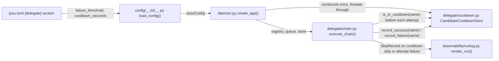

# Delegate Candidate Circuit Breaker

## Summary

Add per-candidate failure memory to josu's delegate fallback chain: a small in-memory state store tracks consecutive failures per candidate, and `execute_chain()` skips a candidate currently in cooldown instead of attempting (and timing out on) it, recovering automatically once the cooldown elapses.

## Problem Frame

`execute_chain()` (`src/josu/delegate/chain.py`) has no memory of a candidate's recent outcomes today — a candidate that's been down for the last several tasks still gets attempted, and times out, on every new task before the chain advances. Every delegate call is serialized behind one global lock (`src/josu/delegate/queue.py`'s `DelegateQueue`), so a wasted timeout on one task is lock-hold time every other queued caller waits behind. Full requirements, and the design lessons drawn from researching OmniRoute as a reference before scoping this down, are in the origin brainstorm.

---

## Key Technical Decisions

- **KTD1 — Cooldown filtering lives inside `execute_chain()`'s per-candidate attempt loop, not `resolve_chain()`/`resolve_proactive_check_chain()`.** Filtering one layer up (in the pure chain-resolution functions) would return an empty candidate list when every candidate is cooled down, raising `NoCandidatesError` instead of `ChainExhaustedError` — silently breaking the origin doc's AE2 (the chain-exhausted signal must fire unchanged when every candidate is currently unavailable). Filtering inside `execute_chain()` also means both resolvers feed the same code path, satisfying R6 without touching either one.
- **KTD2 — A cooldown-skip is reported via a new `CandidateCooldownError(DelegateError)`, not a new `SkipRecord`/`SkipEntry` field.** `execute_chain()` already has a precedent for "skip without ever building a client": the local-candidate preflight RAM check raises a `DelegateError` subclass that the existing `except DelegateError as exc` handler catches into a `SkipRecord`, with `SkipRecord.error` (`chain.py`) set to the exception's class name — that value flows into the run log's `SkipEntry.error_class` (`runlog.py`) automatically via `SkipEntry.from_skip_record()`. Reusing that path means no schema change to either dataclass — `render_run()`'s existing rendering shows the new reason with zero additional code. Trade-off: the skip reason is a class-name string, not a structured field, matching how every other skip reason already works.
- **KTD3 — The cooldown check also needs its own inner timeout inside `_attempt()`, wrapping just the `delegate()` call, separate from `queue.run_chain()`'s existing per-attempt `asyncio.wait_for()`.** `run_chain()`'s `asyncio.wait_for(fn(), timeout=timeout)` wraps the whole `_attempt()` closure from the *outside*; when it fires, the resulting `TimeoutError` is raised at `run_chain()`'s own call site, never delivered to `_attempt()`'s own `except DelegateError as exc:` block — so a candidate that simply hangs past its timeout (the exact scenario the Problem Frame names as the motivation for this feature) would never call `record_failure()` or trip cooldown under the plan's original design. The fix: `_attempt()` wraps its own `delegate()` call in `asyncio.wait_for(..., timeout=timeout)` (the same `timeout` value, already in scope via closure), catching the resulting local `TimeoutError` alongside `DelegateError` so `record_failure()` fires and a `SkipRecord` is appended before re-raising — `run_chain()`'s outer `wait_for` remains as an unchanged backstop. This also closes a small pre-existing gap where a queue-level timeout produced no `SkipRecord` at all, though closing that pre-existing gap generally is a side effect, not a goal, of this unit.
- **KTD4 — A cooldown-skipped candidate is counted in `attempted`, matching the existing preflight-failure precedent.** Both are "never built a client" skips; treating them identically keeps `_attempt()`'s bookkeeping uniform.
- **KTD5 — The cooldown check happens once, inside the lock-guarded attempt closure, not as a pre-filter before the chain's attempt list is built.** `DelegateQueue.run_chain()` acquires its lock after `chain.py` has already built the full `attempts` list, so a pre-filter would read stale state relative to the actual attempt. Checking inside the closure that `queue.run_chain()` invokes under the lock makes the check authoritative at the moment it matters, closing the narrow race a pre-filter would leave open.
- **KTD6 — Threshold and cooldown duration are read directly from raw TOML (`[delegate]` section scalars), mirroring `_load_wall_clock_timeout_seconds()`**, not added as pydantic fields on `DelegateCandidate`/`DelegateConfig`. This lets `[delegate]` host both its existing `[[delegate.candidates]]` array-of-tables and new global scalars, the same way `[orchestrator]` already hosts `wall_clock_timeout_seconds` alongside `[[orchestrator.adapters]]`. Invalid values (non-numeric, `<= 0`) degrade to the built-in default with a load-time warning, matching that helper's exact behavior — never a crashed daemon start.
- **KTD7 — No manual override to clear a stuck cooldown.** Consistent with the origin brainstorm's explicit choice of auto-recovery over manual-reset. A misconfigured cooldown value's only recourse is restarting the daemon (`josu daemon start` has no `stop`/`restart`/`reload` subcommand today), which also wipes all cooldown state per the in-memory-only design.

---

## Requirements

- R1. A candidate that fails N consecutive qualifying times during chain execution is excluded from chain attempts for a cooldown window, rather than retried (and timed out) on every subsequent task.
- R2. Once the cooldown window elapses, the candidate becomes eligible for chain attempts again automatically — no manual reset required.
- R3. A successful call to a candidate resets its consecutive-failure count.
- R4. A qualifying failure is the same exception classification `execute_chain()` already uses to advance to the next candidate (`_ADVANCE_ON`: `DelegateError`, `TimeoutError`) — no new failure taxonomy.
- R5. The failure threshold and cooldown duration are configurable in `josu.toml`, with sensible built-in defaults when unset or invalid.
- R6. Cooldown state applies uniformly to every chain a candidate can appear in — both task-type delegation chains and the proactive-check chain.
- R7. A cooldown-skip is recorded in the run log as a reason distinguishable from a same-request attempt-and-fail.

---

## High-Level Technical Design

Each candidate is implicitly healthy (absent from the store) until N consecutive qualifying failures mark it as cooling down with an expiry timestamp. The next chain resolution after expiry treats it as healthy again; a single success at any point resets its failure count to zero.

---

## Implementation Units

### U1. Candidate cooldown state store

**Goal:** A small, standalone module tracking per-candidate consecutive-failure counts and cooldown expiry, with an injectable clock for deterministic tests.

**Requirements:** R1, R2, R3

**Dependencies:** none

**Files:**
- Create: `src/josu/delegate/cooldown.py`
- Test: `tests/delegate/test_cooldown.py`

**Approach:** A class (e.g. `CandidateCooldownStore`) constructed with `failure_threshold: int`, `cooldown_seconds: float`, and `clock: Callable[[], float] = time.monotonic`, mirroring `orchestrator/circuit_breaker.py`'s `CircuitBreaker` constructor shape. Internally a `dict[str, _CandidateHealth]` keyed by candidate name, where `_CandidateHealth` holds a consecutive-failure count and an optional cooldown-expiry timestamp. Exposes `record_failure(name)` (increments the count; at threshold, sets expiry to `clock() + cooldown_seconds`), `record_success(name)` (resets count to zero, clears any expiry), and `is_in_cooldown(name) -> bool` (absent-from-dict or expiry elapsed → `False`). Every method is synchronous with no `await` inside — the store's "no lock needed" safety depends on asyncio's cooperative scheduling never yielding mid-update; state this invariant explicitly in the module docstring so a later change doesn't reopen a race by adding one.

**Patterns to follow:** `src/josu/orchestrator/circuit_breaker.py`'s `CircuitBreaker` class, for the injectable-clock constructor shape and its docstring's framing of why the clock is injectable.

**Test scenarios:**
- Happy path: fewer than `failure_threshold` consecutive failures leaves `is_in_cooldown()` `False`.
- Happy path: exactly `failure_threshold` consecutive failures trips `is_in_cooldown()` to `True`.
- Happy path: advancing the injected fake clock past `cooldown_seconds` after a trip returns `is_in_cooldown()` to `False` with no further action.
- Edge case: `record_success()` after some (but fewer than `failure_threshold`) failures resets the count — a subsequent `failure_threshold - 1` failures does not trip cooldown. Covers R3.
- Edge case: `record_success()` on a candidate already in cooldown clears it immediately, not just at expiry.
- Edge case: a candidate never seen before (`is_in_cooldown()` with no prior `record_*` call) returns `False` — implicit healthy-by-default.
- Edge case: constructing the store with `failure_threshold <= 0` raises, mirroring `CircuitBreaker.__init__`'s `if timeout_seconds <= 0: raise ValueError` guard.

**Verification:** All test scenarios pass; `CandidateCooldownStore` has no dependency on `chain.py`, `queue.py`, or `daemon.py`.

---

### U2. Cooldown config knobs in josu.toml

**Goal:** Parse `[delegate]`'s `failure_threshold`/`cooldown_seconds` scalars from raw TOML, following `_load_wall_clock_timeout_seconds()`'s exact validation convention.

**Requirements:** R5

**Dependencies:** none

**Files:**
- Modify: `src/josu/config/__init__.py`
- Test: `tests/config/test_config.py`

**Approach:** A new helper (shaped like `_load_wall_clock_timeout_seconds()`, e.g. `_load_delegate_cooldown_config(data: dict) -> tuple[int, float, list[str]]`) reads `data.get("delegate", {})["failure_threshold"]` / `["cooldown_seconds"]` directly off the parsed TOML dict, not through `DelegateConfig`'s pydantic model — so `[delegate]`'s existing `[[delegate.candidates]]` array-of-tables and these new scalars coexist. Missing key → silent default. Present-but-invalid (non-numeric, `threshold <= 0`, `cooldown_seconds < 0`) → default plus a warning appended to `JosuConfig.warnings`, never a crashed load. Add two new constants (default threshold, default cooldown seconds) and two new `JosuConfig` dataclass fields, wired into `load_config()` alongside the existing `wall_clock_timeout_seconds` wiring.

**Patterns to follow:** `src/josu/config/__init__.py`'s `_load_wall_clock_timeout_seconds()` — same function shape, same warning convention, same place in `load_config()`.

**Test scenarios:**
- Happy path: valid `[delegate] failure_threshold = 5` / `cooldown_seconds = 30` parses into `JosuConfig` unchanged.
- Edge case: `[delegate]` section absent entirely → both fields fall back to defaults, no warning.
- Edge case: `failure_threshold` zero, negative, or non-numeric → falls back to default with a warning in `JosuConfig.warnings`.
- Edge case: `cooldown_seconds` negative or non-numeric → falls back to default with a warning.
- Integration: a `josu.toml` with both `[[delegate.candidates]]` and `[delegate] failure_threshold = ...` in the same `[delegate]` section parses both correctly.

**Verification:** All test scenarios pass; `load_config()` on a `josu.toml` with no `[delegate]` cooldown keys produces the same candidate list as before this unit, plus the two new default-valued fields.

---

### U3. Cooldown-aware chain execution

**Goal:** `execute_chain()` skips a candidate currently in cooldown without attempting it, records the outcome of every real attempt back into the store, and reports a cooldown-skip distinguishably in the run log — resolving KTD1-KTD5.

**Requirements:** R1, R2, R3, R4, R6, R7

**Dependencies:** U1

**Files:**
- Modify: `src/josu/delegate/chain.py`
- Test: `tests/delegate/test_chain.py`

**Execution note:** Test-first for the cooldown-check-and-skip path specifically — this is the unit where getting "which layer filters, does the skip count as attempted, which exception reports it" wrong would silently break AE2 without any test failing to say so.

**Approach:** Add `CandidateCooldownError(DelegateError)` to the module's exception set (no new fields needed). `execute_chain()` takes a new `cooldown_store: CandidateCooldownStore` parameter, threaded from its caller (ultimately U4's daemon wiring). Inside `_make_attempt()`'s `_attempt()` closure, alongside the existing `local`-candidate preflight RAM check: if `cooldown_store.is_in_cooldown(candidate.name)`, raise `CandidateCooldownError`. This flows through the existing `except DelegateError as exc` handler unchanged — `attempted.append(candidate.name)` still runs (KTD4), a `SkipRecord` is appended with `error=type(exc).__name__` (KTD2, renders as `"CandidateCooldownError"`), and the chain advances exactly as any other `DelegateError` does today.

On the actual `delegate()` call's outcome: success calls `cooldown_store.record_success(candidate.name)`. Per KTD3, the `delegate()` call itself is wrapped in its own `asyncio.wait_for(delegate(...), timeout=timeout)` inside `_attempt()`, and the resulting local `TimeoutError` is caught alongside `DelegateError` (e.g. `except (DelegateError, TimeoutError) as exc:`) — both branches call `cooldown_store.record_failure(candidate.name)` before their own `SkipRecord` is appended and the exception re-raised. Without this inner wrapping, a candidate that hangs past `timeout` would only ever be caught by `queue.run_chain()`'s own outer `wait_for`, which raises `TimeoutError` outside `_attempt()`'s own exception handling — invisible to this unit's failure-counting.

Because every candidate in the resolved chain always gets a closure, and the cooldown check runs at the moment `queue.run_chain()` invokes that closure under the lock (not before), the check is inherently the authoritative, race-closing check KTD5 calls for — no separate pre-filter or second check is needed. `resolve_chain()`/`resolve_proactive_check_chain()` are untouched by this unit; both feed this same code path, satisfying R6.

**Patterns to follow:** `chain.py`'s existing `preflight_check()` failure path (raise a `DelegateError` subclass before building a client; caught by the same handler) is the structural template.

**Test scenarios:**
- Happy path: a candidate with no prior failures is attempted normally. Covers R1.
- Happy path: a successful call resets a previously-nonzero failure count via `record_success()`. Covers R3.
- Happy path: a candidate in cooldown is skipped without `delegate()` ever being invoked (assert via a client factory that fails the test if called), and the chain advances to the next candidate. Covers R1, R4.
- Edge case: after a candidate's cooldown expires (advance the store's injected fake clock between two `execute_chain()` calls), the next call attempts it again. Covers R2.
- Error path: a candidate whose `delegate()` call hangs past `timeout` (a fake client that sleeps longer than the configured timeout, never raising or returning) still calls `record_failure()` and produces a `SkipRecord` — proving the inner `wait_for` wrapping (KTD3), not just `queue.run_chain()`'s outer one, is what makes this observable. Covers R1, R4, R7.
- Edge case: a `resolve_proactive_check_chain()`-sourced call and a `resolve_chain()`-sourced call, both referencing the same candidate name, consult the same cooldown store — a candidate tripped via one sees it tripped via the other. Covers R6.
- Error path: every candidate in the resolved chain is currently in cooldown → `ChainExhaustedError` is raised (not `NoCandidatesError`), with one `SkipRecord` per candidate, each `error="CandidateCooldownError"`. Covers R1, R7. **Covers AE2.**
- Error path: a mixed chain (one candidate cooldown-skipped, one actually attempted and failed) produces a `ChainExhaustedError.skip_records` list distinguishing the two by `error_class`. Covers R7. **Covers AE1.**
- Integration: N consecutive qualifying failures (via a fake client that always raises an `_ADVANCE_ON`-classified exception) trip a candidate into cooldown mid-test, observable via a subsequent `execute_chain()` call skipping it. **Covers AE3.**

**Verification:** All test scenarios pass, including both AE-covering error-path scenarios; existing `test_chain.py` tests continue to pass with only the new `cooldown_store` parameter threaded through their `execute_chain()` calls (a fresh `CandidateCooldownStore` starts every candidate healthy, so existing behavior is unaffected).

---

### U4. Daemon wiring

**Goal:** Construct one `CandidateCooldownStore` per daemon process, alongside `DelegateQueue`, and thread it into every `execute_chain()` call path.

**Requirements:** R1-R7 (end-to-end wiring; no new behavior beyond making U1-U3 reachable)

**Dependencies:** U1, U2, U3

**Files:**
- Modify: `src/josu/daemon.py`
- Modify: `src/josu/delegate/server.py` — `build_server()` (imported into `daemon.py` as `build_delegate_server`) calls `chain.execute_chain(..., queue=queue, ...)` directly and needs a new `cooldown_store` parameter added and threaded through, mirroring its existing `queue` parameter.
- Modify: `src/josu/delegate/internal_api.py` — `build_delegate_internal_route()` also calls `chain.execute_chain(..., queue=queue, ...)` directly and needs the same new parameter.
- Test: `tests/test_daemon.py`

**Approach:** In `create_app()`, construct `cooldown_store = CandidateCooldownStore(failure_threshold=config.candidate_failure_threshold, cooldown_seconds=config.candidate_cooldown_seconds)` alongside the existing `delegate_queue = DelegateQueue()` line, using the two new `JosuConfig` fields from U2. Pass `cooldown_store` into `build_delegate_server()` and `build_delegate_internal_route()` the same way `queue`/`registry` are already passed — both functions call `execute_chain()` directly and need the parameter added to their own signatures, not just threaded through `daemon.py` — so both the MCP tool path and the internal HTTP route path share the one instance for the daemon's lifetime. No teardown logic needed — the store is dropped when the process exits, matching KTD7.

**Patterns to follow:** `daemon.py`'s existing `delegate_queue = DelegateQueue()` construction-and-threading pattern (its own docstring states "exactly ONE `DelegateQueue` is constructed here and shared").

**Test scenarios:**
- Integration: a daemon started via `create_app()` shares one `CandidateCooldownStore` across a task-delegation call (MCP tool path) and a proactive-check call (internal route path) — a candidate tripped through one path is skipped through the other. Covers R6 at the daemon-wiring level, complementing U3's unit-level coverage of the same requirement.
- Test expectation for the construction/threading change itself: none beyond the integration scenario above — no new branching logic in `daemon.py`.

**Verification:** A real daemon process demonstrates a candidate tripped via one entry point is skipped via the other; no existing daemon test breaks from the new constructor call.

---

## Scope Boundaries

**Deferred for later** (from origin)
- Probe-based Half-Open recovery — the cooldown-timer approach is v1.
- Persisting cooldown state across daemon restarts — in-memory-only is v1.
- Populating the run log's existing `DelegationEvent.cost` field — unrelated pre-existing gap.

**Outside this product's identity** (from origin)
- OmniRoute's broader gateway design, dynamic quality/cost-based delegate routing, a general-purpose LLM gateway, and OmniRoute's skill/MCP packaging pattern — see the origin brainstorm for full detail.

**Deferred to Follow-Up Work** (plan-local)
- `daemon.py`'s candidate registry silently last-wins on duplicate candidate names in `josu.toml`, with no warning today — unlike `chains.py`'s duplicate-`task_type` warning. This feature keys cooldown state off that same registry, so a duplicate name isn't a new problem, but fixing the underlying silent-collision gap is a natural, low-cost adjacent improvement noticed during planning — not part of this plan.
- No manual CLI command to clear a stuck cooldown (see KTD7) — revisit if a badly misconfigured value proves disruptive enough in practice to need a lighter fix than a full daemon restart.
- `fallback/quota.py`'s `route_bounded_request()` and `proactive/watchers.py`'s `run_proactive_check()` both call `execute_chain()` directly with their own `queue: DelegateQueue` parameter, structurally identical to the two paths U4 wires. Confirmed via a repo-wide search that neither function has any in-repo caller today — both are currently unreachable in production (superseded by `internal_api.py`'s HTTP-route path per U13/U14). Not threaded with `cooldown_store` in this plan; if either becomes a live call path later, it needs the same parameter added the same way.
- **Known residual (R7, Tier 2 code review):** R7 ("a cooldown-skip is recorded in the run log as a reason distinguishable from a same-request attempt-and-fail") is satisfied at the `execute_chain()` boundary today — `SkipRecord(error="CandidateCooldownError")` is distinguishable from an attempt-and-fail `SkipRecord` the moment a `ChainExhaustedError` is raised (see U3 test scenarios above). It is **not** yet threaded further into `orchestrator/run.py`'s persisted `RunRecord`/`observability.runlog.save_run()` — that orchestrator-level run log doesn't currently consume `execute_chain()`'s `skip_records` at all, for any error type, so wiring cooldown-skips into it is a pre-existing gap this plan surfaces but doesn't own, not a defect introduced by this diff. A future unit doing that wiring should thread `skip_records` (including their `error` field) through to whatever run-log event type carries delegate-call outcomes.

---

## Open Questions

**Deferred to Implementation**
- Exact default values for `failure_threshold` and `cooldown_seconds` — pick values informed by `chain.py`'s existing `DEFAULT_TIMEOUT_SECONDS` when implementing U2, reading that constant's current value fresh rather than this plan guessing at it secondhand.
- Whether `record_success()` clearing an in-progress cooldown early (a U1 test scenario) is the desired behavior, or whether a tripped candidate should always serve its full cooldown regardless of an incidental success (e.g., via a manual `josu delegate` call while cooling down) — the origin doc's flows don't examine this case since a cooled-down candidate is never normally attempted. Implementation should keep the simpler behavior (clear on any success) unless it proves surprising once built.

---

## Risks & Dependencies

- The mechanism depends on `execute_chain()`'s `_ADVANCE_ON` tuple staying `(DelegateError, TimeoutError)` — a future change to that classification changes what counts as a qualifying failure here too, by design (mirrors R4).
- U4's daemon-wiring test needs a real integration test spanning both the MCP tool path and the internal route path to prove R6 end-to-end — unit-testing U1-U3 in isolation alone would not catch a wiring bug where the two paths end up with separate store instances.

---

## Sources / Research

- Origin brainstorm: `docs/brainstorms/2026-08-04-delegate-candidate-circuit-breaker-requirements.md` — full requirements, key decisions, and the OmniRoute research that scoped this down to a single mechanism.
- `src/josu/delegate/chain.py`'s `execute_chain()`, `_ADVANCE_ON`, `SkipRecord`, `ChainExhaustedError`, and the existing `preflight_check()` failure path — the structural template U3 follows.
- `src/josu/delegate/queue.py`'s `DelegateQueue.run_chain()` — confirms the lock spans the whole attempt sequence and is acquired after `chain.py` builds the `attempts` list, which is why the cooldown check belongs inside the per-candidate closure rather than as a pre-filter on the candidate list. Also confirms `run_chain()`'s own `asyncio.wait_for(fn(), timeout=timeout)` wraps the entire `_attempt()` closure from outside, raising `TimeoutError` at its own call site rather than inside `_attempt()` — the basis for KTD3's inner-`wait_for` fix.
- `src/josu/delegate/server.py`'s `build_server()` and `src/josu/delegate/internal_api.py`'s `build_delegate_internal_route()` — both call `execute_chain()` directly with their own `queue` parameter; confirmed via direct read that both need `cooldown_store` added the same way (U4).
- A repo-wide search confirmed `fallback/quota.py`'s `route_bounded_request()` and `proactive/watchers.py`'s `run_proactive_check()` have zero in-repo callers today, informing the Scope Boundaries note that they're out of this plan's live-integration surface.
- `src/josu/config/__init__.py`'s `_load_wall_clock_timeout_seconds()` — the exact config-parsing convention U2 mirrors.
- `src/josu/orchestrator/circuit_breaker.py`'s `CircuitBreaker` — the closest existing analog for U1's injectable-clock, synchronous-state-mutation design.
- `src/josu/daemon.py`'s `create_app()` — confirms `DelegateQueue` is constructed exactly once and shared into both the MCP tool and internal-route paths, the pattern U4 mirrors.
